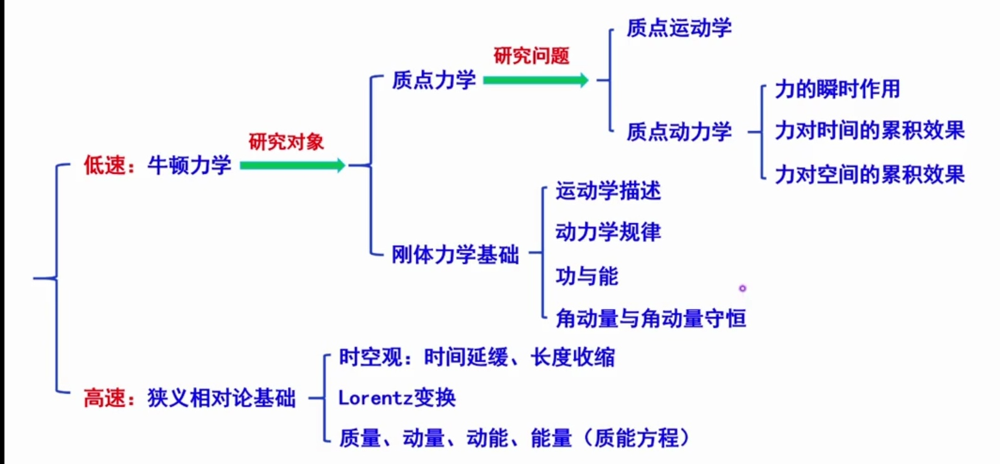
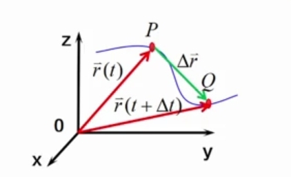
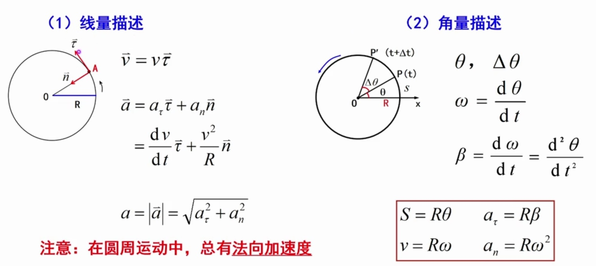
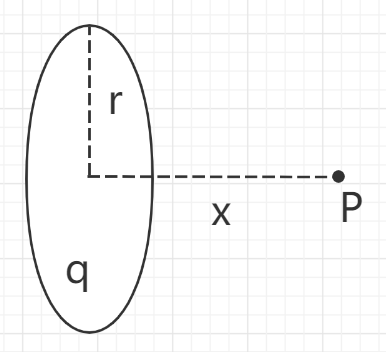
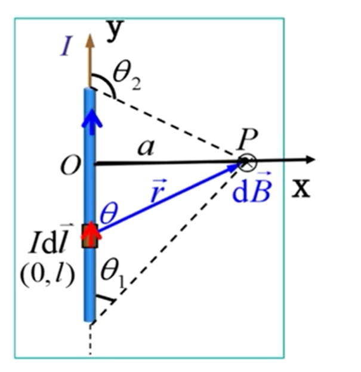
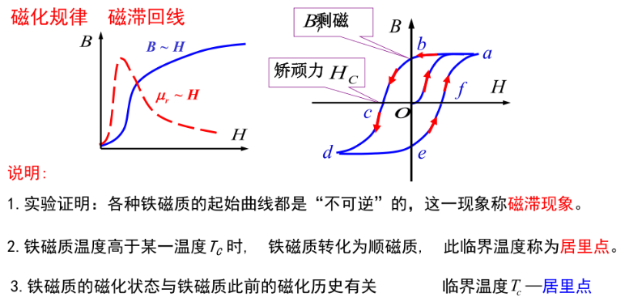
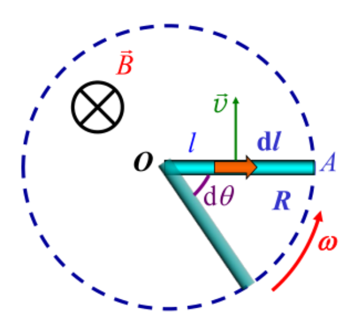
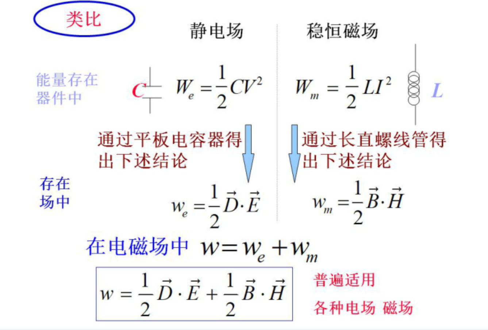

# 牛顿力学与狭义相对论基础整体框架

# 质点运动学

## 描述质点运动的物理量

### 位置矢量

- 运动方程

$$
\overrightarrow{r} = \overrightarrow{r}(t)
$$

- 矢量形式

$$
\overrightarrow{r}(t) = x(t)\overrightarrow{i} + y(t)\overrightarrow{j} + z(t)\overrightarrow{k}
$$

- 参数方程

$$
\begin{cases}
x = x(t),\\
y = y(t),\\
z = z(t).
\end{cases}
$$

消去参数$t$即可得到质点运动的==轨迹方程==。

### 位移$\Delta \overrightarrow{r}$

注意区分：
$$
\vert \Delta \overrightarrow{r} \vert \ \& \ \Delta r \\
\vert \Delta \overrightarrow{r} \vert \ \& \ \Delta S
$$
极限
$$
\vert d\overrightarrow{r} \vert = ds
$$

### 速度和速率

$$
速度 \quad \overrightarrow{v} = \lim_{\Delta t \rightarrow 0} \frac{\Delta \overrightarrow{r}}{\Delta t} = \frac{d\overrightarrow{r}}{dt}\\
速率 \quad v = \vert \overrightarrow{v} \vert = \frac{ds}{dt}
$$

### 加速度

$$
\overrightarrow{a} = \lim_{\Delta t \rightarrow 0} \frac{\Delta \overrightarrow{v}}{\Delta t} = \frac{d\overrightarrow{v}}{dt} = \frac{d^2\overrightarrow{r}}{dt^2}
$$

## 质点运动学的两类问题

- 已知运动方程，求质点任意时刻的位置、速度以及加速度

$$
\overrightarrow{r} = \overrightarrow{r}(t)\\
\overrightarrow{v} = \frac{d\overrightarrow{r}}{dt}\\
\overrightarrow{a} = \frac{d\overrightarrow{v}}{dt} = \frac{d^2\overrightarrow{r}}{dt^2} \quad （微分）
$$

- 已知运动质点的加速度函数（或速度函数）以及初始条件求质点的运动方程

$$
d\overrightarrow{v} = \overrightarrow{a}dt,\ \int_{\overrightarrow{v_0}}^{\overrightarrow{v}}d\overrightarrow{v} = \int_{t_0}^{t}\overrightarrow{a}dt\\
d\overrightarrow{r} = \overrightarrow{v}dt,\ \int_{\overrightarrow{r_0}}^{\overrightarrow{r}}d\overrightarrow{r} = \int_{t_0}^{t}\overrightarrow{v}dt \quad （积分）
$$

## 圆周运动

### 直线运动与圆周运动的比较

|        | 匀速直线运动                                                                              | 匀速圆周运动                                                                                                                                              |
|:------:|:-----------------------------------------------------------------------------------:|:---------------------------------------------------------------------------------------------------------------------------------------------------:|
| 位置比较   | $x(t) = x_0 + vt$                                                                   | $\theta(t) = \theta_0 + \omega t$                                                                                                                   |
| 运动规律比较 | $v(t) = v_0 + at \\ x(t) = x_0 + v_0t + \frac{1}{2}at^2\\v^2 - v_0^2 = 2a(x - x_0)$ | $\omega(t) = \omega_0 + \alpha t \\ \theta(t) = \theta_0 + \omega_0t + \frac{1}{2}\alpha t^2 \\ \omega^2 - \omega_0^2 = 2\alpha(\theta - \theta_0)$ |

### 总结

## 相对运动

### 伽利略变换（位矢和速度变换关系）

$$
\overrightarrow{r} = \overrightarrow{r'} + \overrightarrow{r_0}\\
\overrightarrow{v} = \overrightarrow{v'} + \overrightarrow{u}
$$

- 两个参考系：S系（地面），S'系（车厢），运动的一点P
- $\overrightarrow{r}$和$\overrightarrow{r'}$分别为点P在S系和S'系的位矢
- $\overrightarrow{r_0}$为S'系的坐标原点在S系中的位矢
- $\overrightarrow{v}$为P点在S系中的速度
- $\overrightarrow{v'}$为P点在S’系中的速度
- $\overrightarrow{u}$为S'系相对于S系的速度

进而可以得到
$$
\Delta \overrightarrow{r} = \Delta \overrightarrow{r'} + \Delta \overrightarrow{r_0}\\
\overrightarrow{a} = \overrightarrow{a'} + \overrightarrow{a_0}
$$
上式表明，在相互做匀速直线运动的参考系中，观察同一质点的运动时，所测得的加速度相同。

# 牛顿运动定律

## 牛顿三大定律

- 牛顿第一定律

$$
\overrightarrow{F} = 0, \ \overrightarrow{v} = 恒矢量
$$

- 牛顿第二定律

$$
\overrightarrow{F} = \frac{d\overrightarrow{p}}{dt} = m\overrightarrow{a} \ （m不变）
$$

- 牛顿第三定律

$$
\overrightarrow{F_{12}} = -\overrightarrow{F_{21}}
$$

## 牛顿第二定律在坐标系下的分解

- 直角坐标系

$$
F_x = ma_x = m\frac{dv_x}{dt}\\
F_y = ma_y = m\frac{dv_y}{dt}\\
F_z = ma_z = m\frac{dv_z}{dt}
$$

- 自然坐标系（曲线运动，圆周运动）

$$
F_\tau = ma_\tau = m\frac{dv}{dt}\\
F_n = ma_n = m\frac{v^2}{R}
$$

# 动量和动量守恒定律

## 动量

$$
\overrightarrow{I} = \int_{t_1}^{t_2}\overrightarrow{F}(t)dt
$$

## 质点的动量定理

$$
\overrightarrow{I} = \int_{t_0}^{t}\overrightarrow{F}dt = \int_{\overrightarrow{p_0}}^{\overrightarrow{p}}d\overrightarrow{p} = \overrightarrow{P} - \overrightarrow{P_0}\\
冲量 = 质点动量的变化量
$$

### 平均冲力

$$
\overline{\overrightarrow{F}} = \frac{1}{t-t_0}\int_{t_0}^{t}\overrightarrow{F}dt
$$

## 质点系的动量定理

$$
\overrightarrow{I_外} = \int_{t_0}^{t}\sum\overrightarrow{F_t}dt = \overrightarrow{p} - \overrightarrow{p_0} = \Delta \overrightarrow{p}\\
\overrightarrow{I_外}为质点系所受合外力的冲量
$$

### 动量守恒定律

$$
若 \quad \sum\overrightarrow{F_i} = 0,（质点系所受合外力为0）\\
则 \quad \overrightarrow{p} = \sum m_i\overrightarrow{v_i} = \overrightarrow{p_0} = \sum m_i\overrightarrow{v_{i0}}（质点系前后动量不变）
$$

## 质点对一固定点的角动量

$$
\overrightarrow{L} = \overrightarrow{r} \times \overrightarrow{p} = \overrightarrow{r} \times m\overrightarrow{v}\\
（\overrightarrow{L}为角动量，\overrightarrow{r}为质点对固定点的位矢）
$$

## 质点对一固定点的力矩

$$
\overrightarrow{M} = \overrightarrow{r} \times \overrightarrow{F}\\
（\overrightarrow{M}表示力矩）
$$

注意：角动量和力矩都和固定点的选取有关。

## 质点的角动量守恒定律

$$
当力矩\overrightarrow{M} = 0时，有\\
\frac{d\overrightarrow{L}}{dt} = \overrightarrow{M} = 0,\\
则\overrightarrow{L}为常矢量，说明当质点所受力矩为0时，其角动量保持不变.\\
$$

### 角动量守恒的条件

由$\overrightarrow{M} = \overrightarrow{r} \times \overrightarrow{F}$，则角动量守恒需满足下列条件之一：
$$
(1)合外力\overrightarrow{F} = 0\\
(2)合外力\overrightarrow{F} // 位矢\overrightarrow{r}，此时\overrightarrow{F}为有心力（常用条件）
$$

# 功和能

## 做功

元功：$dA = \overrightarrow{F}·d\overrightarrow{r}$

总功：$A = \int_{a}^{b} \overrightarrow{F}·d\overrightarrow{r}$

## 功率

$$
P = \frac{dA}{dt} =  \overrightarrow{F}·\overrightarrow{v}
$$

## 保守力 & 非保守力

保守力：做功与路径无关

非保守力：做功与路径有关

## 势能

注意：只有保守力才有势能的概念
$$
\int_{a}^{b} \overrightarrow{F_保}·d\overrightarrow{r} = -(E_{pb} - E_{pa})\\
保守力做功 = 势能变化量的负数\\
保守力做功对应势能的减少
$$

$$
E_{pa} = \int_{a}^{(0)} \overrightarrow{F}·d\overrightarrow{r}\\
点a处的势能 = 从a点移动到零势能点过程中保守力做的功
$$

## 质点的动能定理

$$
A_{a\rightarrow b} = \frac{1}{2}mv_b^2 - \frac{1}{2}mv_a^2 = E_{kb} - E_{ka}\\
a\rightarrow b过程中合外力对质点所做的功 = 质点动能的改变量
$$

## 质点系的动能定理

$$
\sum A_{外} + \sum A_{内} = E_k - E_{k0}\\
质点系所受的合外力做功与合内力做功之和 = 质点系动能的改变量\\
注意：合内力做的功需要考虑在内，与质点系的动量定理区分开
$$

## 功能原理 & 机械能守恒定律

$$
\sum A_{外} + \sum A_{非保内} = \Delta(E_k + E_p) = \Delta E\\
质点系所受合外力与非保守内力做功之和 = 质点系动能的改变量
$$

$$
若质点系的受力满足：\\
\sum A_{外} + \sum A_{非保内} = 0，即质点系所受合外力与非保守内力为零，只存在保守内力做功\\
则对该质点系有机械能守恒：\\
\Delta E = \Delta(E_k + E_p) = 0
$$

# 刚体的定轴转动

## 刚体定轴转动的运动学描述

### 角量描述

$$
角速度：\omega = \frac{d\theta}{dt}\\
角加速度：\beta = \frac{d\omega}{dt} = \frac{d^2\theta}{dt^2}
$$

角速度方向的确定使用右手法则

### 线量描述

$$
对刚体中一个转动半径为r的质点：\\
v = \omega r\\
a_\tau = \frac{dv}{dt} = r\beta\\
a_n = \frac{v^2}{r} = \omega^2 r\\
a = \sqrt{a_\tau^2 + a_n^2}
$$

## 刚体定轴转动的转动定律

$$
M = J\beta \quad 类比\rightarrow \quad \overrightarrow{F} = m\overrightarrow{a}\\
其中，M为力矩，定义为\overrightarrow{M} = \overrightarrow{r}\times\overrightarrow{p}\\
J为转动惯量，定义为J = \sum m_ir_i^2
$$

## 转动定律的应用

研究对象与分析方法：
$$
平动  \rightarrow  质点 \rightarrow \overrightarrow{F} = m\overrightarrow{a} \\
转动 \rightarrow 刚体 \rightarrow M = J\beta
$$
找出对应的角量-线量关系：
$$
v = \omega r\\
a_\tau = r\beta\\
a_n = \frac{v^2}{r} = \omega^2 r
$$

## 刚体定轴转动的动能

$$
E_k = \frac{1}{2}J\omega^2 \quad类比\rightarrow \quad E_k = \frac{1}{2}mv^2\\
刚体定轴转动的动能同样属于动能，是物体运动所具有能量的另一种表现形式
$$

## 刚体定轴转动的重力势能

$$
E_p = mgz_c\\
刚体的重力势能与刚体质心的位置有关
$$

## 力矩的功

$$
元功：dA = Md\theta\\
总功：A = \int_{\phi_1}^{\phi_2}Md\theta\\
类比\rightarrow A = \int_{a}^{b}\overrightarrow{F}d\overrightarrow{r}
$$

## 刚体定轴转动的动能定理

$$
A_外 = \frac{1}{2}J\omega_2^2 - \frac{1}{2}J\omega_1^2 = \Delta E_k\\
类比：A_外 = \frac{1}{2}mv_2^2 - \frac{1}{2}mv_1^2（质点）\\
\sum A_外 + \sum A_内 = \Delta E_p（质点系）
$$

注意：

- 刚体的定轴转动只有合外力矩做功，合内力矩不做功（刚体内质点无相对位移）
- 刚体的定轴转动如果只有保守力做功，则机械能守恒

## 刚体定轴转动的角动量

$$
\overrightarrow{L} = J \overrightarrow{\omega}
$$

## 刚体定轴转动的角动量守恒定律

$$
\overrightarrow{M} = \frac{d\overrightarrow{L}}{dt}\\
\overrightarrow{M} = 0 \rightarrow \Delta \overrightarrow{L} = 0,此时角动量守恒
$$

推论：所受合外力矩为零时，对于定轴转动可发生形变的物体，角动量仍然守恒：
$$
J_0\omega_0 = J\omega
$$

# 真空中的静电场

## 库仑定律

$$
\vec{F} = k\frac{q_1q_2}{r^2}\hat{r} = \frac{q_1q_2}{4\pi \varepsilon_0 r^2}\hat{r}\\
(k = \frac{1}{4\pi\varepsilon_0})，\varepsilon_0 = 8.85\times10^{-12}称为真空介电常数
$$

## 电场强度&电势

$$
E = \frac{\vec{F}}{q} = \frac{Q}{4\pi\varepsilon_0r^2}\\
V = \frac{W}{q} = \int_{a}^{0}\vec{E}d\vec{l}
$$

电场中某点的电势 = 将一个单位正电荷从该点移动到零电势能点电场力做的功

## 点电荷的静电场

对于真空中的一个点电荷Q，某点P到点电荷Q的距离为r，则该点的电场强度为：
$$
E = \frac{Q}{4\pi \epsilon_0 r^2}
$$
取无穷远处为零电势点，则该点的电势为：
$$
V = \frac{q}{4\pi \epsilon_0 r}
$$

## 高斯定理

$$
\oint_{S}\vec{E}d\vec{S} = \frac{\sum q}{\varepsilon_0}\\
q为高斯面内包含的电荷量
$$

## 常用电场模型

### 带电圆环

$$
E = \frac{qx}{4\pi\epsilon_0(r^2 + x^2)^{\frac{3}{2}}}
$$

### 无限带电导线（电荷线密度$\lambda$）

$$
E = \frac{\lambda}{2\pi r\epsilon_0}
$$

### 无限带电平面（电荷面密度$\sigma$）

$$
E = \frac{\sigma}{2\epsilon_0}
$$

# 静电场中的导体和电介质

## 静电平衡

当导体达到静电平衡时，导体成为一个等势体，其表面为等势面，且导体内部和表面电势一致。

静电平衡时导体表面的场强：
$$
E = \frac{\sigma}{\varepsilon_0}\\
其中\sigma 为导体表面的电荷面密度
$$

#### 导体球-球壳模型

一个球壳（带电或不带电都可）内放置一带电量为q的导体球，则球壳发生静电感应，在内外表面感应出电荷。此时球壳和导体球均为等势体，球壳内部电场强度为零。在球壳内部取一高斯面，由高斯定理可得该高斯面内净电荷为零，可以推出**球壳内表面分布的电荷与导体球所带电荷为等量异号**。

## 静电场中的电介质

电偶极矩：
$$
\vec{p} = q\vec{l}\\
\vec{l}：从负电荷指向正电荷
$$
电极化强度矢量：
$$
\vec{P} = \varepsilon_0(\varepsilon_r - 1)\vec{E}\\
\varepsilon_r称为相对介电常数，且有：\\
\begin{cases}
\varepsilon_r = 1,\quad 真空\\
\varepsilon_r \approx 1,\quad 空气\\
\varepsilon_r > 1,\quad 电介质
\end{cases}
$$
电位移矢量：
$$
\vec{D} = \epsilon_0\vec{E} + \vec{P} = \epsilon_0\epsilon_r\vec{E} = \epsilon \vec{E}\\
\epsilon称为介电常数
$$

## 电介质的高斯定理

$$
\oint_{S}\vec{D}d\vec{S} = \sum q_{自由}\\
其中\vec{D}称为电位移矢量，且\vec{D} = \epsilon_0\epsilon_r\vec{E} = \epsilon \vec{E}\\
(\epsilon_r称为相对介电常数)
$$

==注意==：

$\epsilon_r$：相对介电常数

$\epsilon$：介电常数

## 电容和电容器

### 平行板电容器

设平行板电容器极板间距离为d，极板正对面积为S，则由电介质的高斯定理可知该平行板电容器的电容为：
$$
C = \frac{\epsilon S}{d} = \frac{\epsilon_0\epsilon_r S}{d}
$$

若两极板上电荷面密度分别为$\sigma$和$-\sigma$，则由电介质中的高斯定理可以知道两极板之间的电位移大小为：
$$
D = \sigma
$$
进而可以得到两极板间的电场强度大小为：
$$
E = \frac{D}{\epsilon_0\epsilon_r} = \frac{\sigma}{\epsilon_0\epsilon_r}
$$

### 电容器的串联和并联

串联：
$$
\frac{1}{C} = \frac{1}{C_1} + \frac{1}{C_2}
$$
并联：
$$
C = C_1 + C_2
$$

## 静电场的能量

### 等效电容器法

对于一个平行板电容器C，其所带电荷为Q，则该电容器的能量为：
$$
W_e = \int_{0}^{Q}Vdq = \int_{0}^{Q}\frac{q}{C}dq = \frac{1}{2}\frac{Q^2}{C}
$$

$$
W_e = \frac{1}{2}\frac{Q^2}{C} = \frac{1}{2}CV^2 = \frac{1}{2}QV
$$

### 能量密度积分

$$
由平行板电容器可以推导：\\
由于W_e = \frac{1}{2}CV^2 = \frac{1}{2}\frac{\epsilon S}{d} (Ed)^2 = \frac{1}{2}\epsilon E^2 · Sd = \frac{1}{2}DE · Sd \\(Sd即为平行板电容器内部体积)\\
定义能量密度：w_e = \frac{W_e}{Sd} = \frac{1}{2}DE\\
上式对于非平行板电容器电场同样适用
$$

则有：
$$
W_e = \int_{V}w_edV = \frac{1}{2}\int_{V}DEdV\\
(w_e = \frac{1}{2}DE)
$$

有电场的空间具有能量，即电场能。

# 真空恒定电流的磁场

## 磁场和磁感应强度

磁感应强度大小：
$$
B = \frac{F_{max}}{q_0v}
$$
方向：正检验电荷的零受力方向。

## 毕奥-萨伐尔定律

对于一电流元$Id\vec{l}$和空间中一点P，电流元在P点产生的磁感应强度为：
$$
d\vec{B} = \frac{\mu_0}{4\pi}\frac{Id\vec{l}\times\vec{e_r}}{r^2}\\
= \frac{\mu_0}{4\pi}\frac{Id\vec{l}\times\vec{r}}{r^3}\\
其中，r为电流元到P点之间的距离，\vec{e_r} = \frac{\vec{r}}{r}
$$

## 典型磁场

### 通电直导线

由上图所示，可以计算得到：
$$
B = \frac{\mu_0I}{4\pi a}(\cos\theta_1 - \cos\theta_2)
$$

### [无限长通电直导线]()

对于真空中一无限长通电直导线，电流为I，其在距离导线为a的点处产生的磁感应强度大小为：
$$
B = \frac{\mu_0I}{2\pi a}
$$
对于半无限长的通电直导线，过其固定端且垂直于直导线的平面内一点的磁感应强度大小为：
$$
B = \frac{\mu_0I}{4\pi a}
$$
对于直导线（或延长线）上的点，磁感应强度为0。

### 通电线圈

一半径为R，电流为I的圆形通电线圈，其轴线上距其中心为x处的一点的磁感应强度大小为：
$$
B = \frac{\mu_0IR^2}{2(x^2 + R^2)^{3/2}}
$$
令$x = 0$，可得线圈中心的磁感应强度大小为：
$$
B_0 = \frac{\mu_0I}{2R}
$$
进一步扩展可得，对应圆心角为$\theta$的通电圆弧导线，其中心处的磁感应强度大小为：
$$
B_0' = \frac{\mu_0I}{2R}·\frac{\theta}{2\pi} = \frac{\mu_0I\theta}{4\pi R}
$$

### 带电圆盘

一半径为R，电荷面密度为$\sigma$，以角速度$\omega$旋转的的带电圆盘，其轴线上距其x处一点的磁感应强度大小为：
$$
B = \frac{\mu_0\omega\sigma}{2}(\frac{2x^2 + R^2}{\sqrt{x^2 + R^2}} - 2x)
$$
令$x = 0$，可得带电圆盘中心点的磁感应强度大小为：
$$
B_0 = \frac{\mu_0\omega\sigma R}{2}
$$

### 通电螺线管

有一横截面半径为R，通有电流I，单位长度内绕线匝数为n的螺线管，取其内部一点P，则其磁感应强度大小为：
$$
B_p = \frac{\mu_0nI}{2}(\cos\beta_2 - \cos\beta_1)\\
\beta_1,\beta_2为螺线管最左端和最右端与P点的连线和磁感应强度方向之间的夹角
$$
进一步扩展可以得到，无限长通电螺线管内部轴线上各点磁感应强度都相同，其大小为：
$$
B = \mu_0nI
$$
可以证明，对于无限长通电螺线管，其内部各点磁感应强度和轴线一致，其大小为：
$$
B = \mu_0nI
$$
对于半无限长螺线管，其轴线上在固定端的一点磁感应强度大小为：
$$
B = \frac{\mu_0nI}{2}
$$

## 一个运动电荷产生的磁场

一个带电量为q，运动速度为$\vec{v}$的电荷，在某点产生的磁场的磁感应强度为：
$$
\vec{B} = \frac{\mu_0}{4\pi} \frac{q\vec{v}\times\vec{e_r}}{r^2}
$$

## 磁场中的高斯定理

$$
\oint_S\vec{B}·d\vec{S} = 0
$$

## ==安培环路定理==

对于一条无限长直导线，环路L与该直导线交链，且环路方向和电流方向满足右手定则，则有：
$$
\oint_L\vec{B}·d\vec{l} = \mu_0I
$$
若不满足右手定则，则有：
$$
\oint_L\vec{B}·d\vec{l} = -\mu_0I
$$
对于存在多条直导线的情况，有以下安培环路定理：
$$
\oint_L\vec{B}·d\vec{l} = \mu_0\sum I_内\\
I_内表示和环路L交链的直导线的电流，若其方向和环路方向满足右手定则取正，否则取负
$$

## 洛伦兹力

$$
\vec{f_m} = q\vec{v}\times\vec{B}\\
大小：f_m = qvB\sin\theta\\
$$

### 带电粒子的螺旋线运动

一带电粒子在均匀磁场中以速度v做螺旋线运动，和磁场方向夹角为$\theta$，其垂直于磁场方向和平行于磁场方向分量分别为：
$$
v_{\bot} = v\sin\theta\\
v_{\parallel} = v\cos\theta
$$
其做圆周分运动的周期恒为：
$$
T = \frac{2\pi m}{qB}
$$
圆周轨迹半径：
$$
R = \frac{mv\sin\theta}{qB}
$$
螺旋线轨迹的螺距为：
$$
h = v_{\parallel}T = \frac{2\pi mv\cos\theta}{qB}
$$

### 霍尔效应

$$
\Delta U_H = R_H\frac{IB}{d}\\
霍尔系数R_H = \frac{1}{nq}
$$

## 安培力

电流微观表达式：
$$
I = nqvS
$$
安培力表达式：
$$
\vec{F} = \int_{l}Id\vec{l}\times\vec{B}
$$

### 磁场中通电导线的受力

- 均匀磁场中任意弯曲通电导线ab，其所受磁场力为：

$$
\vec{F} = I\vec{ab}\times\vec{B}
$$

- 均匀磁场中任意闭合通电导线ab，其所受磁场力为：

$$
\vec{F} = 0
$$

### 平行电流间的相互作用力

$$
dF = \frac{\mu_0I_1I_2}{2\pi a}dl
$$

单位长度平行电流所受的作用力大小：
$$
\frac{dF}{dl} = \frac{\mu_0I_1I_2}{2\pi a}
$$

## 磁力

### 磁矩

$$
\vec{m} = IS\vec{n}
$$

### 磁力矩

$$
\vec{M} = \vec{m} \times \vec{B}
$$

在均匀磁场中，平面载流线圈在磁力矩作用下的运动趋势是使磁矩的方向与磁场的方向趋于一致。

# 有磁介质存在时的磁场

## 相对磁导率与磁介质

设无磁介质时空间某点的磁感应强度为$B_0$，有磁介质时为B，由此定义磁介质的相对磁导率：
$$
\mu_r = \frac{B}{B_0}
$$
由磁介质的不同，相对磁导率有不同的取值范围：

- 顺磁质：$\mu_r > 1,B > B_0$
- 抗磁质：$\mu_r < 1,B < B_0$
- 铁磁质：$\mu_r >> 1,B >> B_0$

## 磁化强度

单位体积内分子磁矩的矢量和定义为磁化强度：
$$
\vec{M} = \frac{\sum\vec{m}}{\Delta V}
$$

## 磁化电流与磁化强度的关系

对于一个长为L底面积为S的均匀磁介质圆柱体，其表面的磁化电流为$I_s$，单位长度上的磁化电流为$i_s$，有：
$$
M = \frac{\sum m}{\Delta V} = \frac{I_sS}{SL} = \frac{I_s}{L} = i_s
$$
上式说明磁化强度在数值上等于单位长度上磁化电流（又称束缚电流）的大小。

## 磁化强度的环路积分

$$
\oint\vec{M}·d\vec{l} = \int_{ab}Mdl = Ml = \sum i_s
$$

上式表明，磁化强度对环路的积分，等于通过 以该环路为边界的任意曲面 的磁化电流的代数和。

## 磁介质中的安培环路定理

由安培环路定理：
$$
\oint_L\vec{B}·d\vec{l} = \mu_0(I + I_s) \quad\quad (I：传导电流，I_s：束缚电流)\\
= \mu_0(I + \oint_L\vec{M}·d\vec{l})
$$
经变换得到：
$$
\oint_L(\frac{\vec{B}}{\mu_0} - \vec{M})·d\vec{l} = I
$$
定义磁场强度H：
$$
H = \frac{\vec{B}}{\mu_0} - \vec{M}
$$
则有**磁介质的安培环路定理**：
$$
\oint_L\vec{H}·d\vec{l} = \sum I
$$
即磁场强度沿环路的积分等于通过该环路所围曲面的传导电流的代数和。

## 磁化强度、磁场强度和磁感应强度的关系

总结： 
$$
\vec{M} = \frac{\mu_r - 1}{\mu_0\mu_r}\vec{B} = (\mu_r - 1)\vec{H}
$$
由磁介质的安培环路定理的推导可知：
$$
H = \frac{\vec{B}}{\mu_0} - \vec{M}
$$
经实验发现，**磁化强度M和磁感应强度B**之间存在如下关系：
$$
\vec{M} = \frac{\mu_r - 1}{\mu_0\mu_r}\vec{B}
$$
则**磁场强度H和磁感应强度B**存在如下关系：
$$
H = \frac{\vec{B}}{\mu_0} - \vec{M} = \frac{1}{\mu_0\mu_r}\vec{B}\\
即：\vec{B} = \mu_0\mu_r\vec{H} = \mu\vec{H}\\
其中，\mu_r称为相对磁导率，\mu称为磁介质的磁导率
$$
最后，**磁化强度M和磁场强度H**存在如下关系：
$$
\vec{M} = \chi_m\vec{H}\\
其中\chi_m称为磁化率
$$
则有：
$$
\vec{H} = \frac{\vec{B}}{\mu_0} - \vec{M} = \frac{\vec{B}}{\mu_0} - \chi_m\vec{H}\\
\Rightarrow \vec{B} = \mu_0(1+\chi_m)\vec{H} = \mu_0\mu_r\vec{H}\\
其中有：\mu_r = 1 + \chi_m，称为相对磁导率
$$
对于真空有：
$$
\chi_m = 0,\mu_r = 1
$$

## 铁磁质的磁化

# 电磁感应

## 电磁感应定律

实验表明，在电磁感应中，感应电动势的大小和穿过导体线圈的磁通量随时间的变化率成正比，方向与磁通量的变化方向有关。以$\Phi$表示穿过导体线圈的磁通量，$\varepsilon$表示感应电动势，则有：
$$
\varepsilon = -\frac{d\Phi}{dt}
$$
若导体线圈由N匝线圈组成，则总感应电动势为：
$$
\varepsilon = -N\frac{d\Phi}{dt} = -\frac{d\Psi}{dt}\\
其中，\Psi = N\Phi，称为磁链
$$

由此还可以推导出线圈中通过的电荷量与磁通量的变化量之间的关系：
$$
q = -\frac{1}{R}\int_{\varPhi_1}^{\varPhi_2}d\varPhi = 
\frac{1}{R}(\varPhi_1 - \varPhi_2)
$$
可以看出，感应电流与磁通量的变换率有关，而感应电荷与磁通量的变化量有关。

## 楞次定律

楞次定律：闭合回路磁通量变化所引起的感应电流，总是会阻碍其磁通量的改变（来拒去留）。

## 感生电动势

$$
\varepsilon = -\frac{d\varPhi}{dt} = -\frac{d(BS)}{dt} = -(\frac{dB}{dt}S + \frac{dS}{dt}B) = -\frac{dB}{dt}S
$$

### 感生电场的计算

对于感生电场有：
$$
\oint_L\vec{E}_i·d\vec{l} = -\int_S\frac{\partial{\vec{B}}}{\partial{t}}·d\vec{S}
$$
上式表明，在变化的磁场中，感生电场强度对任意闭合路径L的线积分等于该闭合路径所包围面积上磁通量的变化率。

由电动势的定义还可以知道，在一般情况下，当空间中同时存在静电场$E_e$和感生电场$E_i$：
$$
\vec{E} = \vec{E}_e + \vec{E}_i
$$
则总的电动势为：
$$
\varepsilon = \oint_L（\vec{E}_e + \vec{E}_i）·d\vec{l} = \oint_L\vec{E}_i·d\vec{l} = -\int_S\frac{\partial{\vec{B}}}{\partial{t}}·d\vec{S}
$$
即：
$$
\varepsilon = \oint_L \vec{E}·d\vec{l} = -\int_S\frac{\partial{\vec{B}}}{\partial{t}}·d\vec{S}
$$

## 动生电动势

一段导线在磁场$\vec{B}$中以速度$\vec{v}$运动，则其产生的动生电动势为：
$$
\varepsilon = \int_{a}^{b}(\vec{v}\times\vec{B})·d\vec{l}
$$
**（左力右电）**
右手定则判断动生电动势的方向：伸平右手手掌使拇指和其他四指垂直，使磁力线从手掌穿过，拇指指向导线运动的方向，则四指所指方向即为动生电动势的方向。

### 旋转体的动生电动势

如图所示长R的导体棒在磁场B中以角速度$\omega$转动，其动生电动势为：
$$
\varepsilon = -\frac{\omega BR^2}{2}\\
方向：A \rightarrow O
$$

## 自感和互感

### 螺线管的自感

$$
L = \frac{\varPsi}{I} = \mu_0\mu_rn^2V\\
其中，n为螺线管的匝数，V为螺线管的体积
$$

另：电容C可以表示为：
$$
C = \frac{\varepsilon_0\varepsilon_rS}{d}
$$

### 自感线圈中的磁场能量

$$
W_m = \int_0^ILidi = \frac{1}{2}LI^2 = \frac{1}{2}BHV
$$

由此定义磁场能量密度：
$$
w_m = \frac{1}{2}BH
$$
利用磁场能量密度计算磁场能量：
$$
W = \int_V\frac{1}{2}BHdV
$$

## 电场和磁场能量的类比

# 麦克斯韦方程组

## 位移电流

位移电流密度：
$$
\vec{j}_D = \frac{\partial \vec{D}}{\partial t}
$$
位移电流：
$$
I_D = \frac{d\varPhi_D}{dt} = \int_S \frac{\partial \vec{D}}{\partial t} · d\vec{S}\\
其中，\varPhi_D为电位移矢量的通量
$$

## 全电流安培环路定理

### 全电流的定义

$$
I_S = I_C + I_D = \int_S\vec{j}_C · d\vec{S} + \int_S \frac{\partial \vec{D}}{\partial t} · d\vec{S}\\
其中，I_C = \int_S\vec{j}_C·d\vec{S}为传导电流，\vec{j}_C为传导电流密度\\
$$

### 全电流安培环路定理

$$
\oint_L\vec{H}·d\vec{L} = I_S = I_C + I_D = \int_S\vec{j}_C·d\vec{S} + \int_S\frac{\partial \vec{D}}{\partial t}·d\vec{S}
$$

## 麦克斯韦方程组

- 电场的高斯定理

$$
\oint_S\vec{D}·d\vec{S} = \oint_S(\vec{D}_静 + \vec{D}_感)·d\vec{S} = \oint_S\varepsilon(\vec{E}_静 + \vec{E}_感)·d\vec{S} = \sum q_i = \int_V\rho dV
$$

静电场为有源场，感应电场为无源场。

- 磁场的高斯定理

$$
\oint_S\vec{B}·d\vec{S} = 0
$$

磁场为无源场。

- 电场的环路定理

$$
\oint_L\vec{E}·d\vec{l} = \oint_L(\vec{E}_静 + \vec{E}_感)·d\vec{S} = -\int_S\frac{\partial \vec{B}}{\partial t}·d\vec{S}
$$

$$
\oint_L\vec{E_感}·d\vec{l} = -\frac{d\varPhi}{dt} = -\frac{d}{dt}(\int_S\vec{B}·d\vec{S}) = -\int_S\frac{\partial \vec{B}}{\partial t}·d\vec{S}
$$

综合得到：
$$
\oint_L\vec{E}·d\vec{l} = -\frac{d\varPhi}{dt} = -\int_S\frac{\partial \vec{B}}{\partial t}·d\vec{S}
$$
静电场为保守场和无旋场，感生电场为有旋场。

- 全电流安培环路定理

$$
\oint_L\vec{H}·d\vec{l} = \int_S(\vec{j}_c + \frac{\partial \vec{D}}{\partial t})·d\vec{S} = \sum I_c + \sum\frac{d\varPhi_D}{dt}
$$

传导电流和变化电场可以激发涡旋电场。

综上，可以得到（令人惊叹的）麦克斯韦方程组：

$$
\begin{cases}
\oint_S\vec{D}·d\vec{S} = \sum q_i = \int_V\rho dV\\
\\
\oint_L\vec{E}·d\vec{l} = -\int_S\frac{\partial \vec{B}}{\partial t}·d\vec{S}\\
\\
\oint_S\vec{B}·d\vec{S} = 0\\
\\
\oint_L\vec{H}·d\vec{l} = \int_S(\vec{j}_c + \frac{\partial \vec{D}}{\partial t})·d\vec{S} = \sum I_c + \sum\frac{d\varPhi_D}{dt}
\end{cases}
$$

