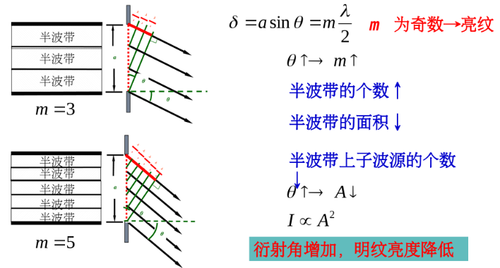
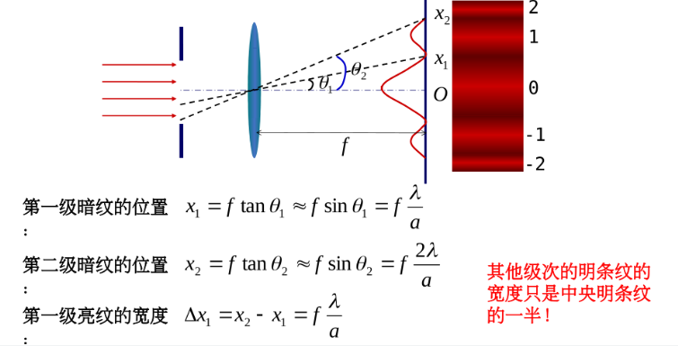
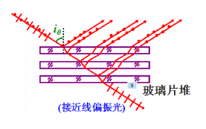

## 小知识

- $\alpha$粒子：由两个质子，两个中子构成
- 电子质量：$m_0 = 9.11 \times 10^{-31} \ kg$
- 元电荷：$e = 1.6 \times 10^{-19} \ C$
- 相对论能量-动量关系式：$E^2 = E_0^2 + p^2c^2$

## 公式

# 热力学基础

## 理想气体的物态方程

### 气体实验定律

#### 波意耳-马略特定律

$$
pV = C(T) \\
当温度不变时，C(T)为常数
$$

#### 盖-吕萨克定律

$$
\frac{V}{T} = \frac{V_0}{T_0}
$$

#### 查理定律

$$
\frac{p}{T} = \frac{p_0}{T_0}
$$

#### 阿伏伽德罗定律

在相同温度和压强下，1 mol任何气体的体积都相等.

### ==理想气体的物态方程==（克拉伯龙方程）$pV = \nu RT$

$$
pV = \nu RT \\
\nu: 气体分子摩尔数，单位：mol \\
p: 气体压强，单位：Pa \\
V: 气体体积，单位：m^3 \\
T: 气体温度，单位：K 
$$

*普适气体常量*：$R = 8.31(J \cdot mol^{-1} \cdot K^{-1})$

注：理想气体应当满足“无限稀薄”的条件，气体分子之间互不干扰。

#### 克拉伯龙方程的变体

$$
p = \frac{\nu RT}{V} = \frac{N}{V}\frac{R}{N_A}T = nkT \\
其中，\nu = \frac{N}{N_A}，N表示气体总分子数 \\
n: 单位体积气体分子数，称为气体的分子数密度 \\
k: 玻尔兹曼常数 \\
N_A: 阿伏伽德罗常数，即1\ mol气体的分子数
$$

## 热力学第一定律

$$
Q = \Delta E + A \\
Q: 系统从外界吸收的热量\\
\Delta E: 系统内能增量\\
A: 系统对外做的功\\
该式表明：外界对系统传递的热量，一部分使系统内能增加，另一部分用于系统向外界做功
$$

### 气体做功

$$
dA = Fdl = pSdl = pdV \\
气体对外做功为；A = \int_{V_1}^{V_2}pdV
$$

==注==

- 通常情况下，气体体积发生变化，就存在做功（唯一的例外：气体自由膨胀）
- 做功大小取决于$p,V$的函数关系，$p-V$图中曲线下方所围面积在数值上即为做功大小。即使体积变化相同，功的大小也可能不同。

### 热容 比热容 摩尔热容

热容

$$
C = \frac{dQ}{dT}
$$

比热容

$$
c = \frac{C}{m} = \frac{1}{m}\frac{dQ}{dT}
$$

 摩尔热容

$$
C_m = \frac{C}{\nu} = \frac{1}{\nu}\frac{dQ}{dT} \\
定体摩尔热容：C_{V,m} = \frac{1}{\nu}(\frac{dQ}{dT})_V\\
定压摩尔热容：C_{p,m} = \frac{1}{\nu}(\frac{dQ}{dT})_p\\
$$

定压摩尔热容与定体摩尔热容的比值称为**比热比**：

$$
\gamma = \frac{C_{p,m}}{C_{V,m}}
$$

另注：

$$
C_{V,m} = \frac{i}{2} R\\
其中i为自由度，且有：i = 
\begin{cases}
3, 单原子分子\\
5, 双原子分子\\
6, 多原子分子
\end{cases}
$$

### 理想气体的内能

$$
\Delta E = \nu C_{V,m}\Delta T \\
E = \nu C_{V,m}T
$$

==注意== 理想气体的内能是仅与温度有关的态函数（理想气体的内能是温度的单值函数），其增量取决于始末状态的温度增量，与中间过程无关，因此[该式适用于理想气体的任意过程]()。

### 迈耶公式

$$
C_{p,m} = C_{V,m} + R
$$

==注== 结合比热比的定义，可得：
$$
C_{p,m} = C_{V,m} + R = \gamma C_{V,m} \\
$$

则有：

$$
C_{V,m} = \frac{R}{\gamma - 1}
$$

## 典型准静态过程

### 等体过程

由$dA = pdV = 0$，系统不做功，有（参考定体摩尔热容的定义）：

$$
dQ = dE = \nu C_{V,m}dT
$$

若$C_{V,m}$为常量，则有：

$$
Q = \Delta E = \nu C_{V,m} \Delta T
$$

### 等压过程

系统对外界做功：

$$
A = \int_{V_1}^{V_2}pdV = p(V_2 - V_1)
$$

若$C_{p,m}$为常量，系统吸收的热量为（参考定压摩尔热容的定义）：

$$
Q = \nu C_{p,m}\Delta T
$$

系统内能增量为：

$$
\begin{aligned}
\Delta E &= Q - A \\
&= \nu C_{p,m}(T_2 - T_1) - p(V_2 - V_1) \\
&= \nu C_{p,m}(T_2 - T_1) - \nu R(T_2 - T_1) \\
&= \nu C_{V,m}\Delta T \quad (迈耶公式)
\end{aligned}
$$

==注== 注意内能增量表达形式的一致性，只要始末两态对应的温度相同，不管中间过程如何，理想气体内能的改变量都是相同的，均为：

$$
\Delta E = \nu C_{V,m}\Delta T
$$

### 等温过程

等温过程，温度不变，则有：

$$
dT = 0, dE = 0 \\
Q = A
$$

系统对外界做功：

$$
A = \int_{V_1}^{V_2}pdV = \int_{V_1}^{V_2} \frac{\nu RT}{V}dV = \nu RT\ln\frac{V_2}{V_1}
$$

即：

$$
Q = A = \nu RT\ln\frac{V_2}{V_1}
$$

### 绝热过程

对于绝热过程有：$Q = 0, \quad A = -\Delta E = -\nu C_{V, m}\Delta T$

#### 绝热过程方程

用压强和体积表示的理想气体准静态的绝热过程方程：$pV^\gamma = C$
$$
pV^{\gamma} = C \quad (C为常量) \\
\gamma = \frac{C_{p,m}}{C_{V,m}} > 1
$$

==注== 绝热过程一般伴随着温度的变化，因此波义尔-马略特定律并不适用：
$$
pV = C(T) \\
当温度不变时，C(T)为常数
$$

- 用压强和温度表示：$p^{1 - \gamma}T^\gamma = C \quad (C为常量)$
- 用体积和温度表示为：$TV^{\gamma - 1} = C \quad (C为常量)$

==注== 等温线的斜率为：

$$
\frac{dp}{dV} = -\frac{p}{V}
$$

绝热线的斜率为：

$$
\frac{dp}{dV} = -\gamma\frac{p}{V}
$$

由$\gamma > 1$，可知[绝热线比等温线陡峭]()

#### 绝热过程的功

由绝热过程方程：

$$
pV^\gamma = p_1V_1^\gamma = p_2V_2^\gamma
$$

则有：

$$
\begin{aligned}
A &= \int_{V_1}^{V_2}pdV \\
&= \int_{V_1}^{V_2}\frac{p_1V_1^\gamma}{V^\gamma}dV \\
&= p_1V_1^\gamma\frac{1}{1 - \gamma}(V_2^{1 - \gamma} - V_1^{1 - \gamma}) \\
&= \frac{1}{\gamma - 1}(p_1V_1 - p_2V_2)
\end{aligned}
$$

绝热过程中无热量传递，故有：

$$
Q = 0 \\
A = -\Delta E = -\nu C_{V,m}\Delta T
$$

可以证明，做功的两种表示形式是一致的

## 循环过程与卡诺循环

### 热机（正循环）

$$
Q_1: 全部吸热之和 \\
Q_2: 全部放热之和 
$$

==注== $Q_1,Q_2$均为正数。若计算得$Q < 0$（放热），需在前面加负号然后代入求热机的效率

#### 热机的效率$\eta = 1 - Q_2/Q_1$

$$
\eta = 1 - \frac{Q_2}{Q_1}
$$

### 制冷机（逆循环）

$$
Q_1: 全部放热之和 \\
Q_2: 全部吸热之和 \\
（Q_1,Q_2均为正数）
$$

#### 制冷机的制冷系数$w = \frac{Q_2}{Q_1 - Q_2}$

$$
w = \frac{Q_2}{Q_1 - Q_2}
$$

### 卡诺循环

卡诺循环是由两个等温过程和两个绝热过程构成的准静态循环，该循环只与两个热源交换热量

#### 卡诺热机

以卡诺循环工作的理想热机称为卡诺热机，其效率表示为：

$$
\eta = 1 - \frac{T_2}{T_1}
$$

#### 卡诺定理

* 卡诺热机的效率为热机的最大工作效率：$\eta = 1 - \frac{Q_2}{Q_1} \le 1 - \frac{T_2}{T_1}$

$$
\eta = 1 - \frac{Q_2}{Q_1} \le 1 - \frac{T_2}{T_1}
$$

* 制冷机工作的最大制冷系数：$w = \frac{Q_2}{Q_1 - Q_2} \le \frac{T_2}{T_1 - T_2}$

$$
w = \frac{Q_2}{Q_1 - Q_2} \le \frac{T_2}{T_1 - T_2}
$$

# 气体动理论

宏观量：描述气体整体特征的量

微观量：描述单个分子特征的量

宏观量、微观量的判断方法：用k描述的，通常是微观量；用R描述的，通常是宏观量（因为$R = kN_A$)

统计平均值计算方法：先求和，再均分

==注意== 如果是求某量在部分速率区间的平均值，不能用全部分子数N来均分

## 气体分子热运动及统计规律

### 分子热运动基本观点

- 一切宏观物体都是由大量粒子组成
- 所有物质的分子都在做杂乱无章的运动，分子运动的剧烈程度与温度有关
- 分子之间存在相互作用力

分子运动服从统计规律

## 理想气体的压强和温度

理想气体就是大量做无规则运动的相互无作用力的弹性质点的集合。

对理想气体分子的微观结构有以下3点假设：

1. 分子可以视为质点
2. 除碰撞的瞬间，气体分子之间以及气体分子与器壁之间无相互作用
3. 分子之间以及分子与器壁之间的碰撞都是完全弹性的

### 理想气体的压强

气体的压强就是无规则运动的大量分子撞击器壁时，作用于器壁单位面积上的平均冲力或单位时间作用于器壁单位面积上的平均冲量：

$$
p = \frac{2}{3}n\overline{\varepsilon_t} \\
$$

- 其中，$\overline{\varepsilon_t} = \frac{1}{2}m\overline{v}^2$，表示[分子平均平动动能]()。

压强是大量分子与器壁不断撞击的结果，是统计平均值，对单个分子无意义。

### 理想气体的温度

$$
\begin{cases}
p = nkT \ (理想气体状态方程) \\
p = \frac{2}{3}n\overline{\varepsilon_t} \ (理想气体压强公式)
\end{cases} 
\quad \Rightarrow \quad
\overline{\varepsilon_t} = \frac{3}{2}kT
$$

==说明==

1. 温度是描述热力学系统平衡态的一个宏观物理量
2. 温度是统计概念，只能反映大量分子的集体状态，讨论单个分子的温度毫无意义
3. 温度反映的是分子无规则的热运动，与分子整体运动无关
4. 分子热运动的平均平动动能只与热力学温度有关

## 能量按自由度均分定理

自由度：确定一个物体空间位置所需要的独立坐标个数

- 质点有3个自由度（3个平动自由度）
- 自由刚体有6个自由度（3个平动自由度，3个转动自由度）

对于刚性分子有：

- 单原子分子：3个自由度
- 双原子分子：5个自由度
- 多原子分子：6个自由度

### 能量按自由度均分定理（能量均分定理）

* 处于温度为T的平衡态的气体分子的任何一种运动形式的每一个自由度的[平均动能]()都相等且等于$kT/2$
* 根据能量均分定理，在温度为T的平衡态下，一个气体分子的[平均总动能]()由它的自由度决定，即$\overline{\varepsilon_{总}} = \frac{i}{2}kT$

由此可以知道：

$$
单元子分子：\overline{\varepsilon_k} = \frac{3}{2}kT \\
刚性双原子分子：\overline{\varepsilon_k} = \frac{5}{2}kT \\
刚性多原子分子：\overline{\varepsilon_k} = 3kT
$$

### 理想气体的内能

$$
E = N\overline{\varepsilon_k} = N\frac{i}{2}kT = \frac{i}{2}\nu RT \\
k = \frac{R}{N_A}, \quad \nu = \frac{N}{N_A}
$$

==说明== 理想气体内能只是温度的函数，与热力学温度成正比

由此可以得到理想气体的摩尔热容和比热比：

$$
\begin{cases}
\Delta E = \nu \frac{i}{2}R\Delta T \\
\Delta E = \nu C_{V,m}\Delta T
\end{cases} 
\quad \Rightarrow \quad
\begin{cases}
C_{V,m} = \frac{i}{2}R \\
C_{p,m} = \frac{i + 2}{2}R
\end{cases}
$$

$$
\begin{cases}
C_{V,m} = \frac{i}{2}R \\
C_{p,m} = C_{V,m} + R
\end{cases}
\quad \Rightarrow \quad
\gamma = \frac{C_{p,m}}{C_{V,m}} = 1 + \frac{2}{i}
$$

## 麦克斯韦速率分布律

### 速率分布函数

设总分子数N，速率区间$v \sim v + dv$，该速率区间内分子数为$dN_v$，则有：

$$
\frac{dN_v}{N} = f(v)dv \\
$$

$f(v)$为速率分布函数，其具体形式为：

$$
f(v) = 4\pi(\frac{m}{2\pi kT})^{\frac{3}{2}}e^{-\frac{mv^2}{2kT}}v^2\\
其中，T为气体温度，m为分子的质量，k为玻尔兹曼常数
$$

*[速率分布函数的意义：速率v附近单位速率区间内分子数占总分子数的百分比]()*

速率分布函数满足[归一化条件]()：

$$
\int_0^\infty f(v)dv = 1
$$

该式可以理解为分子速率在$0 \sim +\infty$范围内的概率是1.

#### 某物理量的统计平均值的计算

[先求和，再均分]()

例如：求全部的平均速率

先求和：
$$
\sum v_i = \int_0^\infty vdN
$$
再均分：
$$
\overline{v} = \frac{\sum v_i}{N}
$$
用速率分布函数表示结果：
$$
\overline{v} = \frac{1}{N} \int_0^\infty vdN = \int_0^\infty vf(v)dv \\
(\frac{dN}{N} = f(v)dv)
$$

#### 求与$v$有关的物理量$x$的平均值

$$
\overline{x}(v) = \int_0^\infty xf(v)dv
$$

#### 求某量在部分速率区间的平均值

==易错== 如果是求某量在[部分速率区间]()的平均值，不能用全部分子数N来均分

### 三种统计速率

#### 最概然速率

分布函数$f(v)$极大值对应的速率$v_p$

分布函数$f(v)$有一个极大值，即在某一速率附近单位速率间隔内的分子数占总分子数的比率最大，这个与$f(v)$的极大值对应的速率称为[最概然速率]()，用$v_p$表示，可推导出该速率为：

$$
v_p = \sqrt{\frac{2kT}{m}}
$$

$v_p$与气体的温度T和气体的分子质量m有关。

##### 最概然速率的物理意义

最概然速率的物理意义是：当温度一定时，在该速率附近的单位速率区间的分子数占总分子数的比率最大，或者说一个分子的速率出现在该速率附近的单位速率区间的概率最大，也可以说分子在$0 \sim +\infty$范围内所有可能的各种速率中，具有速率$v_p$附近的值的可能性最大。

#### 平均速率$\overline{v}$

平均速率是指一定温度下大量分子无规则热运动速率的统计平均值

其定义式为

$$
\overline{v} = \frac{v_1 \Delta N_1 + v_2 \Delta N_2 + ... + v_i \Delta N_i + ...}{\Delta N_1 + \Delta N_2 + ... + \Delta N_i + ...} = \frac{\sum_iv_i\Delta N_i}{N}
$$

令$\Delta N$趋于极小值，用$dN$表示，则有：

$$
\overline{v} = \frac{\int_0^{\infty}vdN}{N} = \int_0^{\infty}v\frac{dN}{N} \\
= \int_0^\infty vf(v)dv
$$

#### 方均根速率$\sqrt{\overline{v^2}}$

方均根速率$\sqrt{\overline{v^2}}$是指一定温度下大量分子无规则热运动速率平方的统计平均值的平方根

其定义式为：

$$
\overline{v^2} = \frac{v_1^2 \Delta N_1 + v_2^2 \Delta N_2 + ... + v_i^2 \Delta N_i + ...}{\Delta N_1 + \Delta N_2 + ... + \Delta N_i + ...} = \frac{\sum_iv_i^2\Delta N_i}{N}
$$

令$\Delta N$趋于极小值，用$dN$表示，则有：

$$
\overline{v^2} = \frac{\int_0^{\infty}v^2dN}{N} = \int_0^{\infty}v^2f(v)dv
$$

# 简谐振动

## 简谐振动的运动学描述

$$
x = A\cos(\omega t + \phi)
$$

三个特征量：

- A：振幅
- $\omega$：角频率

- $\phi$：初相位

其他物理量：

- $$
  周期；T = \frac{2\pi}{\omega}\\
  频率：\nu = \frac{\omega}{2\pi}
  $$

- $\omega t + \phi$：振动相位，反映振动的步调，决定质点的运动状态

- $\Delta \phi = \phi_2 - \phi_1 \in (-\pi, \pi]$：相位差（当两个简谐振动频率相同时，相位差才有意义），根据相位差的情况可以判断两个简谐振动的步调关系：

$$
\begin{cases}
\Delta\phi = 0, \quad 同相 \\
\Delta\phi = \pi, \quad 反相 \\
\Delta\phi > 0, \quad 超前 \\
\Delta\phi < 0, \quad 落后 \\
\end{cases}
$$

- 简谐振动的速度与加速度

$$
速度：v = \frac{dx}{dt} = -\omega A \sin(\omega t + \phi) = \omega A \cos(\omega t + \phi + \frac{\pi}{2}) \\
加速度：a = \frac{d^2x}{dt^2} = -\omega^2A\cos(\omega t + \phi) = \omega^2A\cos(\omega t + \phi + \pi)
$$

==注== 加速度a与位移x反相，有：
$$
a = -\omega^2x
$$

## 旋转矢量表示法

旋转矢量$\vec{A}$以逆时针方向（正方向）以角速度$\omega$旋转，则投影点的运动是简谐振动
$$
\vert \vec{A} \vert \quad \rightarrow \quad 振幅 \\
\vert \vec{A} \vert 的角速度\omega \quad \rightarrow \quad 角频率 \\
\vert \vec{A} \vert 与x轴正方向的夹角 \quad \rightarrow \quad 相位 \\
t = 0时，\vert \vec{A} \vert 与x轴正方向的夹角 \quad \rightarrow \quad 初相位 \\
\vert \vec{A} \vert 旋转一周 \quad \rightarrow \quad 质点完成一次全振动 \\
\vert \vec{A} \vert 旋转周期T = \frac{2\pi}{\omega} \quad \rightarrow \quad 简谐振动的周期
$$

### 三个特征量的计算

#### 振幅A的计算

- 由初始条件求A：

$$
A = \sqrt{x_0^2 + \frac{v_0^2}{\omega^2}}
$$

- 由能量守恒求A：

$$
E = \frac{1}{2}mv^2 + \frac{1}{2}kx^2 = \frac{1}{2}kA^2 \ （振幅最大处势能）
$$

#### 角频率$\omega$的计算

用动力学方法求解，由牛顿定律：
$$
F = -kx = m\frac{d^2x}{dt^2} \\
\frac{d^2x}{dt^2} = -\omega^2 x \\
k:力和位移的比例系数
$$
得到：
$$
\frac{d^2x}{dt^2} + \omega^2 x = 0
$$

#### 初相$\varphi$的计算

$$
\tan\varphi = -\frac{v_0}{\omega x_0} \\
\varphi \in [-\pi, \pi]
$$

## 简谐振动的动力学方程

### 弹簧振子

振动产生的条件：

1. 存在回复力（始终指向平衡位置的作用力）
2. 物理具有惯性

$$
\begin{cases}
a = -\omega^2x \\
-kx = ma
\end{cases}
\Rightarrow 
\omega^2 = \frac{k}{m} \ (振动频率只与k,m有关) 
\Rightarrow 
T = 2\pi\sqrt{\frac{m}{k}}
$$

$$
\begin{cases}
F = -kx = m\frac{d^2x}{dt^2} \\
\omega ^ 2 = \frac{k}{m}
\end{cases}
\Rightarrow
\frac{d^2x}{dt^2} + \omega^2x = 0 \ (简谐振动的特征方程)
$$

该微分方程解的形式为：
$$
x = A\cos(\omega t + \phi)
$$
利用初始条件$x_0,v_0$确定振幅A和初相$\phi$：
$$
初始条件：
\begin{cases}
x_0 = A\cos\phi \\
v_0 = -\omega A \sin\phi
\end{cases}
\Rightarrow
\begin{cases}
A = \sqrt{x_0^2 + \frac{v_0^2}{\omega^2}}\\
\phi = \arctan\frac{-v_0}{\omega x_0} \ (需要具体分析其所在象限)
\end{cases}
$$
由时间零点的任意性，上述结果可以写为：
$$
\begin{cases}
A = \sqrt{x^2 + \frac{v^2}{\omega^2}}\\
\phi = \arctan\frac{-v}{\omega x}
\end{cases} \quad (x,v可以为任意时刻的值)
$$
实际上也可以通过旋转矢量表示法画图直接确定未知量。

#### ==易错== 弹簧的并联与串联

两弹簧（设劲度系数分别为$k_1, k_2$）串联或并联后，劲度系数会发生改变：

- 并联：$k = k_1 + k_2$
- 串联：$k = \frac{k_1 k_2}{K_1 + k_2}$

### 单摆

单摆的简谐振动特征方程为：
$$
\frac{d^2\theta}{dt^2} + \frac{g}{l}\theta = 0
$$
可以知道单摆简谐振动的角频率和周期为：
$$
\omega = \sqrt{\frac{g}{l}} \\
T = 2\pi\sqrt{\frac{l}{g}}
$$

## 简谐振动的能量

$$
势能：E_p = \frac{1}{2}kx^2 = \frac{1}{2}kA^2\cos^2(\omega t + \phi) \\
动能：E_k = \frac{1}{2}mv^2 = \frac{1}{2}m\omega^2A^2\sin^2(\omega t + \phi) = \frac{1}{2}kA^2\sin^2(\omega t + \phi)\\
总机械能：E = E_p + E_k = \frac{1}{2}kA^2 \ (简谐振动过程中总机械能保持不变)
$$

==注==

- k表示力与位移的比例系数，不应简单理解为弹簧的劲度系数
- $E_p,E_k$变化的周期为简谐振动周期的一半
- 位移最大处：势能最大，动能为零；平衡位置：动能最大，势能为零。由总机械能守恒有：

$$
\frac{1}{2}mv_{max}^2 = \frac{1}{2}kx_{max}^2 = \frac{1}{2}kA^2
$$

亦有：
$$
v_{max}^2 = \frac{k}{m}A^2 = \omega^2 A^2\\
v_{max} = \omega A
$$

## 简谐振动的合成

### 同方向同频率两个简谐振动的合成

$$
\begin{cases}
x_1 = A_1\cos(\omega t + \phi_1) \\
x_2 = A_2\cos(\omega t + \phi_2) \\
\end{cases}
\Rightarrow 
x = A\cos(\omega t + \phi)
$$

可以得到：
$$
A = \sqrt{A_1^2 + A_2^2 + 2A_1A_2\cos(\phi_2 - \phi_1)} \\
\phi = \arctan\frac{A_1\sin\phi_1 + A_2\sin\phi_2}{A_1\cos\phi_1 + A_2\cos\phi_2} \ (具体象限根据\phi_1,\phi_2确定)
$$

### 两个同方向不同频率简谐振动的合成

$$
\begin{cases}
x_1 = A\cos\omega_1t \\
x_2 = A\cos\omega_2t \\
\end{cases}
$$

$$
x = x_1 + x_2 = 2A\cos\frac{\omega_2 - \omega_1}{2}t\cos\frac{\omega_2 + \omega_1}{2}t
$$

此时合振动不再为简谐振动

### 相互垂直简谐振动的合成（平面运动）

两个简谐振动的振动方向相互垂直（考虑频率相同的情况）：
$$
\begin{cases}
x = A_1\cos(\omega t + \phi_1)\\
y = A_2\cos(\omega t + \phi_2)\\
\end{cases}
$$
 消去$t$可得到轨迹方程：
$$
(\frac{x}{A_1})^2 + (\frac{y}{A_2})^2 - 2\frac{x}{A_1}\frac{y}{A_2}\cos(\phi_2 - \phi_1) = \sin^2(\phi_2 - \phi_1)
$$
对轨迹的形状分如下情况讨论：

- $\phi_2 - \phi_1 = 0,\pi$：直线段
- $\phi_2 - \phi_1 = \pm \frac{\pi}{2}$：正椭圆；若有$A_1 = A_2$：圆
- $\omega_1, \omega_2$之比为整数之比：轨迹为稳定的封闭曲线（李萨如图形，可用来测频率和相位），且有：

$$
切点数之比\frac{n_x}{n_y} = \frac{\omega_y}{\omega_x} = \frac{T_x}{T_y} \\
n_x:曲线与平行于x轴的直线的切点数\\
n_y:曲线与平行于y轴的直线的切点数\\
$$

# 波动学基础

## 机械波

### 波速、波长、周期和频率的关系

$$
u = \frac{\lambda}{T} = \lambda \nu
$$

波的频率等于波源振动频率，波速与介质有关，因此波长也与介质有关。

## 平面简谐波的波函数

### 平面简谐波的波函数表达式

设原点O处质点振动方程为：
$$
y_0 = A\cos(\omega t + \varphi)
$$
设平面简谐波沿x轴正向传播，则波函数可表示为：
$$
y = A\cos[\omega(t - \frac{x}{u}) + \varphi]
$$
且由：
$$
\omega = \frac{2\pi}{T} = 2\pi\nu, \quad uT = \lambda
$$
上式也可写为：
$$
y = A\cos[2\pi(\frac{t}{T} - \frac{x}{\lambda}) + \varphi] = A\cos[2\pi(\nu t - \frac{x}{\lambda}) + \varphi]
$$
==注== 按波的传播方向有（设震源处于原点O）：

- 波沿x轴正向传播：

$$
y_p = A\cos[\omega(t - \frac{x}{u}) + \varphi] \quad (x > 0)
$$

- 波沿x轴负向传播：

$$
y_p = A\cos[\omega(t + \frac{x}{u}) + \varphi] \quad (x < 0)
$$

==注意== 由于波的传播方向有x轴正向负向之分，故波函数需分区域表示

==易错== 若震源处于点$x = x_0$，则波函数应表示为：

- 波沿x轴正向传播：

$$
y_+ = A\cos[\omega(t - \frac{x - x_0}{u}) + \varphi] \quad (x > x_0)
$$

- 波沿x轴负向传播：

$$
y_- = A\cos[\omega(t - \frac{x_0 - x}{u}) + \varphi] \quad (x < x_0)
$$

### 波函数的物理意义

- 若$x$给定$(x = x_0)$，则$y = y(x_0, t)$，此时波函数表示$x = x_0$处的质点方程
-  若$t$给定$(t = t_0)$，则$y = y(x, t_0)$，此时波函数表示给定时刻$t_0$的波形图
- 由于

$$
y = A\cos[\omega(t_1 - \frac{x}{u}) + \varphi] = A\cos[\omega(t_1 + \Delta t - \frac{x + u\Delta t}{u}) + \varphi]
$$

说明振动状态和或波形在$\Delta t$时间内沿波的传播方向传播的距离为$\Delta x = u\Delta t$

- 同一时刻同一波形上，位置坐标为$x_1$和$x_2$的两质点的相位差为

$$
\Delta \varphi = \frac{2\pi}{\lambda}(x_2 - x_1)
$$

### 波动方程

### 波函数常用计算公式

$$
\frac{\omega}{u} = \frac{2\pi}{\lambda}
$$

## 波的能量

### 波的能量

- 动能

$$
\Delta E_k = \frac{1}{2}\rho \Delta V \omega^2 A^2\sin^2\omega(t - \frac{x}{u})
$$

- 势能（与质元的切向形变有关，平衡点处质元的切向形变最大）

$$
\Delta E_p = \frac{1}{2}\rho \Delta V \omega^2 A^2 \sin^2 \omega(t - \frac{x}{u})
$$

==注意== 对于任意时刻的任一质元，其动能与势能方程完全一致，即[动能与势能完全相等]()。

- 总机械能

$$
\Delta E = \Delta E_k + \Delta E_p \\
= \rho \Delta V \omega^2 A^2 \sin^2 \omega (t - \frac{x}{u})
$$

### 波的能量密度

介质中单位体积内波的能量称为[波的能量密度]()，可表示为：
$$
w = \frac{\Delta E}{\Delta V} = \rho A^2 \omega^2 \sin^2 \omega(t - \frac{x}{u})
$$

### 波的强度

## 惠根斯原理

## 波的干涉及驻波

### 波的叠加原理

### 波的干涉

### 驻波

#### 波的反射

在波密介质的反射面上，反射将发生半波损失，[入射波与反射波在反射面上引起的振动反相。]()

- 反射波的求解：先设反射波方程，再比较两波在反射点的相位关系，求出反射波的初相。

- 相位关系：看是否存在半波损失，若没有半波损失，相位差为零；若有半波损失，相位差为$\pi$（一般取$\varphi_{入射} - \varphi_{反射} = \pi$）。
- 半波损失发生的条件：波疏媒质入射到波密媒质的反射；固定端的反射（自由端的反射没有半波损失）。

#### 驻波

原波与反射波的波函数相加得到驻波的波函数。

常用的和差化积公式：
$$
\cos a + \cos b = 2\cos\frac{a + b}{2} \cos\frac{a - b}{2}
$$

# 光的干涉

## 光的相干叠加与非相干叠加

### 光的相干条件

- 频率相同
- 振动方向相同
- 相位差恒定

### 光的叠加

对于频率相同、振动方向相同的两个单色光：

$$
E_1 = E_{10}\cos(\omega t + \phi_1) \\
E_2 = E_{20}\cos(\omega t + \phi_2) 
$$

合成光矢量：

$$
E = E_1 + E_2 = E_0\cos(\omega t + \phi) \\
E_0 = \sqrt{E_{10}^2 + E_{20}^2 + 2E_{10}E_{20}\cos\delta\phi}
$$

合成光平均光强：

### 非相干叠加

对于两个普通独立光源有：
$$
\overline{\cos(\Delta\phi)} = 0 \\
\overline{E}_0^2 = \overline{E}_{10}^2 + \overline{E}_{20}^2 \\
I = I_1 + I_2
$$

结论：对于非相干叠加，两束光重合后的光强为两束光分别照射时的光强$I_1, I_2$之和

### 相干叠加

## 光程和光程差

### 光程

$$
\Delta = nr
$$

- n：折射率
- r：光在介质中的传播距离

且有：

$$
\Delta = nr = \frac{c}{u}r = ct
$$

- u：光在介质中的传播速度
- t：光在介质中的传播时间

==说明== 光程的大小取决于光在介质中的传播时间，光程等同于光在真空中传播的几何距离。由此可以通过统一的标准比较光在不同介质中的传播情况。

### 光程差

光程差：$\delta = \Delta_1 - \Delta_2$

相位差：$\Delta\varphi = \frac{2\pi}{\lambda}\delta, \quad (\varphi_1 = \varphi_2)$

==说明== 

- 理想透镜不产生附加的光程差

- 获得相干光的方法：

1. 分波面法
2. 分振幅法

## 分波阵面干涉——杨氏双缝干涉

在$D \gg d$时，光程差为：

$$
\delta \approx d \sin\theta
$$

### 干涉条件

- 当光程差为波长的整数倍时，即

$$
\delta = \pm k\lambda \quad (k = 0, 1, 2, ...)
$$

形成明纹，k为明纹干涉级次，$k = 0$对应的明纹称为零级明纹或中央明纹，$k = 1, 2, ...$对应的明纹称为第1级明纹、第2级明纹、...

- 当光程差为半波长的奇数倍时，即

$$
\delta = \pm (2k - 1)\frac{\lambda}{2} \quad (k = 1, 2, ...)
$$

形成暗纹

### 干涉条纹的分布

特点：

- 条纹干涉级次中间低，外侧高
- 明暗条纹等间距排布，与干涉级次无关
- 条纹间距与D成正比，与d成反比，与波长成正比

==思考==

### 劳埃镜实验

#### 半波损失

当光由光疏介质（折射率小的介质）入射到光密介质（折射率大的介质）发生反射时，反射光在反射点的相位发生了$\pi$的突变。这一变化导致反射光的光程在反射过程中附加了半个波长。

## 分振幅干涉——等厚干涉

薄膜干涉一般分为两类：

- 等厚干涉
- 等倾干涉

### 劈尖干涉

#### 介质劈尖

#### 空气劈尖

#### 劈尖干涉的应用

### 牛顿环干涉

- 明纹：$2e + \frac{\lambda}{2} = k\lambda \quad (k = 1, 2, ...)$
- 暗纹：$2e + \frac{\lambda}{2} = (2k + 1)\frac{\lambda}{2} \quad (k = 0, 1, 2, ...)$
- 明纹半径

$$
r = \sqrt{\frac{(2k - 1)R\lambda}{2}} \quad (k = 1, 2, ...)
$$

- 暗纹半径

$$
r = \sqrt{kR\lambda} \quad (k = 0, 1, 2, ...)
$$

特点：

- k越大，相邻明（暗）纹间距越小（条纹分布非均匀）
- 由于存在半波损失，反射式牛顿环中心为暗纹

## 分振幅干涉——等倾干涉

### 薄膜的等倾干涉

光程差：
$$
\delta = 2n_2e\cos\gamma + \frac{\lambda}{2}
$$

### 增透膜

# 光的衍射

## 惠更斯-菲涅尔原理

### 衍射的分类

## 夫琅禾费单缝衍射

### 半波带法

### 明暗条件

### 光强分布

### 中央明条纹宽度

$$
\Delta x = 2\frac{f}{a}\lambda
$$

其他明纹宽度：

$$
\Delta x_k = \frac{1}{2}\Delta x = \frac{f}{a}\lambda
$$

### 条纹的位置

==注意== [单缝位置发生移动不会改变条纹的位置]()（所有单缝发出的衍射光如果角度（方向）一致，经过透镜它们将汇聚于一点）

## 圆孔衍射&光学仪器的分辨本领

在衍射圆环中，由第一级暗纹所围的中央亮斑称为[艾里斑]()

艾里斑的半角宽度：
$$
\theta_0 = 1.22\frac{\lambda}{D}
$$

### 光学仪器的分辨本领

## 光栅衍射

### 多缝干涉-光栅方程

#### 主极大明条纹的间隔

==注== 由于衍射角一般较小，故有：
$$
\sin\varphi_2 - \sin\varphi_1 \approx \varphi_2 - \varphi_1 = \frac{\lambda}{d}
$$

#### 屏幕上可出现的最多条纹级数

==注== 由于$\vert \sin\varphi \vert \ne 1$，故$k$不可以取到$d/\lambda$

### 光强分布

- 单缝衍射光强图样：所有单缝发出的衍射光如果角度（方向）一致，经过透镜它们将汇聚于一点

### 缺级现象

缺级：干涉极大，衍射极小

## X射线衍射

$d$：晶格常数

# 光的偏振

## 光的偏振态

### 非偏振光（自然光）

光矢量的分布各项均匀，且各个方向光矢量振幅相同。自然光的光矢量可以用两个振幅相等、振动方向互相垂直的分振动来表示。

### 完全偏振光（线偏振光、平面偏振光）

在垂直于传播方向的平面内，光矢量只沿某一固定的方向振动。

振动面：线偏振光的光矢量方向和光的传播方向构成的平面。

### 部分偏振光

在垂直于光传播方向的平面上，光振动在某一个方向较强，在与之垂直的方向上较弱。

[偏振度]()（衡量光的偏振程度）：
$$
R = \frac{I_{max} - I_{min}}{I_{max} + I_{min}}
$$

其中，$I_{max}$为最强光强，$I_{min}$为最弱光强。

容易知道：

- $R = 1 \ \rightarrow \ $线偏振光
- $R = 0 \ \rightarrow \ $自然光
- $0 < R < 1 \ \rightarrow \ $部分偏振光

### 椭圆偏振光和圆偏振光

## 偏振片&检偏

以光的入射方向为轴旋转检偏器一周，可以判别入射光的偏振态：

- 自然光：光强不变，保持为原光强（$I_0$）的一半（$\frac{I_0}{2}$）
- 线偏振光：光强改变，且有消光现象
- 部分偏振光：光强改变，无消光现象

## 马吕斯定律

$$
I = I_0 \cos^2\theta
$$

- $I_0$：由起偏器产生、投射到检偏器的光的强度
- $I$：通过检偏器的光的强度
- $\theta$：起偏器与检偏器偏振化方向的夹角（或入射线偏振光的光振动方向与检偏器偏振化方向之间的夹角）

证明如下：

==扩展== 利用马吕斯定律证明自然光通过偏振片后光强变为原来的一半：
$$
dI = I_0 \frac{d\theta}{2\pi} \cdot \cos^2\theta = \frac{I_0}{2\pi}\cos^2\theta d\theta \\
I = \int_0^{2\pi} \frac{I_0}{2\pi}\cos^2\theta d\theta = \frac{I_0}{2}
$$

## 布儒斯特定律

当入射角$i_0$满足：
$$
\tan i_0 = \frac{n_2}{n_1} 
$$
其中，$n_2$对应折射光所在媒质，$n_1$对应入射光所在媒质。此时，反射光只有垂直于入射面的振动而无平行于入射面的振动（即[振动方向平行入射面的线偏振光只能折射不能反射]()）。$i_0$称为[起偏振角]()，或[布儒斯特角]()。

由折射定律：
$$
\frac{\sin i_0}{\sin r} = \frac{n_2}{n_1}
$$
可以得到：
$$
i_0 + r = \frac{\pi}{2}
$$
说明当入射光以起偏振角入射时，[反射光线与折射光线相互垂直]()。

### 布儒斯特定律的应用

玻璃片堆：增强反射的线偏振光强度和折射光的偏振化程度。

# 早期量子论

## 黑体辐射和普朗克能量子假设

### 斯特潘-玻尔兹曼定律

### 维恩位移定律

对于给定温度T，黑体的单色辐出度$M_{\lambda 0}$有一最大值，其对应波长为$\lambda_m$，则有
$$
T\lambda_m = b \\
b = 2.897 \times 10^{-3} m \cdot K
$$

热辐射的峰值波长随着温度的增加而向着短波方向移动。

### 普朗克能量子假设

$$
\varepsilon = h\nu
$$

普朗克常数：$h = 6.626 \times 10^{-34} J \cdot s$

==注== 电子伏特$eV$：
$$
1eV = e \cdot J = 1.6 \times 10^{-19}J
$$

## 光电效应

[两条曲线]()：

- 电流-电压特性曲线
- 截止电压-频率的关系曲线

[四点实验规律]()

- $i_m ∝ I$（光强）
- $U_c = k\nu - U_0$
- 当$\nu > \nu_0$时，才会发生光电效应
- 瞬时性

### 光电效应的四点实验规律

- 饱和电流与入射光强成正比

$I_S$反映光电子的数量，上图中两种光频率相同，光强不同。

- 存在遏止电压$U_a$（见上图）

遏止电压（正比于光电子的最大初动能）与入射光强无关，与入射光频率有关。光电子的最大初动能为：
$$
\frac{1}{2}mv_{m}^2 = eU_a
$$

- 存在截止频率（红限频率）$\nu_0$

==注== 曲线斜率与金属品种无关

遏止电压$U_a$和入射光的频率$\nu$之间具有如下线性关系：
$$
U_a = K\nu - U_0
$$

只有当入射光频率$\nu > \nu_0$时，才会产生光电流

- 光电效应是瞬时发生的，弛豫时间不超过$10^{-9}s$

## 爱因斯坦光子理论

### 光电效应方程

$$
\frac{1}{2}mv^2 = h\nu - A \\
\begin{aligned}
\frac{1}{2}mv^2&：逸出光电子的最大动能 \\
h\nu&：入射光子的能量 \\
A&：金属逸出功
\end{aligned}
$$

==注意== 光子的静止能量为零，$h\nu$是光子的动能亦即全部能量

- 光子能量：$\varepsilon = h\nu$
- 光强：$I = Nh\nu$，（N：单位时间通过单位面积的光子数）

### 光电效应的解释

- 光强大，光子数多，释放的光电子也多，所以光电流也大。
- 光子的最大初动能

$$
eU_c = \frac{1}{2}mv_m^2
$$

- 红限频率存在的原因：

$$
\frac{1}{2}mv^2 = h\nu - A \ge 0 \quad \Rightarrow \quad \nu \ge \frac{A}{h}
$$

得到红限频率：

$$
\nu_0 = \frac{A}{h}
$$

红限波长：
$$
\lambda_0 = \frac{hc}{A}
$$
光电效应方程的另一种形式：
$$
\frac{1}{2}mv^2 = h(\nu - \nu_0) \quad （\nu_0为红限频率）
$$

- 各量关系

$$
eU_c = \frac{1}{2}mv_m^2 \\
eU_0 = A = h\nu_0 \\
k = \frac{h}{e} \\
i_m ∝ N
$$

饱和电流与入射光的光子数成正比。

- 光子的动量：

$$
p = \frac{h}{\lambda}
$$

### 光的波粒二象性

$$
\varepsilon = mc^2 = h\nu \\
p = mc = \frac{h\nu}{c} = \frac{h}{\lambda}
$$

波长越大，波动性越明显；波长越小，粒子性越明显。（电子云是电子在原子中的概率分布）

## 康普顿散射

光子与晶体中静止的自由电子发生弹性碰撞，造成光子能量损失，波长变大（若与束缚态电子作用则波长不变）

### 康普顿散射的实验规律

$$
\Delta \lambda = \lambda - \lambda_0 = \lambda_c(1 - \cos\theta) \\
\lambda_c = 2.43 \times 10^{-12} \ m
$$

$\lambda_c$：电子的康普顿波长

### 康普顿散射的理论解释

光子与静止的自由电子发生弹性碰撞，能量守恒、动量守恒，可以得到：
$$
\Delta \lambda = \frac{h}{m_0c}(1 - \cos\theta) = \lambda_c(1 - \cos\theta) \\
\lambda_c = \frac{h}{m_0c}
$$
$m_0$：电子的静止质量

## 氢原子光谱&波尔氢原子理论

### 氢原子光谱的实验规律

$$
\widetilde{v} = \frac{1}{\lambda} = R_H(\frac{1}{k^2} - \frac{1}{n^2}) \quad n,k为正整数，n>k
$$

- 里德伯常数：$R_H = 1.097 \times 10^{7} \ m^{-1}$

- $k = 1, 2, 3, 4, 5, ...$分别称为：莱曼系、巴耳末系、帕邢系、布拉凯系、普芳德系。（巴尔末系在可见光区）
- ：波长单位，1$= 10^{-10}m$

### 波尔氢原子理论

三个假设：

- 原子稳定性假设
- 角动量量子化假设
- 跃迁假设

由：
$$
牛顿定律：\frac{e^2}{4\pi \varepsilon_0r_n^2} = m\frac{v_n^2}{r_n} \\
量子化条件：mv_nr_n = n\overline{h}
$$
得到：
$$
r_n = n^2r_1 \ (轨道半径量子化)\\
r_1 = 5.29 \times 10^{-11} \ m \ (波尔半径) \\
E_n = \frac{1}{n^2}E_1 \ (能量量子化)\\
E_1 = -13.6 \ eV \ (基态能量)
$$

# 量子力学初步

## 德布罗意波&微观粒子的波粒二象性

### 德布罗意公式

$$
\lambda = \frac{h}{p} = \frac{h}{mv} = \frac{h}{m_0v}\sqrt{1 - \frac{v^2}{c^2}} \\
\nu = \frac{E}{h} = \frac{mc^2}{h}
$$

- $m_0$为静止质量，$m$为运动质量

对于物质波而言，$\lambda = \frac{h}{mv}$，并非由计算得到，而是由类比得到的。可以计算得到物质波的波速：
$$
u = \lambda \nu = \frac{h}{p}\times\frac{E}{h} = \frac{mc^2}{mv} = \frac{c^2}{v} > c
$$
波速是相速度，不是粒子的实际速度。

- 波长越大，波动性越明显；波长越小，粒子性越明显。

## 不确定关系

$$
\Delta x \Delta p_x \ge \frac{\overline{h}}{2} \\
\Delta E \Delta t \ge \frac{\overline{h}}{2}
$$

==说明==

- 微观粒子在同一方向上的坐标与动量不可能同时准确测量，它们的精度存在一个不可逾越的终极限制
- 不确定关系的根源是“波粒二象性”
- 普朗克常数h：是经典物理学与量子力学的界限，即：h如果可以忽略不记，属于经典范畴；h如果不能忽略，则属于量子力学范畴

### 计算示例

## 波函数及其统计解释

物质波的波函数：$\Psi(\vec{r}, t)$

$\vert \Psi(\vec{r}, t) \vert ^2$：表示粒子$t$时刻在空间$\vec{r}$处单位体积内出现的概率（即[概率密度]()）

### 波函数满足的条件

- 单值、有限、连续
- 归一化条件：

$$
\int_0^\infty \vert \Psi(\vec{r}, t) \vert ^2 dv = 1
$$

## 薛定谔方程

$$
[-\frac{\overline{h}^2}{2m}\nabla^2 + U(\vec{r}, t)]\Psi(\vec{r}, t) = i\overline{h}\frac{\partial}{\partial t}\Psi(\vec{r}, t)
$$

$U(\vec{r}, t)$：粒子所处势场的势能函数

### 量子力学处理问题的方法

1. 找出粒子所处势场的势能函数$U(\vec{r}, t)$
2. 将势能函数代入薛定谔方程
3. 解薛定谔方程，求出波函数$\Psi(\vec{r}, t)$
4. 分析$\vert \Psi(\vec{r}, t) \vert ^2$，得到粒子在各处的概率分布

==注== 解薛定谔方程，一般需要用[分离变量法]()，并利用波函数满足的自然条件、归一化条件、边界条件。求解过程中，很自然地得到一些量子化结果，比如粒子的能量量子化、角动量量子化，等等

# 原子中的电子

## 氢原子的量子理论

### 能量量子化

氢原子能量必须满足量子化条件为：
$$
E_n = -13.6 \frac{1}{n^2} \ eV \quad (n = 1, 2, 3 ...)
$$
n称为主量子数。当$n = 1$时，可以得到基态能量：
$$
E_1 = -13.6 \ eV
$$
$n = 2, 3, ...$对应的能量称为激发态能量。

### 角动量量子化

### 角动量空间取向量子化

==注== 对于确定的角量子数$l$，$m$可取$2l + 1$个值（方向）

## 电子自旋

核外电子运动由四个量子数决定：

- 主量子数$n \ (n = 1, 2, 3...)$：决定[原子核外电子的能量]()：$E_n = -\frac{13.6}{n^2} \ (eV)$
- 轨道角量子数$l \ (l = 0, 1, 2, ..., n - 1)$：决定[电子绕核运动的轨道角动量的大小]()：$L = \overline{h}\sqrt{l(l + 1)}$
- 轨道磁量子数$m_l \ (m_l = 0, \pm1, \pm2, ..., \pm l)$：决定电子绕核运动角动量在外磁场中的指向，影响电子在外磁场中的能量。[轨道角动量L的空间取向$L_z$的大小]()：$L_z = m_l \overline{h}$
- 自旋磁量子数$m_s \ (m_s = \pm \frac{1}{2})$：决定电子自旋角动量在外磁场中的指向，也会影响电子在外磁场中的能量。[自旋角动量S的空间取向$S_z$的大小]()：$S_z = m_s\overline{h}$

## 原子的壳层结构

### 泡利不相容原理

### 能量最小原理

​	
