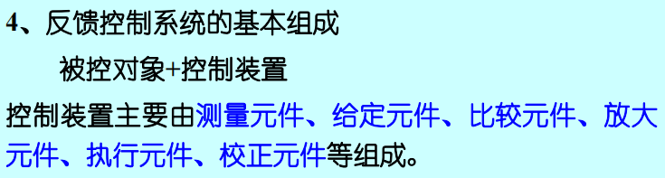
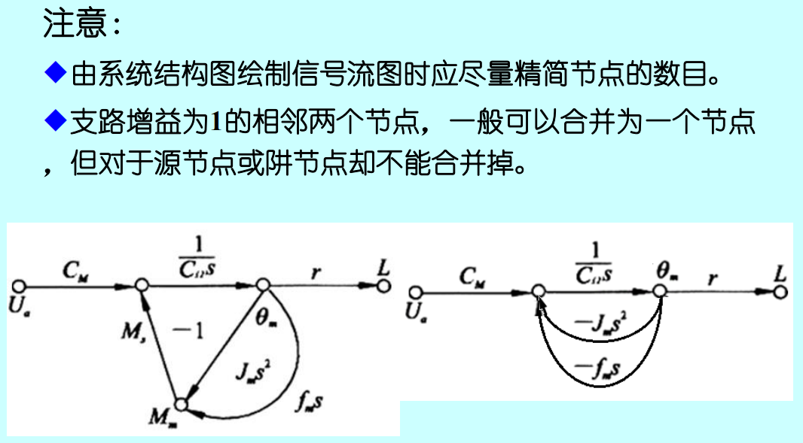
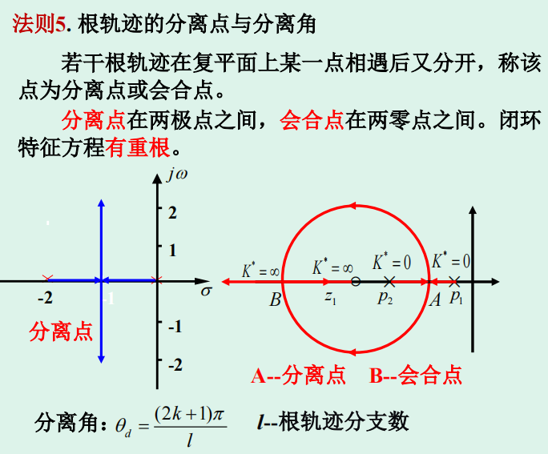
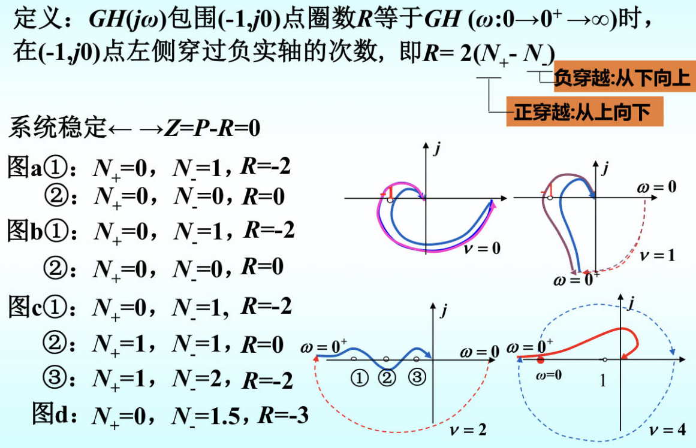
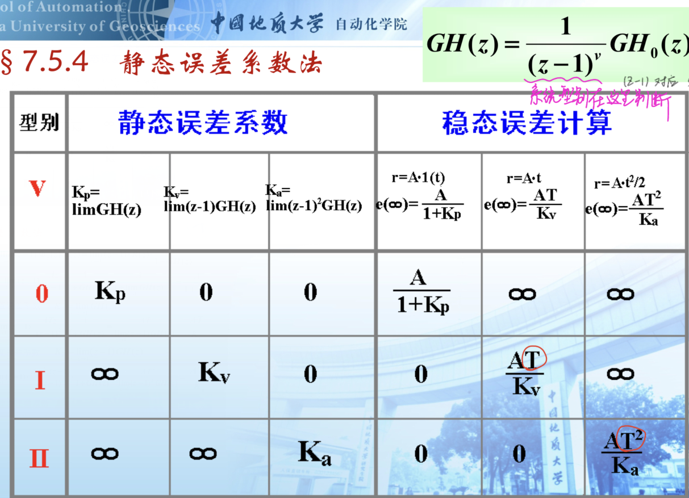

#### 考试须知

- 考试开始前快速浏览一遍试卷，估计一下每道题的计算量，考试时先挑计算量小的题先做
- 遇到特别棘手的题先放一放（比如计算量很大的题）
- 名词解释大概花10~15分钟
- 一共七道大题，每题大概15分钟，共105分钟
- 考试一共120分钟

运算量比较大的题目：

- 稳定裕度的计算（穿越频率--幅值裕度，截止频率--相角裕度）

- 根轨迹

- 离散系统的稳定性分析（涉及到z变换，朱利判据）

#### 复习思路

- 作业
- 例题
- 期间结合PPT内容整理知识点
- 针对特定题型总结和训练解题思路和方法
- 真题训练

## 概念总结

### 系统型别$\nu$

确定系统型别时，应根据[开环]()传递函数分母中$s$的次数决定$\nu$的值

### 开环增益$K$

将开环传递函数化为[尾一标准形式]()（例如对一阶系统：$\frac{K}{\tau s + 1}$，高阶系统满足类似要求），系数即为所求的开环增益

### 根轨迹增益$K^*$

开环传递函数，化为零极点形式（首1标准形）

## ==常用拉氏变换==

$$
L[1(t)] = \frac{1}{s} \quad (单位阶跃函数)\\
L[t] = \frac{1}{s^2} \quad (单位斜坡函数)\\
L[t^m] = \frac{m!}{s^{m + 1}} \\
L[\delta(t)] = 1 \quad (单位脉冲函数)\\
L[1(t) \cdot e^{at}] = \frac{1}{s - a} \quad\\
L[1(t) \cdot e^{-at}] = \frac{1}{s + a} \\
L[\sin\omega t] = \frac{\omega}{s^2 + \omega^2} \quad (正弦函数) \\
L[\cos\omega t] = \frac{s}{s^2 + \omega^2} \quad (余弦函数) \\
L[te^{-at}] = \frac{1}{(s + a)^2} \\
L[\frac{1}{2!}t^2e^{-at}] = \frac{1}{(s + a)^3} \\
L[\frac{1}{(m - 1)!}t^{m - 1}e^{-at}] = \frac{1}{(s + a)^m} \\
$$

### 积分定理

$$
L[\frac{dx(t)}{dt}] = sX(s) - x(0) \\
L[\frac{d^2x(t)}{dt^2}] = s^2X(s) - sx(0) - x'(0)
$$

若$x^{(n)}(0) = 0$，则有：
$$
L[\frac{d^nx(t)}{dt^n}] = s^nX(s)
$$

## 常用$z$变换

另见教材P315

| 拉氏变换$E(s)$                       | 时间函数$e(t)$        | $z$变换$E(z)$                      |
|:--------------------------------:|:-----------------:|:--------------------------------:|
| $e^{-nTs}$                       | $\delta(t - nT)$  | $z^{-n}$                         |
| $1$                              | $\delta(t)$       | $1$                              |
| $\frac{1}{s}$                    | $1(t)$            | $\frac{z}{z - 1}$                |
| $\frac{1}{s^2}$                  | $t$               | $\frac{Tz}{(z - 1)^2}$           |
| $\frac{1}{s^3}$                  | $\frac{1}{2!}t^2$ | $\frac{T^2z(z + 1)}{2(z - 1)^3}$ |
| $\frac{1}{s - \frac{1}{T}\ln a}$ | $a^{\frac{t}{T}}$ | $\frac{z}{z - a}$                |
| $\frac{1}{s + a}$                | $e^{-at}$         | $\frac{z}{z - e^{-aT}}$          |

$$
\begin{aligned}
\delta(t) \quad & \rightarrow \quad 1 \\
1(t) \quad & \rightarrow \quad  \frac{z}{z - 1} \\
\delta_T(t) \quad & \rightarrow \quad  \frac{z}{z - 1} \\
t \quad & \rightarrow \quad  \frac{Tz}{(z - 1)^2} \\
a^{\frac{t}{T}} \quad & \rightarrow \quad \frac{z}{z - a} \\
e^{-at} \quad & \rightarrow \quad  \frac{z}{z - e^{-aT}} \\
sin\omega t \quad & \rightarrow \quad \frac{z\sin\omega T}{z^2 - 2\cos\omega T + 1} \\
\cos\omega t \quad & \rightarrow \quad  \frac{z(z - \cos\omega T)}{z^2 - 2\cos\omega T + 1} \\
\end{aligned}
$$

==注== 关于$ZOH$的变换
$$
Z[\frac{1 - e^{-Ts}}{s} \cdot G(s)] = (1 - z^{-1}) \cdot Z[\frac{1}{s} \cdot G(s)]
$$

### ==重要== z变换的基本定理

- 延迟定理的理解：$z^{-n}$对应延迟n拍

## 重要公式

### $z$变换定义及相关公式

$$
z^{-1} = e^{-Ts} \\
E(z) = Z[e^*(t)] = E^*(s)|_{z = e^{Ts}} = \sum^{\infty}_{n = 0}e(nT) \cdot z^{-n}
$$

$$
e^*(t) = \sum^{\infty}_{n = 0} e(nT) \cdot \delta(t - nT) \\
E^*(s) = \sum^{\infty}_{n = 0} e(nT) \cdot e^{-nTs}
$$

事实上有：
$$
E^*(s) = L[e^*(t)] \\
L[\delta(t - nT)] = e^{-nTs}
$$

和
$$
E(z) = Z[e*(t)] \\
Z[\delta(t - nT)] = z^{-n}
$$

### 欠阻尼二阶系统的时域响应公式（了解即可）

$$
\begin{aligned}
c(t) &= 1 - \frac{e^{-\zeta\omega_nt}}{\sqrt{1 - \zeta^2}}\sin(\omega_n\sqrt{1 - \zeta^2} \cdot t + \arctan\frac{\sqrt{1 - \zeta^2}}{\zeta}) \\
&= 1 - \frac{e^{-\zeta\omega_nt}}{\sqrt{1 - \zeta^2}}\sin(\omega_d t + \beta) \\
\end{aligned}
$$

# 重要知识点

- 稳态误差的计算 ==必考==
- 阻尼比$\xi$对特征根的分布及稳定性的影响 ==记忆==
- 标准二阶系统欠阻尼过程性能指标计算 ==记住公式== （第三章PPT67）
- 常规根轨迹（起始角不作要求）（模值条件，相角条件）
- 稳定裕度
- 离散系统的稳定性和稳态误差
- 描述函数法

### 赫尔维茨稳定判据

## 时域动态性能指标

### 超调量$\sigma \%$

$$
\sigma = e^{-\pi\zeta / \sqrt{1 - \zeta^2}} \times 100\%
$$

反过来还可以计算得出阻尼比$\xi$：
$$
\zeta = \frac{\ln(1/\sigma)}{\sqrt{\pi^2 + (\ln(1/\sigma))^2}}
$$

==注== 超调量有时也写作$M_p$，别把它和谐振峰值$M_r$搞混了

### 峰值时间$t_p$

$$
t_p = \frac{\pi}{\omega_d} = \frac{\pi}{\omega_n\sqrt{1 - \zeta^2}}
$$

也可以得到自然频率$\omega_n$：
$$
\omega_n = \frac{\pi}{t_p\sqrt{1 - \zeta^2}}
$$

### 上升时间$t_r$

$$
t_r = \frac{\pi - \beta}{\omega_d} \\
\beta = \arctan\frac{\sqrt{1 - \zeta^2}}{\zeta} = \arccos\zeta \\
\quad \omega_d = \omega_n\sqrt{1 - \zeta^2}
$$

### 调节时间$t_s$

$$
t_s = 
\begin{cases}
\frac{3.5}{\zeta\omega_n}, \quad \Delta = \pm5\% \\
\\
\frac{4.4}{\zeta\omega_n}, \quad \Delta = \pm2\%
\end{cases} \quad \quad 
(0 < \zeta < 0.8)
$$

### 谐振峰值$M_r$

$$
M_r = \frac{1}{2\zeta\sqrt{1 - \zeta^2}}
$$

## 静态误差系数法

## $\xi$对特征根的分布及稳定性的影响 ==记住==

# 基本概念（名词解释） ==重点关注==

## 1. 控制系统的一般概念

- 自动控制：指在没有人直接参与的情况下，利用外加的设备或装置（[控制装置或控制器]()），使机器、设备或生产过程（统称[被控对象]()）的某个工作状态或参数（即[被控量]()）自动地按照[预定的规律]()运行。

- ==背== 自动控制系统：为了实现各种复杂的控制任务，将[被控对象和控制装置]()按照一定的方式连接起来，组成一个有机总体。

- ==背== 被控量：被控对象的输出量，是严格要求加以控制的物理量。

- ==背== 控制装置：是对被控对象[施加控制作用]()的机构的总体，可以采用不同的原理和方式对被控对象进行控制，最基本的是基于[反馈控制原理]()组成的反馈控制系统。

- ==背== ==反馈控制原理==：在反馈控制系统中，控制装置对被控对象施加的控制作用，取自被控量的反馈信息，用来不断修正被控量与输入量之间的[偏差]()，从而实现对被控对象进行控制的任务。

- 反馈：把输出量送回到输入端，并与输入信号相比较产生偏差信号的过程，称为反馈。

- 负反馈：若反馈的信号是与输入信号相减，使产生的偏差越来越小，则称之为负反馈；反之，则称为正反馈。

- 反馈控制：采用负反馈并[利用偏差进行控制]()的过程，也称为按偏差的控制。由于引入了被控量的反馈信息，整个控制过程成为闭合过程，因此反馈过程也称闭环控制。

- 反馈控制系统的基本组成：被控对象 + 控制装置

控制装置主要由[测量元件]()、[给定元件]()、[比较元件]()、[放大元件]()、[执行元件]()、[校正元件]()组成。

测量元件：检测被控制的物理量

给定元件：给出与期望的被控量相对应的系统输入量

比较元件：把测量元件检测的被控量实际值与给定元件给出的输入量进行比较，求出偏差

放大元件：将比较元件给出的偏差信号放大，用来推动执行元件控制被控对象

执行元件：直接推动被控对象，使其被控量发生变化

校正元件：也称补偿元件，是结构或参数便于调整的元部件，用串联或反馈的方式连接在系统中，以改善系统的性能

- 反馈系统的两种外作用：

有用输入：决定系统被控量的变化规律

扰动：系统不希望的外作用，破坏有用输入对系统的控制

- 开环控制系统：控制装置与被控对象之间[只有顺向作用]()而[没有反向联系]()的控制过程，按这种方式组成的系统称为开环控制系统。

- 复合控制方式：把按偏差控制与按扰动控制结合起来。对于[主要扰动]()采用适当的[补偿装置]()实现[按扰动控制]()；再组成反馈控制系统实现[按偏差控制]()，以消除其余扰动产生的偏差。

- 自动控制系统：不需要人工直接参与，利用控制装置，使被控对象自动地按预定的要求（运行规律）运行的系统（自动调节）。

- ==重要== 自动控制系统的基本要求（稳、准、快）：稳定性、快速性、准确性

- 相似系统：不同类型的元件或系统可具有形式相同的数学模型，称为相似系统。

## 2. 控制系统的数学模型

- 传递函数的定义：对于线性定常系统，在零初始条件下，系统输出的拉氏变换与输入拉氏变换之比
- 稳态过程：指时间趋于无穷大时，系统输出状态的表现形式。它表征系统输出量最终复现输入量的程度。

## 3. 线性系统的时域分析法

- 超调量$\sigma$：响应的最大偏离量和终值的差与终值比的百分数
- 峰值时间$t_p$：系统输出量超过稳态值达到第一个峰值所需的时间
- 上升时间$t_r$：响应从终值的$10\%$上升到终值的$90\%$所需的时间
- 调节时间$t_s$：响应到达并保持在终值$\pm5\%,\ \pm2\%$以内所需的最短时间
- 主导极点：在时间响应过程中起主导作用的极点。如果系统闭环极点中有一个极点或一对复数极点离虚轴最近且附近没有其他闭环极点，则它在相应过程中起主导作用，称为主导极点。

## 4. 线性系统的根轨迹法

## 5. 线性系统的频域分析法

- 相角裕度$\gamma$：对闭环稳定系统，如果系统的开环相频特性再滞后$\gamma$度，则系统将处于临界稳定状态
- 幅值裕度$h$：对闭环稳定系统，如果系统的开环幅频特性再增大$h$倍，则系统将处于临界稳定状态

对最小相位系统而言，当幅值裕度和相角裕度都是正值时，系统才是稳定的。

- 系统的相频特性：指输入、输出正弦信号相位差与频率的关系
- 系统的幅频特性：指输入、输出正弦信号幅值比与频率的关系

## 6. 线性系统的校正方法

- 系统校正：为了使系统达到我们的要求，给系统加入特定的环节，这个过程叫做系统校正

（PPT上的定义）在系统中按某种方式，引入一些参数可调的机构或装置，使整个系统的特性能按需要改变，从而满足给定的各项性能指标

- 在系统中附加一些装置改变系统的结构，从而提高系统的性能
- 超前校正的作用：利用相角超前特性提高系统的截止频率与相角裕度，从而减少超调量，还可以提高系统的动态特性，但不利于抗高频干扰能力
- 滞后校正的作用：利用高频衰减特性减小系统的截止频率，提高相角裕度，从而减少超调量，还可以抑制高频噪声，但不利于系统的快速性
- PID控制器：具有比例-微分-积分控制规律的控制器，包含一个比例、积分和微分环节

## 7. 线性离散系统的分析与校正

- 连续系统：如果控制系统中所有的信号都是时间变量的函数，一旦函数关系确定以后，则全部时间上的函数值都是可以确定的，这样的系统称为连续系统
- 离散系统：如果控制系统中有至少一处信号是脉冲串或数码，这些信号仅定义在离散时间上，这样的系统称为离散系统
- 脉冲传递函数：零初始条件下离散系统输出$z$变换对输入$z$变换之比
- 零阶保持器：将离散信号恢复到相应的连续信号的环节，把采样时刻的采样值恒定不变地保持到下一采样时刻

## 8. 非线性控制系统分析

# ==重要== 解题方法与步骤

- 计算传递函数优先考虑[梅森增益公式]()

## 1. 自动控制的一般概念

### 系统方块图的绘制

#### 反馈控制系统的基本组成

要点：

- 被控对象 + 被控量
- 给定量（希望值）
- 控制装置，主要关注：
1. 测量元件（一般构成反馈回路，注意反馈的极性）
2. 放大元件（电压放大，功率放大）
3. 执行元件（常见的有电机 + 减速器）

==注== 系统工作原理从简阐述即可，不要写太多

## 2. 控制系统的数学模型

### 求系统的微分方程

建立环节微分方程的步骤：

1. 确定输入输出量
2. 根据条件写出关系方程式
3. 整理成标准形式：

左边为输出，右边为输入，按降幂排列。

### 拉氏变换的应用

给定某个输入下的输出响应（时域），求系统的传递函数（频域）和其他类型输入（用频域计算）时的输出响应（转换为时域）。

时域-频域的转换需要应用拉氏变换。

### 给出系统传递函数，求非零初始条件下某类型输入的输出响应

==注意== 传递函数的定义前提是[零初始条件]()。若给出的初始条件非零，则需要进行相应的转换

1. 利用传递函数（注意[传递函数的前提一定是零初始条件]()）得到时域方程（微分方程）

具体操作：
$$
s^2C(s) \quad \rightarrow \quad c''(t) \\
sC(s) \quad \rightarrow \quad c'(t) \\
C(s) \quad \rightarrow \quad c(t) \\
因为 \ c''(0) = c'(0) = c(0) = 0
$$
$R(s)$亦同理。

2. 对微分方程作拉氏变换

具体操作：
$$
c''(t) \quad \rightarrow \quad s^2C(s) - sc(0) - c'(0) \\
c'(t) \quad \rightarrow \quad sC(s) - c(0) \\
c(t) \quad \rightarrow \quad C(s)
$$

3. 将非零初始条件代入

也就是题目给定的$c'(0),\ c(0)$

4. 整理得到给定初始条件下的传递函数$G'(s)$
5. 计算得到指定输入的输出响应：$C(s) = G'(s) \cdot R(s)$

==注== 留意 零输入响应 出现的情况。

### 给定系统结构图，求传递函数 ==梅森公式==

有两种解法：

方法1：梅森增益公式：优先选用

应用梅森增益公式需配合信号流图（熟练的话可以跳过，但是可以算点步骤分）。

然后就是套公式了（[这个要练！]()）

1. 确定前向通道的数量$n$
2. 确定前向通道的增益$p_1,\ p_2,\ ...$
3. 确定单独回路的数量和增益$L_1,\ L_2,\ ...$
4. 确定特征式$\Delta = 1 - \sum L_a + \sum L_bL_c - \sum L_dL_eL_f + ...$

==注意== 留意系统中是否有[两两互不接触的回路]()

5. 确定子式$\Delta_k$

6. 计算总增益$P$：

$$
P = \frac{1}{\Delta}\sum_{k = 1}^n p_k\Delta_k
$$

方法2：结构图化简（等效变换）：建议当题目明确要求使用该方法时才用

注意：

- 看清楚反馈的极性（正/负反馈）
- 经常会见到反馈连接方框，注意它的传递函数：

### 给定系统结构图，分别求响应对输入的传递函数/对干扰的传递函数

- 求响应对输入$R(s)$的传递函数，则令干扰信号$N(s)$为零
- 求响应对干扰$N(s)$的传递函数，则令输入信号$R(s)$为零

## 3. 线性系统的时域分析法

==注意==

- 系统的特征方程对应的是系统[闭环传递函数]()的分母为零

### 利用劳斯判据确定系统的稳定性

1. 列劳斯表
2. 分析第一列元素的符号有无改变
3. 符号改变次数等于系统正实部根的个数（有则不稳定）
4. 特殊情况的处理（出现全零行--有纯虚根）

### 利用劳斯判据求系统的虚根值

1. 求闭环特征方程$D(s) = 0$

2. 列劳斯表

3. 若遇到全零行，则根据上一行系数构造辅助方程，将求导后得到的方程系数重新填入全零行

4. 根据新的系数继续列完劳斯表

5. 对构造的辅助方程求根，得到的虚根值即为系统的虚根值

### 利用劳斯判据确定系统的参数范围

1. 得到闭环系统的传递函数
2. 得到闭环系统的特征方程：$D(z) = 0$，按[降幂]()排列
3. 劳斯表的前两行分别由特征方程的第$1, 3, 5, ...$项系数和$2,4,6$项系数组成（注意是降幂排列，第1项系数就是最高次项的系数）
4. 逐行计算得到数值，直到一行只剩下一个元素为止
5. 系统稳定的充要条件是劳斯表第一列元素全为正数

### ==求系统的稳态误差==

==注意== 求系统稳态误差前[必须考察系统的稳定性]()

计算系统的稳态误差有两种方法：

方法1：根据稳态误差的定义计算（这个方法比较保险）

1. 计算误差传递函数$\varPhi_e(s)$
2. 根据终值定理计算稳态误差：

$$
\begin{aligned}
e_{ss}(\infty) &= \lim_{s \rightarrow 0}s \cdot E(s) \\
&= \lim_{s \rightarrow 0} s \cdot \varPhi_e(s)R(s)
\end{aligned}
$$

方法2：==记忆== 输入信号作用下的稳态误差表（能记住最好，尽量记）

## 4. 线性系统的根轨迹法

### 给出开环传递函数，绘制系统根轨迹

1. 将开环传递函数化为首1形（[零极点形]()），得到[根轨迹增益]()

2. 确定根轨迹的[分支数]()（根据开环传递函数分母的阶数判断）

3. 确定每条分支的[起点和终点]()（起点--开环传递函数的极点，终点--零点或无穷远处）

4. 确定[实轴上的根轨迹]()范围（“奇是偶不是”）

5. 计算[分离点]()

试探法：
$$
\sum_{i = 1}^m \frac{1}{d - z_j} = \sum_{i = 1}^n \frac{1}{d - p_i}
$$
若系统无有限零点：
$$
\sum_{i = 1}^n \frac{1}{d - p_i} = 0
$$
所求得的$d$即为分离点。

6. 计算[虚轴交点]()（这里好像可以用劳斯判据）

有两种方法：

方法1：劳斯稳定判据（当某行出现全零时，特征方程可能出现纯虚根）

方法2：令$s = j\omega$（相当于虚轴上的根），代入[闭环特征方程]()$D(s) = 0$中，使$D(j\omega)$实部、虚部分别为零，求出$\omega,\ K^*$

7. 计算渐近线

$n$为极点个数，$m$为零点个数，当$n > m$时，$n - m$条根轨迹沿渐近线趋向无穷远处。

与实轴的交点：
$$
\sigma_a = \frac{\sum_{i = 1}^n p_i - \sum_{j = 1}^m z_j}{n - m}
$$
与实轴的夹角：
$$
\varphi_a = \frac{(2k + 1)\pi}{n - m} \\
k = 0,1,...,n - m - 1
$$
==注== 

- 只考察常规根轨迹，且起始角不作要求
- 根之和

## 5. 频率响应法

### 给出单位阶跃响应（一般是阶跃信号，时域），确定系统的频率特性

1. 对响应取拉氏变换
2. 结合响应/输入得到传递函数（当然是频域）
3. 得到频率特性（幅值$A(\omega)$ + 相角$\varphi(\omega)$，一般是频率$\omega$的函数）

### 给出开环传递函数$G(s)$，绘制概略开环幅相曲线（幅相曲线就是极坐标曲线）

1. 令$s = j\omega$，得到开环频率特性$G(j\omega)$
2. 计算起点$G(j0_+)$和终点$G(j\infty)$
3. 判断范围（象限），以及是否和坐标轴有交点

### ==必考== 给出传递函数，绘制对数幅频渐进特性曲线

1. 传递函数$G(s)$化为标准形（尾1，$Ts + 1$型），得到$G(j\omega)$
2. 确定开环增益$K$（注意要化为标准形式[尾1形]()，得到的才是开环增益！）
3. 确定系统型别$\nu$
4. 确定交接频率$\omega_1, \omega_2, ...$

交接频率的确定法：设
$$
G(s) = \frac{K}{(T_1s + 1)(T_2s + 1)}
$$
则有：
$$
\omega_1 = \frac{1}{T_1},\quad \omega_2 = \frac{1}{T_2}
$$

4. 由系统型别$\nu$确定[低频段斜率]()$-20 \cdot \nu \ dB/vec$：0型系统 - $0dB/dec$，$I$型系统 - $-20dB/dec$，$II$型系统 - $-40dB/dec$

5. 由开环增益$K$确定[起始点坐标]()：$L(\omega)\vert_{\omega = 1} = 20\lg K$，即曲线过点$(1,\ 20\lg K)$

确定起始点处的频率$\omega_0$时，还需要考虑到各交接频率的取值。如（6）的例子所示，当交接频率分别为$\omega_1 = 0.1,\ \omega_2 = 1$时，应选取$\omega_0 = 0.01$作为起始点处的频率为宜。

6. 确定每个交接频率处的$L(\omega)$（也就是确定交接点的坐标）

==注== 计算每个交接频率处的$L(\omega)$时，可以近似计算，只让对应环节的$\omega$项发挥作用，比如这个题：

7. 由各环节对应的交接频率和斜率变化量绘制对数幅频渐进特性曲线（惯性环节：$-20dB/dec$，微分环节：$20dB/dec$）

### 给出对数幅频渐进特性曲线，确定开环传递函数

==注意== 看清题目要求，若要求绘制Bode图则需要分别画出[幅频特性]()和[相频特性]()曲线

1. 确定系统型别$\nu$（根据起始斜率）
2. 确定各环节的类型和数量
3. 写出传递函数的表达式$G(s)$（一般还剩下开环增益$K$和交接频率需要确定）

一般可以将$G(s)$写为类似如下形式（具体环节数看题目，仅做示意）：
$$
G(s) = \frac{K(\frac{\omega}{\omega_1} + 1)}{(\frac{\omega}{\omega_2} + 1)(\frac{\omega}{\omega_3} + 1)}
$$
其中，$K, \omega_1, \omega_2, \omega_3$即为待定参数。

4. 根据图中所给其他条件确定剩余参数

开环增益$K$：关注起始点处的条件（如起始点的坐标，有时还会用到曲线起始部分的斜率）

交接频率：各环节交接点的横坐标

确定参数时还常常用到斜率

==注意== 若某交接点处渐近线斜率变化为$-40\ dB/dec$，则该处对应的环节为[二阶振荡环节]()：
$$
G(s) = \frac{1}{(s/\omega_0)^2 + 2\zeta(s/\omega_0) + 1}
$$
 其中$\omega_0$即为该环节的交接频率，下面介绍参数$\zeta$的确定方法：

谐振峰值$M_r$：
$$
M_r = \frac{1}{2\zeta\sqrt{1 - \zeta^2}}
$$
==注== 当$0 < \zeta < 0.707$时，才存在$M_r$。$M_r$的具体含义可参考下图：

即有：
$$
20\lg M_r = 20\lg\frac{1}{2\zeta\sqrt{1 - \zeta^2}}
$$

### ==稳定裕度的计算==

==注意== 稳定裕度一般针对开环传递函数

- 计算幅值裕度
1. 计算穿越频率$\omega_x$：$\varphi(\omega_x) = -180^\circ$

另外，还有一种特殊条件下的计算技巧：
$$
传递函数：G(s) = \frac{K}{s(T_1s + 1)(T_2s + 1)} \\
相角：\varphi(\omega) = -90^\circ - \arctan\omega T_1 - \arctan\omega T_2
$$
所以：
$$
\varphi(\omega_x) = -180^\circ \quad \Rightarrow \quad \arctan\omega T_1 + \arctan\omega T_2 = 90^\circ \\
\Downarrow \\
\frac{\omega T_1 + \omega T_2}{1 - T_1T_2\omega^2}\vert_{\omega = \omega_x} = \infty \\
\Downarrow \\
\omega_x = \frac{1}{\sqrt{T_1T_2}}
$$

2. 计算幅值裕度

$$
h = \frac{1}{\vert G(j\omega_x) \vert} \\
h(dB) = 20\lg h = -L(\omega_x)
$$

- 计算相角裕度
1. 计算截止频率$\omega_c$

有两种方法：

方法1：令$\vert G(j\omega_c) \vert = 1$（运算困难，一般放弃）

方法2：[分段函数法]()（保留主要部分的近似计算，老师认可，一定要掌握！）

先丢个示意图（凑合着看吧）：

2. 计算相角裕度

$$
\gamma = 180^\circ + \varphi(\omega_c)
$$

### 用奈氏判据确定系统稳定性（这个应该比较重要吧）

1. 根据[开环]()传递函数确定其右半平面的极点数$P$
2. 绘制开环幅相曲线$\omega:0 \rightarrow +\infty$，判断其[逆时针]()绕点$(-1,j0)$的圈数$N$（半圈算$\frac{1}{2}$）
3. 计算闭环传递函数右半平面的极点数：$Z = P - 2N$
4. 若$Z = 0$，则系统稳定

==注== 关于补圆：

### 用奈氏判据确定稳定条件下，参数的范围

求出奈氏曲线与实轴的交点，再根据公式$P = Z - 2N$具体讨论参数的取值范围。

## 6. 线性系统的校正方法

### ==必须掌握== 给出传递函数$G_0(s)$和串联校正装置$G_c(s)$的对数幅频渐进特性曲线，求系统的开环传递函数，并分析校正装置的作用

1. 由对数幅频渐进特性曲线分别得到$G_0(s),\ G_c(s)$
2. 串联校正：$G(s) = G_0(s) \cdot G_c(s)$
3. ==记忆== 校正方案分析（都是套路，背下来就行）
- 超前校正：利用[相角超前]()特性[提高截止频率$\omega_c$]()与相角裕度$\gamma$，从而减少超调量$\sigma\%$；还可以[提高系统的快速性]()，[改善动态性能]()，但抗高频干扰能力较弱。
- 滞后校正：利用[高频衰减]()特性[减小截止频率$\omega_c$]()，[提高相角裕度$\gamma$,]()，从而[减少超调量$\sigma\%$]()；还可以[抑制高频噪声]()，但不利于系统的快速性。
- 超前校正和滞后校正都可以提高相角裕度，减少超调量。

==注== 超前校正和滞后校正

- 超前校正

$$
G_c(s) = \frac{1 + aTs}{1 + Ts} \quad (a > 1)
$$

- 滞后校正

$$
G_c(s) = \frac{1 + bTs}{1 + Ts} \quad (b < 1)
$$

### 给定校正控制系统的结构图，根据条件求补偿/校正装置的传递函数$G_c(s)$

- 要求系统输出$C(s)$不受扰动$N(s)$的影响
1. 求出扰动$N(s)$到输出$C(s)$的传递函数$\varPhi_N(s)$（老师强烈推荐梅森公式，那就选它了）
2. 令$\varPhi_N(s) = 0$，一般可直接解出一个$G_{c1}(s)$
- 要求系统跟踪某类型指令的误差为零
1. 用梅森公式求出误差传递函数$e_{ss}$（一般可用某$G_{c2}(s)$表示）
2. 令$e_{ss} = 0$，即可求得$G_{c2}(s)$

## 7. 线性离散系统的分析与校正

### 求函数的$z$反变换

有3种方法：

方法1：部分分式法（推荐）

这里有一个计算技巧，先求得：
$$
\frac{E(z)}{z} = f(z) \quad (z的分式表达式)
$$
将$f(z)$进行部分分式展开后，得到$h(z)$，再将分子上的$z$乘过去：
$$
E(z) = z \cdot h(z)
$$
然后是$z$的反变换：
$$
e(t) = Z^{-1}[z \cdot h(z)]
$$
最后得到像$E(z)$的原像$e^*(t)$：
$$
e^*(t) = \sum^{\infty}_{n = 0}e(nT) \cdot \delta(t - nT)
$$
方法2：幂级数法（多项式长除法）

方法3：反演积分法（留数定理）

### 给出离散系统结构图，求脉冲传递函数（跟脉冲信号没关系，不要被骗了）

先贴个脉冲传递函数的定义吧：

脉冲传递函数定义为[零初始条件]()下离散系统[输出$z$变换]()对[输入$z$变换]()之比，即
$$
G(z) = \frac{C(z)}{R(z)}
$$
貌似没有固定的解题步骤，说说几点注意事项：

1. 若两个环节$G_1(s),\ G_2(s)$之间没有采样开关，则需要对$G_1(s) \cdot G_2(s)$整体进行$z$变换$Z[G_1(s) \cdot G_2(s)]$
2. 若两个环节$G_1(s),\ G_2(s)$之间存在采样开关，则需要对$G_1(s),\ G_2(s)$分别进行$z$变换$Z[G_1(s) ] \cdot Z[G_2(s)]$
3. 零阶保持器（$ZOH$）出现频率很高，这里给出它的传递函数（要记住！）：

$$
G(s)_{ZOH} = \frac{1 - e^{-Ts}}{s}
$$

关于$ZOH$的$z$变换还有一个计算技巧：
$$
Z[\frac{1 - e^{-Ts}}{s} \cdot G(s)] = (1 - z^{-1}) \cdot Z[\frac{1}{s} \cdot G(s)]
$$

### ==重点== 判断闭环离散系统的稳定性

有3种方法：

方法1：（充要条件）闭环系统$\varPhi(z)$的全部极点均位于$z$平面的单位圆内，即特征方程的所有特征根的模均小于1。

只需求出所有特征值，并判断所有特征根的模是否小于1.

方法2：$w$域的劳斯稳定判据（一般运算量较大，不建议）

1. 将$z = \frac{w + 1}{w - 1}$代入$z$域特征方程：$D(z)= 0$
2. 用$w$域的劳斯判据判断系统的稳定性

==另注== 在$w$域中判断系统的稳定性时，也可采用解出特征根，并判断特征根所在范围（存在实部根则系统不稳定，和时域分析一致）的方法

方法3：[朱利判据]()（建议使用）

1. （求闭环系统特征方程前最好先写出闭环传递函数），得到（闭环系统）特征方程：$D(z) = 0$（[升幂]()排列），特征方程的阶数记为$n$
2. 判断$D(1),\ D(-1)$是否满足：$D(1) > 0, \ (-1)^{n}D(-1) > 0$
3. 列出朱利阵列
4. 判断阵列是否满足条件：

### 求离散系统的稳态误差

1. 求误差脉冲传递函数
2. 得到闭环特征方程，判断系统稳定性（计算稳态误差前应先判断系统是否稳定）
3. 计算离散系统稳态误差：

$$
e_{ss}(\infty) = \lim_{z \rightarrow 1}(z - 1) \cdot R(z) \cdot \varPhi_e(z)
$$

==注== 静态误差系数法

## 8. 非线性控制系统分析

### 用奈氏判据确定系统的稳定性

### 用描述函数法确定系统是否存在自振，并确定参数

1. 由非线性部分的描述函数得到其负倒描述函数$\frac{-1}{N(A)}$
2. 分别绘制[幅相特性曲线]()：非线性部分的负倒描述函数$\frac{-1}{N(A)}$，线性部分$G(j\omega)$
3. 分析系统的稳定性（是否满足自振条件：1. 有交点；2. [穿出]()）
4. 由自振条件

$$
G(j\omega) = -\frac{1}{N(A)} \\
\Downarrow \\
幅值： \quad \vert G(j\omega) \vert = \vert \frac{1}{N(A)} \vert \\
相角： \quad \measuredangle G(j\omega) = -\pi - \measuredangle N(A)
$$

联立方程组即可解得自振参数。

### 给出非线性系统的结构图，分析周期运动稳定性，确定其振幅和频率

1. 结构图化简（如果需要的话）
2. 得到非线性和线性部分的传递函数
3. 绘制非线性部分负倒描述函数和线性部分的幅相特性曲线
4. 由奈氏判据分析稳定性
5. 求出自振点
6. 确定振荡的幅值和频率：

$$
G(j\omega) = -\frac{1}{N(A)} \\
\Downarrow \\
\quad \vert G(j\omega) \vert = \vert \frac{1}{N(A)} \vert \\
\quad \measuredangle G(j\omega) = -\pi - \measuredangle N(A) \\
\Downarrow \\
振荡幅值：A \\
振荡频率：\omega
$$

==注意== 关于自振振幅有两个容易混淆的量：

- $A$：[非线性环节输入端]()的自振振幅

- $A_c$：非线性[系统]()[输出量$c$]()的自振振幅

若自振频率为$\omega_0$，系统输出量$c$到非线性环节输入端的传递函数为$G(j\omega)$，则存在如下关系：
$$
A = \vert G(j\omega_0) \vert \cdot A_c
$$

# 第一章 自动控制的一般概念 ==方块图==

## 自动控制的基本原理与方式

### 基本概念

#### 自动控制

#### 反馈控制原理 ==记忆==

### 反馈控制系统的基本组成

### 开环控制与闭环控制的区别

## 自动控制系统示例（作方块图）

## 自动控制系统的分类

### 线性连续控制系统

### 线性定常离散控制系统

### 非线性控制系统

## 对自动控制系统的基本要求

### 基本要求

- 稳定性
- 快速性
- 准确性

#### 稳定性

#### 快速性

#### 准确性

### 典型外作用函数

#### 阶跃函数

#### 斜坡函数

#### 脉冲函数

#### 正弦函数

# 第二章 控制系统的数学模型

## 时域数学模型

### 建立环节微分方程的步骤

### 非线性微分方程的线性化

#### 列写元件微分方程的步骤

### 控制系统数学模型的建立

## 复数域数学模型

### 传递函数

==定义== 线性定常系统的传递函数，定义为[零初始条件]()下，系统输出量的拉氏变换与输入量的拉氏变换之比。

#### 传递函数的性质与定理

##### 线性性质

$$
L[ax_1(t) + bx_2(t)] = aX_1(s) + bX_2(s)
$$

##### 微分定理

$$
L[\frac{dx(t)}{dt}] = sX(s) - x(0) \\
L[\frac{d^2x(t)}{dt^2}] = s^2X(s) - sx(0) - x'(0)
$$

若$x^{(n)}(0) = 0$，则有：
$$
L[\frac{d^nx(t)}{dt^n}] = s^nX(s)
$$

##### 终值定理

#### 典型环节的传递函数

### ==常用的拉氏变换==

$$
L[1(t)] = \frac{1}{s} \quad (单位阶跃函数)\\
L[t] = \frac{1}{s^2} \quad (单位斜坡函数)\\
L[t^m] = \frac{m!}{s^{m + 1}} \\
L[\delta(t)] = 1 \quad (单位脉冲函数)\\
L[1(t) \cdot e^{at}] = \frac{1}{s - a} \quad\\
L[1(t) \cdot e^{-at}] = \frac{1}{s + a} \\
L[\sin\omega t] = \frac{\omega}{s^2 + \omega^2} \quad (正弦函数) \\
L[\cos\omega t] = \frac{s}{s^2 + \omega^2} \quad (余弦函数) \\
$$

#### 典型信号的拉氏变换

#### 部分分式展开法

## 控制系统的结构图与信号流图

### 结构图的等效变换与简化

#### 基本环节的变换

#### 结构图的化简

##### 结构图化简规则表

### 信号流图的组成与性质

#### 信号流图的基本性质

#### 信号流图的绘制

##### 由系统结构图绘制信号流图

### ==梅森增益公式==

## 闭环系统的传递函数

### 典型的反馈控制系统

# 第三章 线性系统的时域分析法

## 系统时间响应的性能指标

### 典型输入信号

### 动态过程与稳态过程

### 动态性能与稳态性能

#### 动态性能

==注意==

##### 动态性能指标

==注意== 常用的动态性能指标

- 上升时间$t_r$
- 调节时间$t_s$
- 超调量$\sigma \%$

#### 稳态性能

## 一阶系统的时域分析

### 一阶系统的数学模型

### 一阶系统的单位阶跃响应

#### 时间常数T的确定

将一阶系统的传递函数化为尾一标准形式（分母的常数项为1）：
$$
\frac{K}{Ts + 1}
$$
则s前的系数即为时间常数T

#### 单位阶跃响应

设系统传递函数：
$$
G(s) = \frac{1}{Ts + 1}
$$
输入信号（单位阶跃函数）：
$$
R(s) = \frac{1}{s}
$$
则一阶系统的单位阶跃响应：
$$
C(s) = G(s)R(s) = \frac{1}{Ts + 1}\frac{1}{s} = \frac{1}{s} - \frac{1}{s + \frac{1}{T}} \\
c(t) = 1 - e^{-\frac{t}{T}} \quad t \ge 0
$$
可利用初始斜率特性确定时间常数：
$$
\frac{dc(t)}{dt} \vert_{t = 0} = \frac{1}{T}
$$

##### 动态性能指标的计算

### 一阶系统的单位脉冲响应

### 一阶系统的单位斜坡响应

### 一阶系统的单位加速度响应

## 二阶系统的时域分析

### 二阶系统的数学模型

开环传递函数：
$$
G(s) = \frac{\omega_n^2}{s(s + 2\zeta\omega_n)}
$$
开环增益：
$$
K = \frac{\omega_n}{2\zeta}
$$
闭环传递函数：
$$
\Phi(s) = \frac{\omega_n^2}{s^2 + 2\zeta\omega_ns + \omega_n^2}
$$

- $\zeta$：阻尼比
- $\omega_n$：无阻尼自然频率

特征方程：

### 二阶系统的单位阶跃响应

#### $\zeta$对特征根的分布及稳定性的影响

### 欠阻尼二阶系统的动态过程分析

### 二阶系统性能的改善

## 高阶系统的时域分析

### 高阶系统闭环主导极点及其动态性能分析

## 线性系统的稳定性分析

### 稳定性的基本概念

### 线性系统稳定的充分必要条件

### 劳斯-赫尔维茨稳定判据

#### ==劳斯稳定判据==

- 线性系统稳定的必要条件

在线性闭环系统的特征方程中各项系数为正数

- 劳斯表的计算

- 根据劳斯表判断系统稳定性

#### ==赫尔维茨稳定判据==

### 劳斯稳定判据的特殊情况

- 若某行第一列元素为0，而该行元素不全为0时：将此0改为$\varepsilon$（大于零的微小量），继续运算
- 出现全零行时：用上一行元素组成辅助方程，将其对s求导一次，用新方程的系数代替全零行系数，之后继续运算。

==注== 出现全零行时，系统可能会出现一对纯虚根；或一对符号相反的实根；或两对实部符号相异、虚部相同的复根。对辅助方程求解可能得到位于虚轴上的根。

### 劳斯稳定判据的应用

## 线性系统的稳态误差计算

### 误差定义及稳态误差计算

==注意== 对稳定的系统研究稳态误差才有意义，所以计算稳态误差以系统稳定为前提

#### 按输入端定义的误差传递函数及稳态误差的计算

#### 计算稳态误差的一般方法

1. 判定系统的稳定性
2. 求误差传递函数：

$$
\Phi_e(s) = \frac{E(s)}{R(s)} \\
\Phi_{en}(s) = \frac{E(s)}{N(s)}
$$

==注== 可用梅森增益公式求解

3. 用终值定理求稳态误差：

$$
e_{ss} = \lim_{s \rightarrow 0}s[\Phi_e(s)R(s) + \Phi_{en}(s)N(s)]
$$

### 系统类型

设系统[开环传递函数]()：
$$
G(s)H(s) = \frac{K\prod_{i = 1}^{m}(\tau_is + 1)}{s^\nu \prod_{j = 1}^{n - \nu}(T_js + 1)} \quad (n \ge m)
$$

- $K$：开环增益
- $\tau_i, \ T_j$：一阶微分环节和惯性环节的时间常数
- $\nu$：开环传递函数包含的积分环节个数（即原点处开环极点的个数）

### 典型输入作用下的稳态误差及静态误差系数

- 静态位置误差系数$K_p$：

$$
K_p =  \lim_{s \rightarrow 0} G(s)H(s)\\
$$

- 静态速度误差系数$K_v$：

$$
K_v =  \lim_{s \rightarrow 0} s\cdot G(s)H(s)\\
$$

- 静态加速度误差系数$K_a$：

$$
K_a =  \lim_{s \rightarrow 0} s^2 \cdot G(s)H(s)\\
$$

==注== 影响$e_{ss}$的因素

- 系统自身的结构参数
- 外作用的类型（控制量，扰动量及作用点）
- 外作用的形式（阶跃、斜坡或加速度等）

- $K$：开环增益
- $K_p$：位置误差系数
- $K_v$：速度误差系数
- $K_a$：加速度误差系数
1. 当系统的型别确定时，稳态误差随着输入档次的提高而增加
2. 当输入的档次确定时，稳态误差随着系统型别的提高而降低
3. 当系统的型别和输入的档次对等时，稳态误差是一个非零的常值
4. 当系统的型别高而输入档次低，稳态误差全为0；当系统的型别低而输入档次高，稳态误差全为$\infty$

### 扰动作用下的稳态误差

# 第四章 线性系统的根轨迹法

### 开环极点、零点分布及其相应的根轨迹

==注== 在根轨迹图中，"$\times$"表示开环极点，"$\circ$"表示开环零点。粗线表示根轨迹，箭头表示某一参数增加的方向，"$\cdot$"表示根轨迹上的点

## 根轨迹法的基本概念

- n阶系统有n个根，有n条根轨迹分支
- [每条根轨迹的起点($Kg = 0$)位于开环极点]()处
- 每条根轨迹的终点($Kg = \infty$)或为开环零点处，或为无穷远处
- 重根点，称为分离点或汇合点

### 根轨迹增益

将系统的开环传递函数写为[首1标准形]()，得到的系数$K_g$称为（开环）系统的[根轨迹增益]()。（相对的，将系统的开环传递函数写为[尾1标准形]()，得到的系数$K$称为系统的[开环增益]()）

### 闭环零、极点与开环零、极点之间的关系

- 闭环系统根轨迹增益，等于开环系统前向通路根轨迹增益。对于单位反馈系统，闭环系统根轨迹增益就等于开环系统根轨迹增益。
- 闭环零点由开环前向通路传递函数的零点和反馈通路传递函数的极点所组成。对于单位反馈系统，闭环零点就是开环零点。[闭环零点不随根轨迹增益的改变而变化]()。

$$
闭环零点 = 前向通道开环零点 + 反馈通道开环极点
$$

- 闭环极点与开环零点、开环极点以及根轨迹增益$K^*$均有关

### 根轨迹与系统性能

#### 稳定性

#### 稳态性能

#### 动态性能

==注意==

- 过阻尼系统：闭环极点均位于[负实轴]()上
- 临界阻尼系统：闭环两个实极点重合
- 欠阻尼系统：闭环极点为一对共轭复数极点

### 根轨迹方程

系统开环传递函数：
$$
G(s)H(s) = \frac{K_g\Pi_{i = 1}^m(s - z_i)}{\Pi_{j = 1}^n(s - p_j)} \\
(零极点表达式)
$$
由闭环特征方程：
$$
1 + G(s)H(s) = 0
$$
得到系统的[根轨迹方程]()：
$$
\frac{\Pi_{i = 1}^m(s - z_i)}{\Pi_{j = 1}^n(s - p_j)} = \mp\frac{1}{K_g}
$$
式中$K_g$为系统的根轨迹增益，$z_i$为系统的开环零点，$p_j$为系统的开环极点，“-”对应负反馈（$180^\circ$根轨迹），“+”对应正反馈（$0^\circ$度根轨迹）。

由根轨迹方程可以得到模值条件和相角条件：
$$
模值条件：K^* \cdot \frac{\Pi_{i = 1}^m \vert s - z_i \vert}{\Pi_{j = 1}^n \vert s - p_j \vert} = 1 \\
相角条件：\sum_{j = 1}^m\measuredangle(s - z_j) - \sum_{i = 1}^n\measuredangle(s - p_i) = (2k + 1)\pi \\
(k = 0,\pm1,\pm2,...)
$$

## 根轨迹绘制的基本法则

### 绘制根轨迹的8个准则

#### 定理

若系统有2个开环极点，1个开环零点，且在复平面存在根轨迹，则复平面的根轨迹一定是[以该零点为圆心的圆弧]()。

#### 法则1 根轨迹的起点和终点

起点：对应n个开环极点$p_i$

终点：对应m个开环零点$z_j$

- 根轨迹起始于[开环极点]()，终止于[开环零点]()，若$n > m$，则有$n - m$条根轨迹终止于[无穷远处]()
- 若把有限数值零点称为有限零点，把无穷远处的点称为无限零点，可以说根轨迹起始于开环极点，必终止于开环零点

#### 法则2 根轨迹的分支数、对称性和连续性

- 根轨迹的分支数 = 系统阶数
- 根轨迹连续且对称于实轴

#### 法则3 实轴上根轨迹

从实轴上最右端的开环零点或极点向左算起，奇数开环零、极点到偶数开环零、极点之间的区域必定是根轨迹。

#### 法则4 根轨迹的渐近线

#### 法则5 根轨迹的分离点和分离角

##### 求取分离点的方法

###### 试探法（常用）

###### 极值法

$$
\frac{dK^*}{ds} = 0
$$

###### 牛顿余数定理法

#### 法则6 根轨迹的起始角和终止角

##### 起始角

- $\theta_{p_i}$：起点$p_i$的起始角
- $\varphi_{z_j p_i}$：开环零点$z_j$与开环极点$p_i$的连线和实轴的夹角
- $\theta_{p_j p_i}$：开环极点$p_j$与开环极点$p_i$的连线和实轴的夹角

##### 终止角

#### 法则7 根轨迹与虚轴的交点

#### 法则8 根之和

$n - m \ge 2$时，闭环根之和为常数

### 根轨迹作图步骤

1. 标注开环极点和零点（纵、横坐标用相同的比例尺）
2. 实轴上的根轨迹
3. $n - m$条渐近线
4. 根轨迹的起始角和终止角
5. 根轨迹与虚轴的焦点
6. 根轨迹的分离点

结合根轨迹的连续性、对称性、根轨迹的分支数、起始点和终点、根之和等性质画出根轨迹

# 第五章 频率响应法

## 频率特性

### 频率特性的基本概念

### 频率特性的描述方法

### 频率特性与传递函数的关系

### 频率特性的几何表示

#### 幅相频率特性曲线（幅相曲线，极坐标图）

#### 对数频率特性曲线（对数坐标图，波特图）

#### 对数幅相特性曲线（尼科尔斯图）

### 频率特性的数学表示法

## 典型环节与开环系统的频率特性

### 典型环节的幅相频率特性曲线

==注意== 惯性环节的幅相特性曲线为半圆

#### 振荡环节

$$
G(s) = \frac{\omega_n^2}{s^2 + 2\xi\omega_ns + \omega_n^2} = \frac{1}{(\frac{s}{\omega_n})^2 + 2\xi\frac{s}{\omega_n} + 1}
$$

闭环极点的取值范围：

幅相频率特性：

模值和相角：
$$
\vert G \vert = \frac{K}{\sqrt{[1 - \frac{\omega^2}{\omega_n^2}] + [2\xi\frac{\omega}{\omega_n}]^2}} \\
\measuredangle G = -\arctan\frac{2\xi\frac{\omega}{\omega_n}}{1 - \frac{\omega^2}{\omega_n^2}}
$$

谐振频率$\omega_r$和谐振峰值$M_r$：
$$
\omega_r = \omega_n\sqrt{1 - 2\xi^2} \\
M_r = \vert G(j\omega_r) \vert = \frac{1}{2\xi\sqrt{1 - \xi^2}}
$$

#### 利用s平面判断幅相特性曲线的变换趋势

其中，n为分母的阶数，m为分子的阶数。

### 最小相位系统与非最小相位系统

### 开环频率特性的绘制

#### 开环对数频率曲线（Bode图）的绘制

##### 顺序斜率法 ==重要==

==注== 顺序斜率法也可用来根据对数幅频曲线计算$G(s)$：

## ==重点== 频域稳定性判据

### 奈氏稳定判据

==注意==

- 此处绘制开环幅相曲线时，应注意[频率$\omega$的变换范围为$-\infty\ \rightarrow\ +\infty$]()。通常可以先画出$\omega:\ 0 \rightarrow +\infty$对应的开环幅相曲线，然后根据实轴画出对称的$\omega:\ -\infty \rightarrow 0$部分。
- 当奈氏曲线经过$(-1, j0)$时，系统恰好为临界稳定
- 关于补圆：

#### Nyquist判据的另一种形式（这个好像更好用一点）

==注== 这里的$N$也可以理解为$\omega: 0 \rightarrow +\infty$对应幅相特性曲线逆时针包围$(-1, j0)$的圈数。

### 奈氏判据在Bode图上的应用

### 对数频率特性稳定判据

## 稳定裕度

### 定义

#### 稳定裕度的物理意义

- 相角裕度的物理意义：系统在相角上距离临界稳定还具有的储备量
- 幅值裕度的物理意义：系统在增益上距离临界稳定还具有的储备量

#### 稳定裕度的计算

- 截止频率（或剪切频率）$\omega_c$，对应相角裕度$\gamma$
- 穿越频率（或相角交接频率）$\omega_x$，对应幅值裕度$h$

### $\gamma, h$在开环频率特性图上的表示

### 相对稳定性与对数幅频特性的关系

# 第六章 线性系统的校正方法

## 系统的设计与校正问题

### 系统设计与校正

#### 性能指标

#### 系统带宽$\omega_b$的确定

#### 校正方式

##### 串联校正

##### 反馈校正

##### 前馈校正

##### 复合校正

#### 基本控制规律

##### 比例（P）控制规律

##### 比例-微分（PD）控制规律

##### 积分（I）控制规律

##### 比例-积分（PI）控制规律

##### 比例-积分-微分（PID）控制规律

## 常用校正装置及其特性

### 无源校正网络

#### 无源超前网络（等效于PD控制器）

#### 无源滞后网络（等效于PI控制器）

#### 无源滞后-超前网络（等效于PID控制器）

### 有源校正网络

#### 有源比例（P）

#### 有源比例-微分（PD）

#### 有源比例-积分（PI）

#### 有源比例-积分-微分（PID）

### PID控制器

## 串联校正

### 频率响应法校正设计

### 串联校正

#### 串联超前校正

#### 串联滞后校正

#### 串联滞后-超前校正

## 复合校正

### 按扰动补偿的复合校正

### 按输入补偿的复合校正

# 第七章 线性离散系统的分析与校正 ==必有一道大题==

## 离散系统

### AD过程

### 计算过程

### DA过程

## 信号采样与保持

### 信号采样

- ==重要公式==

$$
e^*(t) = \sum^{\infty}_{n = 0} e(nT) \cdot \delta(t - nT) \\
E^*(s) = \sum^{\infty}_{n = 0} e(nT) \cdot e^{-nTs}
$$

- 傅氏变换

$$
E^*(s) = \frac{1}{T}\sum^{\infty}_{n = -\infty}E(s + jn\omega_s)
$$

- 比较

### 香农采样定理

信号完全复现的必要条件：
$$
\omega_s = \frac{2\pi}{T} > 2\omega_h \\
T < \frac{\pi}{\omega_h}
$$

### 零阶保持器

## z变换理论

### z变换定义

$$
z^{-1} = e^{-Ts} \\
E(z) = Z[e^*(t)] = E^*(s)|_{z = e^{Ts}} = \sum^{\infty}_{n = 0}e(nT) \cdot z^{-n}
$$

从时域上看，$z^{-1}$相当于延迟一拍，可看做一拍延迟因子

#### 常见函数的z变换

补充

| 拉氏变换$E(s)$                   | 时间函数$e(t)$       | z变换$E(z)$                              |
|:----------------------------:|:----------------:|:--------------------------------------:|
| $e^{-nsT}$                   | $\delta(t - nT)$ | $z^{-n}$                               |
| $1$                          | $\delta(t)$      | $1$                                    |
| $\frac{1}{s}$                | $1(t)$           | $\frac{z}{z - 1}$                      |
| $\frac{1}{s^2}$              | $t$              | $\frac{Tz}{(z - 1)^2}$                 |
| $\frac{1}{s^3}$              | $\frac{t^2}{2!}$ | $\frac{T^2z(z + 1)}{2(z - 1)^3}$       |
| $\frac{1}{s^4}$              | $\frac{t^3}{3!}$ | $\frac{T^3z(z^2 + 4z + 1)}{6(z -1)^4}$ |
| $\frac{1}{s + a}$            | $e^{-at}$        | $\frac{z}{z - e^{-aT}}$                |
| $\frac{1}{s - (1 / T)\ln a}$ | $a^{t / T}$      | $\frac{z}{z - a}$                      |

### ==重要== z变换的基本定理

- 延迟定理的理解：$z^{-n}$对应延迟n拍

### z反变换

### z变换的局限性

1. 只反映采样点上信息
2. 一定条件下连续信号在采样点处会有跳变

## 离散系统的数学模型

### 线性常系数差分方程及其解法

差分方程解法：

1. 迭代法
2. z变换法

### 复域数学模型--脉冲传递函数

#### 定义

零初始条件下离散系统输出z变换对输入z变换之比：
$$
G(z) = \frac{C(z)}{R(z)}
$$

#### 脉冲传递函数的性质

#### 脉冲传递函数的局限性

1. 原则上不反映非零初始条件下系统响应的全部信息
2. 一般只适合描述单输入单输出离散系统
3. 只适合用于描述线性定常离散系统

### 闭环系统脉冲传递函数$\varPhi(z)$

==注意== 求$\varPhi(s)$一般不能用Mason（梅森）公式

## 离散系统的稳定性与稳态误差

### 离散系统稳定的充要条件

$\varPhi(z)$的全部极点均位于$z$平面的单位圆内（即系统特征方程的所有特征根的模均小于1）

### 离散系统的稳定判据

#### w域中的劳斯稳定判据

##### $w$变换

$$
z = \frac{w + 1}{w - 1} \ \Harr \ w = \frac{z + 1}{z - 1}
$$

#### 朱利判据

### 计算稳态误差的一般方法

#### 静态误差系数法

# 第八章 非线性控制系统分析

## 用描述函数法分析非线性系统

### 一些基本概念

### 自振分析

### 小结

