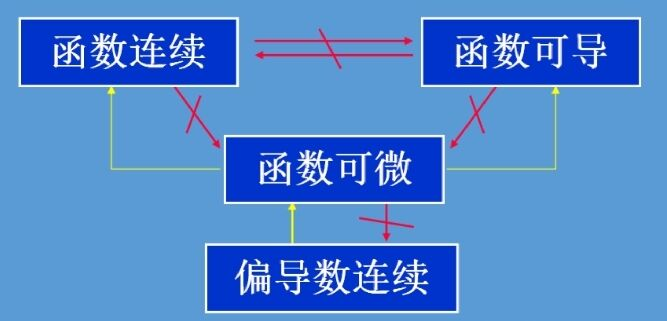
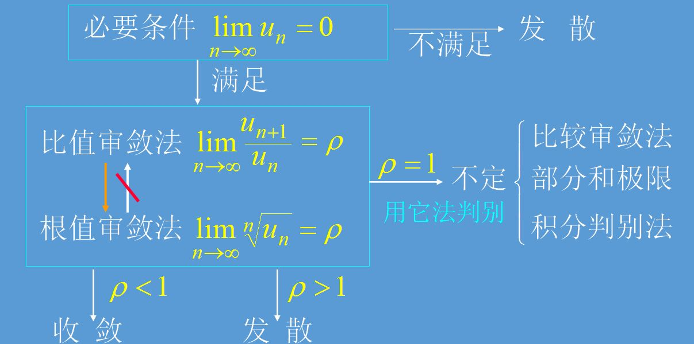
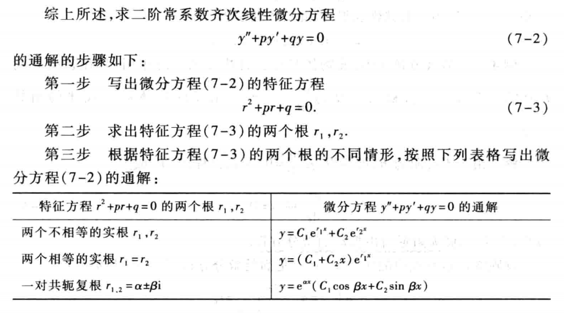
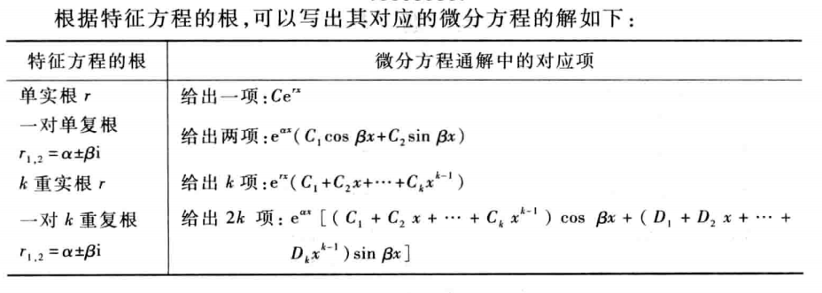

# 常用公式&结论

## 常用不定积分公式

$$
\int e^x\sin xdx = \frac{e^x}{2}(\sin x - \cos x) + C\\
\int e^x\cos xdx = \frac{e^x}{2}(\sin x + \cos x) + C
$$

$$
\int\frac{1}{x^2 - a^2}dx = \frac{1}{2a}\ln\vert \frac{x - a}{x + a} \vert + C
$$

$$
\int\frac{r^3}{\sqrt{a^2 - r^2}}dr = -\frac{1}{3}(2a^2 + r^2)\sqrt{a^2 - r^2} + C
$$

### 含三角函数的不定积分

$$
\int\sec\theta d\theta = \ln\vert\sec\theta + \tan\theta\vert + C
$$

$$
\int \sec^2\theta d\theta = \tan\theta + C
$$

$$
\int\sec^3\theta d\theta = \frac{1}{2}(\sec\theta\tan\theta + \ln\vert\sec\theta + \tan\theta\vert) + C
$$

$$
\int x\sin nxdx = -\frac{x}{n}\cos nx + \frac{1}{n^2}\sin nx + C
$$

### 含根号的不定积分

$$
\int\sqrt{x^2 + a^2}dx = \frac{x}{2}\sqrt{x^2 + a^2} + \frac{a^2}{2}\ln\vert x + \sqrt{x^2 + a^2} \vert + C
\\
\int\sqrt{x^2 - a^2}dx = \frac{x}{2}\sqrt{x^2 - a^2} - \frac{a^2}{2}\ln\vert x + \sqrt{x^2 - a^2} \vert + C
$$

为方便记忆，上述两式可合并写为：

$$
\int\sqrt{x^2 \pm a^2}dx = \frac{x}{2}\sqrt{x^2 \pm a^2} \pm \frac{a^2}{2}\ln\vert x + \sqrt{x^2 \pm a^2} \vert + C
$$

$$
\int\sqrt{a^2 - x^2}dx = \frac{x}{2}\sqrt{a^2 - x^2} + \frac{a^2}{2}\arcsin\frac{x}{a} + C
$$

## 常用公式

### 格林公式常用变换

在满足格林公式所需条件时，由格林公式有如下常用变换：

$$
\int xdy - ydx = \int 2dxdy\\
\int ydx - xdy = -\int 2dxdy
$$

还可以利用格林公式计算区域面积：

$$
S = \iint_Dd\sigma = \oint_Lxdy = \oint_L-ydx = \frac{1}{2}\oint_L xdy - ydx
$$

### 华里士(Wallis)公式

$$
\int_{0}^{\frac{\pi}{2}}\sin^nxdx = \int_{0}^{\frac{\pi}{2}}\cos^nxdx = 
\begin{cases}
\frac{(n-1)!!}{n!!}·\frac{\pi}{2},\quad n为偶数\\
\\
\frac{(n-1)!!}{n!!},\quad n为奇数
\end{cases}\\
$$

其结果可展开写成：

$$
\begin{cases}
\frac{n-1}{n}·\frac{n-3}{n-2}···\frac{3}{4}·\frac{1}{2}·\frac{\pi}{2},\quad n为偶数时\\
\\
\frac{n-1}{n}·\frac{n-3}{n-2}···\frac{4}{5}·\frac{2}{3}·1,\quad n为奇数时
\end{cases}
$$

### 雅克比行列式（积分坐标变换）

设有坐标系xoy，且有

$$
x = x(u,v),\\
y = y(u,v)
$$

则有如下积分坐标变换：

$$
dxdy = \vert J\vert dudv\\
J = 
\frac{\partial(x,y)}{\partial(u,v)} = 
\begin{vmatrix}
\frac{\partial x}{\partial u} & \frac{\partial x}{\partial v}\\
\frac{\partial y}{\partial u} & \frac{\partial y}{\partial v}
\end{vmatrix}
$$

注意雅克比行列式需要取**[绝对值]()**

### 常用积分坐标变换

#### 常用于椭圆的积分坐标变换

令：

$$
\frac{x^2}{a^2} + \frac{y^2}{b^2} = r^2
$$

可以得到x,y的参数表达式：

$$
\begin{cases}
x = ar\cos\theta\\
y = br\sin\theta
\end{cases}
$$

对应的积分坐标变换（利用雅克比行列式计算）为：

$$
dxdy = abr·drd\theta
$$

==例== 计算椭圆面积：
$$
\frac{x^2}{a^2} + \frac{y^2}{b^2} = 1
$$

$$
S = \int_{0}^{2\pi}d\theta\int_{0}^{1}abr·dr = \pi ab
$$

### 弧微分公式
- 直角坐标系

若给出曲线弧的参数方程：

$$
\begin{cases}
x = x(t)\\
y = y(t)
\end{cases}
$$

则弧微分表示为：

$$
ds = \sqrt{x_t'^2 + y_t'^2}dt
$$

- 极坐标系

若给出曲线弧的极坐标方程为：

$$
r = r(\theta)
$$

则弧微分表示为：

$$
ds = \sqrt{r'^2 + r^2}d\theta
$$

### 质心坐标公式
以x坐标为例：
$$
\overline{x} = \frac{\iiint_\Omega x\rho(x,y,z)dv}{\iiint_\Omega \rho(x,y,z)dv} = \frac{\iiint_\Omega x\rho(x,y,z)dv}{M}\\
其中，M为物体质量
$$

### 转动惯量公式
以x轴为旋转轴：
$$
I_x = \iiint_\Omega (y^2 + z^2)\rho(x,y,z)dv = \iiint_\Omega R^2\rho(x,y,z)dv\\
其中，R为物体上一点到旋转轴的距离
$$

### 二项式系数$C_n^k$

$$
C_n^k = \frac{n!}{k!(n-k)!}
$$

## 常用不等式

### 基本不等式扩展

$$
(\vert x\vert + \vert y\vert)^2 = x^2 + y^2 + 2\vert x\vert\vert y\vert\\
\leq 2(x^2 + y^2)\\
可推出：\\
\vert x\vert + \vert y\vert \leq \sqrt{2}\sqrt{x^2 + y^2}
$$

### 绝对值不等式

$$
\vert \vert a\vert - \vert b\vert\vert \leq
\vert a \pm b \vert \leq \vert a \vert + \vert b \vert
$$

### 与e有关的不等式

$$
(1+\frac{1}{x})^{x+1} > e \quad (x > 0)
$$

### 与对数有关的不等式

$$
当x充分大(>0)时，有\\
x > \ln^a x, \quad \frac{1}{x} < \frac{1}{\ln^a x}\\
(其中a为常数)
$$

## 常用极限公式

$$
\lim_{x \rightarrow 0}(1 + x)^{\frac{1}{x}} = \lim_{x \rightarrow \infty}(1 + \frac{1}{x})^x = e
$$

$$
\lim_{x \rightarrow 0}\frac{\sin x}{x} = 1
$$

$$
\lim_{x \rightarrow 0}x\ln x = 0
$$

$$
\lim_{n \rightarrow \infty}\sqrt[n]a = 1
$$

## 常用等价无穷小

$$
\ln(x + 1) \sim x \quad (x \rightarrow 0)\\
$$

$$
e^x - 1 \sim x \quad (x \rightarrow 0)
$$

$$
\sin x \sim x \quad (x \rightarrow 0)
$$

$$
1 - \cos x \sim \frac{x^2}{2} \quad (x \rightarrow 0)
$$

$$
\tan x \sim x \quad (x \rightarrow 0)
$$

$$
\arctan x \sim x \quad (x \rightarrow 0)
$$

## 常用三角公式

### 反三角变换

$$
\arcsin x + \arccos x = \frac{\pi}{2}
$$

$$
\arctan x - \arctan y = \arctan\frac{x-y}{1+xy}
$$

$$
\arctan x + \arctan\frac{1}{x} = \arctan x + arccot x = \frac{\pi}{2}
$$

### 微分

$$
(\csc\theta)' = -\csc\theta\cot\theta\\
(\cot\theta)' = -\csc^2\theta
$$

### 积分

$$
\int\sec\theta d\theta = \ln(\sec\theta + \tan\theta) + C\\
\int\csc\theta d\theta = \ln(\csc\theta - \cot\theta) + C
$$

## 常用结论

### 奇偶函数导数的性质

- 奇函数的导数是偶函数，偶函数的导数是奇函数。
- 若偶函数$f(x)$在$x=0$处可导，则$f'(0) =  0$（偶函数的导数为奇函数，且导数在x=0处有定义）。

证明：

$$
偶函数的导数为奇函数：\\
f(x) = f(-x) \quad\Rightarrow\quad f'(x) = -f'(-x) \\
奇函数的导数为偶函数：\\
f(x) = -f(-x) \quad\Rightarrow\quad f'(x) = f'(-x) \\
$$

### 平面两圆的公割线和空间两球面的公截面

- 对于平面中相交的两个圆：
  
  $$
  (x - a_1)^2 + (y - b_1)^2 = R_1^2\\
  (x - a_2)^2 + (y - b_2)^2 = R_2^2
  $$
  
  它们两交点的坐标满足如下方程组：
  
  $$
  \begin{cases}
  (x - a_1)^2 + (y - b_1)^2 = R_1^2\\
  (x - a_2)^2 + (y - b_2)^2 = R_2^2
  \end{cases}
  $$
  
  将两式相减，得到的方程代入交点坐标后仍然成立，该方程整理后有如下形式：
  
  $$
  Ax + By + C = 0 \quad\quad(1)
  $$
  
  易知(1)式表示平面坐标系中的一条直线，且经过两圆的两个交点，由两点确定一条直线可以知道，(1)式即两圆的公割线。

- 对于空间中相交的两个球面：
  
  $$
  (x - a_1)^2 + (y - b_1)^2 + (z - c_1) = R_1^2\\
  (x - a_2)^2 + (y - b_2)^2 + (z - c_2) = R_2^2
  $$
  
  它们截面圆上任意点的坐标满足如下方程组：
  
  $$
  \begin{cases}
  (x - a_1)^2 + (y - b_1)^2 + (z - c_1) = R_1^2\\
  (x - a_2)^2 + (y - b_2)^2 + (z - c_2) = R_2^2
  \end{cases}
  $$
  
  将两式相减，得到的方程代入截面圆上任意点的坐标后仍然成立，该方程整理后有如下形式：
  
  $$
  Ax + By + Cz + D = 0 \quad\quad (2)
  $$
  
  易知(2)式表示空间坐标系中的一个平面，且经过两球面的截面圆，则由空间中平面的确定方式可以知道，(2)式即两球面的公截面。

## 常用二级结论

### 椭圆的面积

对于椭圆：

$$
\frac{x^2}{a^2} + \frac{y^2}{b^2} = 1
$$

其所围面积为：

$$
S = \pi ab
$$

### 椭球的体积

对于椭球面：

$$
\frac{x^2}{a^2} + \frac{y^2}{b^2} + \frac{z^2}{c^2} = 1
$$

其所围的椭球体的体积为：

$$
V = \frac{4}{3}\pi abc
$$

### 椭圆的切线斜率

对于椭圆：

$$
\frac{x^2}{a^2} + \frac{y^2}{b^2} = 1
$$

其上一点$P(x_0,y_0)$处的切线斜率为：

$$
k = -\frac{b^2x_0}{a^2y_0}
$$

### 圆的切线斜率

对于圆：

$$
(x-a)^2 + (y-b)^2 = r^2
$$

其上一点$P(x_0,y_0)$处的切线斜率为：

$$
k = -\frac{x-a}{y-b}
$$

### 椭球面的切平面方程

对于椭球面：

$$
\frac{x^2}{a^2} + \frac{y^2}{b^2} + \frac{z^2}{c^2} = 1
$$

其上一点$P(x_0,y_0)$处的切平面方程为：

$$
\frac{x_0x}{a^2} + \frac{y_0y}{b^2} + \frac{z_0z}{c^2} = 1
$$

### 空间一点到平面的距离

空间一点$P(x_0,y_0)$到平面

$$
Ax + By + Cz + D = 0
$$

的最短距离为：

$$
d = \frac{\vert Ax_0 + By_0 + Cz_0 + D\vert}{\sqrt{A^2+B^2+C^2}}
$$

### 圆环曲面的面积
对于由平面曲线L$(x - a)^2 + y^2 = b^2,(a > b > 0)$绕y轴形成的圆环曲面，其表面积等于底面半径为b，高为a的圆柱体的侧表面积，即：

$$
S = 2\pi b · 2\pi a = 4\pi^2ab
$$

现利用积分的方式进行求解，对于平面曲线L，设其参数方程如下：

$$
\begin{cases}
x = b\cos\theta + a\\
y = b\sin\theta
\end{cases}\quad\quad 
\theta : 0 \rightarrow 2\pi
$$

在曲线上任取一条微弧ds，其绕y轴旋转一圈后形成的面积微元为：

$$
dS = 2\pi x ds = 2\pi (b\cos\theta + a) · bd\theta
$$

故圆环曲面经积分后可得到：

$$
S = \int_{0}^{2\pi} 2\pi(b\cos\theta + a) · bd\theta = 4\pi^2 ab
$$

## 常用解题法
- 积分的轮换对称性（当积分区域满足轮换对称时可用）

# 函数、极限和导数

## 收敛数列的性质

#### 收敛数列的保号性

如果$\lim_{n\rightarrow \infty}x_n = a$，且$a > 0$（或$a < 0$），那么存在正整数$N$，当$n > N$时，都有$x_n > 0$（或$x_n < 0$）。

推论：
如果数列$\{a_n\}$从某项起有$x_n \geq 0$（或$x_n \leq 0$），且$\lim_{n \rightarrow \infty} = a$，那么$a \geq 0$（或$a \leq 0$ ）。

## 无穷小与函数极限的关系

定理：在自变量的同一变化过程$x\rightarrow x_0(或x\rightarrow \infty)$中，函数$f(x)$具有极限A的充分必要条件是

$$
f(x) = A + \alpha\\
$$

其中$\alpha$是无穷小.

## 高阶导数

### n阶导数的莱布尼兹公式

$$
(uv)^{(n)} = \sum_{k = 0}^{n}C_n^ku^{(n - k)}v^{(k)}
$$

### 典型初等函数的n阶导数

$$
(\sin x)^{(n)} = \sin(x + n·\frac{\pi}{2})\\
(\cos x)^{(n)} = \cos(x + n·\frac{\pi}{2})
$$

$$
[\ln(1+x)]^{(n)} = (-1)^{n-1}\frac{(n-1)!}{(1+x)^n}, \quad(n \geq 1)
$$

# 微分中值定理

## 介值定理

设函数$f(x)$在闭区间$[a,b]$上连续，且[在端点处取不同的函数值]()即：

$$
f(a) = A,\quad f(b) = B
$$

则对于A、B之间任意的一个数C，都有：

$$
f(\xi) = C,\xi \in (a,b)
$$

## 罗尔定理

条件：

$$
f(x) \in C[a,b]\cap D(a,b)（闭区间连续，开区间可导）\\
f(a) = f(b)
$$

结论：

$$
\exist \xi \in (a,b),\quad f'(\xi) = 0
$$

## 拉格朗日中值定理

条件：

$$
f(x) \in C[a,b]\cap D(a,b)（闭区间连续，开区间可导）
$$

结论：

$$
\exist \xi \in (a,b),\quad f(b) - f(a) = f'(\xi)(b - a)
$$

推论：

$$
对于f(x) \in C[a,b]\cap D(a,b)，若f'(x) \equiv 0，则有\\
f(x) = c（常数）
$$

## 柯西中值定理

条件：

$$
f(x),g(x) \in C[a,b]\cap D(a,b)（闭区间连续，开区间可导）,g(x) \ne 0
$$

结论：

$$
\exist \xi \in (a,b),\quad \\
\frac{f(b) - f(a)}{g(b) - g(a)} = \frac{f'(\xi)}{g'(\xi)}
$$

## 泰勒公式

### 泰勒中值定理1

若函数$f(x)$在点$x_0$处的某个邻域$U(x_0)$有[n]()阶导数，则对于任意$x\in U(x_0)$，有：

$$
f(x) = f(x_0) + f'(x_0)(x - x_0) + \frac{1}{2!}f''(x_0)(x - x_0)^2 + ... + \frac{1}{n!}f^{(n)}(x_0)(x - x_0)^n + R(x)\\
其中，R(x) = o((x - x_0)^n)
$$

### 泰勒中值定理2

若函数$f(x)$在点$x_0$处的某个邻域$U(x_0)$有[n+1]()阶导数，则对于任意$x\in U(x_0)$，有：

$$
f(x) = f(x_0) + f'(x_0)(x - x_0) + \frac{1}{2!}f''(x_0)(x - x_0)^2 + ... + \frac{1}{n!}f^{(n)}(x_0)(x - x_0)^n + R(x)\\
其中，R(x) = \frac{f^{(n+1)}(\xi)}{(n+1)!}(x - x_0)^{n+1}，\xi是介于x和x_0之间的某个值
$$

### 麦克劳林公式

令$x_0 = 0$，可以得到麦克劳林公式：

$$
f(x) = f(0) + f'(0)x + \frac{1}{2!}f''(0)x^2 + ... + \frac{1}{n!}f^{(n)}(0)x^n + o(x^n)
$$

# 定积分

## 定积分的性质

### 定积分的常用性质

若$f(x)$连续且为周期函数（周期为$T$），$a$为常数，则有

$$
\int_{a}^{a+T}f(x)dx = \int_{0}^{T}f(x)dx
$$

### 定积分常用不等式

$$
\vert \int_{a}^{b}f(x)dx \vert \leq \int_{a}^{b}\vert f(x) \vert dx \quad (a< b)
$$

## 含参变量积分的连续性定理

设区域D：$[a,b]\times[c,d]$，函数$f(x,y)$在区域D内连续，则含参变量积分：

$$
F(y) = \int_{a}^{b}f(x,y)dx
$$

在$[c,d]$上连续，即有：

$$
\forall y_0 \in [c,d],\\
\lim_{y \rightarrow y_0}F(y) = F(y_0) = \int_{a}^{b}f(x,y_0)dx
$$

# 多元函数微分学

## 可微、可导和连续

### 可微的定义

设二元函数$z = f(x,y)$在点$P_0 = (x_0,y_0)$的某个邻域内有定义，若函数在点$P_0$处的全增量

$$
\Delta z = f(x_0 + \Delta x,y_0 + \Delta y) - f(x_0,y_0)
$$

可以表示成为

$$
\Delta z = A\Delta x + B\Delta y + \omicron(\rho)
$$

其中A、B仅与$x_0、y_0$有关，而与$\Delta x、\Delta y$无关，$\rho = \sqrt{\Delta x^2 + \Delta y^2}$，则称函数在点$P_0$处可微，并称全增量的线性部分$A\Delta x + B\Delta y$为函数在点$P_0$处的全微分，记作

$$
dz = A\Delta x + B\Delta y
$$

## 多元复合函数求偏导（链式法则）

设函数$u = u(x,y),v = v(x,y)$在点$(x,y)$的偏导数存在，函数$z = f(u,v)$在相应于$(x,y)$的点$(u,v)$可微，则有

$$
\frac{\partial z}{\partial x} = \frac{\partial f}{\partial u}\frac{\partial u}{\partial x} + \frac{\partial f}{\partial v}\frac{\partial v}{\partial x},\\
\frac{\partial z}{\partial y} = \frac{\partial f}{\partial u}\frac{\partial u}{\partial y} + \frac{\partial f}{\partial v}\frac{\partial v}{\partial y}
$$

## 混合偏导数相等定理

如果函数$z = f(x,y)$的两个混合偏导数$\cfrac{\partial^2z}{\partial x\partial y},\cfrac{\partial^2z}{\partial y\partial x}$在区域D上连续（[充分条件]()），则在该区域上这两个二阶混合偏导数相等。

## 隐函数微分法

### 函数隐藏于方程组的情形

对于含有3个变量的方程组

$$
\begin{cases}
F(x,y,z) = 0,\\
G(x,y,z) = 0
\end{cases}\\
$$

以x为自变量，可以确定两个一元函数：

$$
y = y(x),\quad z = z(x)
$$

可以得到：

$$
y'(x) = -\frac{
\begin{vmatrix}
F_x&F_z\\
G_x&G_z
\end{vmatrix}
}{
\begin{vmatrix}
F_y&F_z\\
G_y&G_z
\end{vmatrix}
},\quad 
z'(x) = -\frac{
\begin{vmatrix}
F_y&F_x\\
G_y&G_x
\end{vmatrix}
}{
\begin{vmatrix}
F_y&F_z\\
G_y&G_z
\end{vmatrix}
}\\
其中，
\begin{vmatrix}
F_y&F_z\\
G_y&G_z
\end{vmatrix} \ne 0.\\
记J = \begin{vmatrix}
F_y&F_z\\
G_y&G_z
\end{vmatrix},由雅克比行列式，上述结果可改写为：\\
y'(x) = -\frac{1}{J}\frac{\partial(F,G)}{\partial(x,z)},\quad z'(x) = -\frac{1}{J}\frac{\partial(F,G)}{\partial(y,x)}\\
其中，J \ne 0.
$$

## 方向导数

设函数$u = f(x,y,z)$在点$P_0(x_0,y_0,z_0)$处可微，则函数$f(x,y,z)$在点$P_0$沿任一方向$l$的方向导数存在，且

$$
\frac{\partial f(P_0)}{\partial l} = f_x(x_0,y_0,z_0)\cos \alpha + f_y(x_0,y_0,z_0)\cos \beta + f_z(x_0,y_0,z_0)\cos \gamma,
$$

其中$cos\alpha,cos\beta,cos\gamma$是向量$l$的方向余弦。

## 梯度

定义：设函数$u = f(x,y,z)$在点$P_0(x_0,y_0,z_0)$处存在偏导数，则称向量

$$
f_x(x_0,y_0,z_0)\overrightarrow{i} + f_y(x_0,y_0,z_0)\overrightarrow{j} + f_z(x_0,y_0,z_0)\overrightarrow{k}
$$

为该函数在点$P_0$处的梯度向量，简称梯度，记作

$$
grad\ f_{P_0} = \nabla f_{P_0} = \{x_0,y_0,z_0\}_{P_0}.
$$

则方向导数的计算可表示为：

$$
\frac{\partial f(P_0)}{\partial l} = \{x_0,y_0,z_0\}_{P_0} · (cos\alpha,cos\beta,cos\gamma)\\
= grad\ f_{P_0} · \overrightarrow{l^0}
$$

这说明方向导数$\frac{\partial f}{\partial l}$是梯度$grad \ f$在方向$\overrightarrow{l}$上的投影，从而函数在梯度方向上变化最快（方向导数取得最大值），且最大变化率为梯度（向量）的模$\vert grad \ f\vert$。

## 散度

设有向量场：

$$
\vec{F} = P(x,y,z)\vec{i} + Q(x,y,z)\vec{j} + R(x,y,z)\vec{k}
$$

则其散度定义为：

$$
div(\vec{F}) = \frac{\partial P}{\partial x} + \frac{\partial Q}{\partial y} +  \frac{\partial R}{\partial z}
$$

散度通常也表示为：

$$
div{\vec{F}} = \nabla \vec{F}
$$

## 旋度

设有向量场：

$$
\vec{F} = P(x,y,z)\vec{i} + Q(x,y,z)\vec{j} + R(x,y,z)\vec{k}
$$

则其旋度定义为：

$$
rot\vec{F} = \nabla \times \vec{F}\\
=
(\frac{\partial R}{\partial y} - \frac{\partial Q}{\partial z})\vec{i} + 
(\frac{\partial P}{\partial z} - \frac{\partial R}{\partial x})\vec{j} + 
(\frac{\partial Q}{\partial x} - \frac{\partial P}{\partial y})\vec{k}
\\=
\begin{vmatrix}
\vec{i} & \vec{j} & \vec{k}\\
\frac{\partial}{\partial x} & \frac{\partial}{\partial y} & \frac{\partial}{\partial z}\\
P & Q & R
\end{vmatrix}
$$

设单位向量n：

$$
\vec{n} = \cos\alpha\vec{i} + \cos\beta\vec{j} + \cos\gamma\vec{k}
$$

则有：

$$
rot\vec{F}·\vec{n} =
\begin{vmatrix}
\cos\alpha & \cos\beta & \cos\gamma\\
\frac{\partial}{\partial x} & \frac{\partial}{\partial y} & \frac{\partial}{\partial z}\\
P & Q & R
\end{vmatrix}
$$

## 二元函数的极值判断

设函数$f(x,y)$在$(x_0,y_0)$的某个邻域内有定义且有连续的一阶和二阶偏导数，且在点$(x_0,y_0)$处有：

$$
f_x(x_0,y_0) = f_y(x_0,y_0) = 0
$$

令：

$$
f_{xx}(x,y) = A,\quad f_{xy}(x,y) = B,\quad f_{yy}(x,y) = C
$$

则函数$f(x,y)$在该点是否存在极值可由以下条件进行判断：

- $AC > B^2$，此时函数在该点存在极值，且当$A<0$时存在极大值，$A > 0$时存在极小值
- $AC < B^2$，无极值
- $AC = B^2$，无法判断是否存在极值，需另行讨论

## 多元函数微分学的几何应用

### 空间曲线的切向量

#### 参数形式

设曲线$\Gamma$的参数方程为：

$$
\begin{cases}
x = x(t)\\
y = y(t)\\
z = z(t)
\end{cases}
$$

则曲线在其上一点$P(x_0,y_0,z_0),(t = t_0)$处的一个切向量为：

$$
\vec{T} = \{x'(t_0),y'(t_0),z'(t_0) \}
$$

#### 标准形式

设曲线$\Gamma$的标准方程为：

$$
\begin{cases}
F(x,y,z) = 0\\
G(x,y,z) = 0
\end{cases}
$$

对方程两边求全微分，可以得到：

$$
\frac{dy}{dx} = \frac{1}{J}
\begin{vmatrix}
F_z & F_x\\
G_z & G_x
\end{vmatrix},\quad

\frac{dz}{dx} = \frac{1}{J}
\begin{vmatrix}
F_x & F_y\\
G_x & G_y
\end{vmatrix}\\

其中，J = 
\begin{vmatrix}
F_y & F_z\\
G_y & G_z
\end{vmatrix}
$$

由此可以得到曲线在其上一点$P(x_0,y_0,z_0)$处的一个切向量：

$$
\vec{T} = \{
\begin{vmatrix}
F_y & F_z\\
G_y & G_z
\end{vmatrix}_P,

\begin{vmatrix}
F_z & F_x\\
G_z & G_x
\end{vmatrix}_P

\begin{vmatrix}
F_x & F_y\\
G_x & G_y
\end{vmatrix}_P
\}
$$

### 平面曲线的切向量

设平面曲线L的方程为：

$$
F(x,y) = 0
$$

由隐函数求导法可以得到：

$$
\frac{dy}{dx} = -\frac{F_x}{F_y}
$$

则平面曲线在其上一点$P(x_0,y_0)$处的一个切向量可以表示为：

$$
\vec{T} = \{1,\frac{dy}{dx}\}_P = \{1,-\frac{F_x}{F_y}\}_P
$$

整理得到：

$$
\vec{T} = \{F_y,-F_x\}_P
$$

### 空间曲面的法向量

设空间曲面$\Sigma$的方程为：

$$
F(x,y,z) = 0
$$

则曲面在其上一点$P(x_0,y_0,z_0)$处的一个法向量为：

$$
\vec{n} = \{F_x,F_y,F_z\}_P
$$

# 重积分

## 二重积分的对称性（偶倍奇零）

设平面区域D关于x轴$x=0$对称，$D_1$为该平面区域在x轴一侧的部分，函数$f(x,y)$在区域D内可积，则有：

$$
\iint_{D}f(x,y)dxdy = 
\begin{cases}
0,\quad f(-x,y) = -f(x,y)\\
\\
2\iint_{D_1}f(x,y)dxdy,\quad f(-x,y) = f(x,y)
\end{cases}
$$

平面区域D关于y轴对称有同样的结论，对于三重积分、曲线曲面积分有类似的结论。

## 二重积分的轮换对称性

设平面区域D关于直线$l:y = x$对称，$D_1$为该平面区域在$l$一侧的部分，函数$f(x,y)$在区域D内可积，则有：

$$
\iint_{D}f(x,y)dxdy = 
\begin{cases}
0,\quad f(x,y) = -f(y,x),\\
\\
2\iint_{D_1}f(x,y)dxdy,\quad f(x,y) = f(y,x)
\end{cases}
$$

# 曲线曲面积分

<mark>注意</mark>

定积分和二重积分（也可以包括三重积分）具有“偶倍奇零”的性质，但曲面曲线积分则不一定具有这样的性质。

## 对弧长的曲线积分
### 对弧长的曲线积分的计算
给出一段曲线弧L：
$$
\begin{cases}
x = x(t)\\
y = y(t)\\
z = z(t)
\end{cases},\quad t: a \rightarrow b
$$
则有：
$$
\int_L f(x,y,z)ds = \int f(x(t),y(t),z(t))\sqrt{x_t^2 + y_t^2 + z_t^2}dt
$$

## 对面积的曲面积分
### 对面积的曲面积分的计算
给定一个曲面$\Sigma$：
$$
z = z(x,y)
$$
其在xoy面上的投影区域为D，则有：
$$
\iint_\Sigma f(x,y,z)dS = \iint_D f(x,y,z(x,y))\sqrt{1 + z_x^2 + z_y^2}dxdy
$$

## 对坐标的曲线积分
### 对坐标的曲线积分的计算
给出一段曲线弧L：
$$
\begin{cases}
x = x(t)\\
y = y(t)\\
z = z(t)
\end{cases},\quad t: a \rightarrow b
$$
则有：
$$
\int_L P(x,y,z)dx + Q(x,y,z)dy + R(x,y,z)dz \\= \int_a^b [P(x(t),y(t),z(t))x_t' + Q(x(t),y(t),z(t))y_t' + R(x(t),y(t),z(t))z_t']dt
$$

### 对弧长的曲线积分和对坐标的曲线积分之间的关系

$$
\int_L\vec{F}·d\vec{s} = \int_L\vec{F}·\vec{e_\tau}ds\\
\int_LPdx + Qdy = \int_L(P\cos\alpha + Q\cos\beta)ds
$$

### Green 公式

对于单连通区域和复连通区域D的边界曲线L，规定其正方向为：当沿边界行走时，区域D总在左边；与之相反的方向为负方向。

$$
Green公式\\
若函数P(x,y),Q(x,y)在平面闭区域D上具有连续的一阶偏导数，则有\\
\iint_{D}(\frac{\partial Q}{\partial x} - \frac{\partial P}{\partial y})dxdy = \oint_{L}P(x,y)dx + Q(x,y)dy,\\
这里L是D的边界曲线，取正方向.
$$

### 平面曲线积分与路径无关的条件

设D是平面单连通区域，函数$P(x,y),Q(x,y)$在区域D上有一阶连续偏导数，则下列四个条件等价：

1. 对于D内任意分段光滑的简单闭曲线L，有：

$$
\oint_LP(x,y)dx + Q(x,y)dy = 0
$$

2. 曲线积分

$$
\oint_LP(x,y)dx + Q(x,y)dy
$$

的值在[区域D]()内与路径L无关，而只与始点和终点有关。

==注意==：路径L只能在区域D内选取，而区域D必须满足函数$P(x,y),Q(x,y)$在其上有一阶连续偏导数。

3. 在D内存在二元函数$u(x,y)$，使得：

$$
d[u(x,y)] = P(x,y)dx + Q(x,y)dy
$$

此时可以求出函数$u(x,y)$：

$$
u(x,y) = \int_{(x_0,y_0)}^{(x,y)}P(x,y)dx + Q(x,y)dy = \int_{x_0}^{x}P(x,y_0)dx + \int_{y_0}^{y}Q(x,y)dy\\
其中，(x_0,y_0) \in D
$$

4. $\forall (x,y) \in D，满足\frac{\partial Q}{\partial x} = \frac{\partial P}{\partial y}$

## 对坐标的曲面积分
### 对坐标的曲面积分的计算
给定一个曲面$\Sigma$，其在xoy面上的投影区域为$D_{xy}$，则有：

$$
\iint_\Sigma R(x,y,z)dxdy = \iint_{D_{xy}}R(x,y,z(x,y))dxdy
$$
另外，计算对坐标的曲面积分时经常用到如下转换式：

$$
\frac{dxdy}{\cos\alpha} = \frac{dydz}{\cos\beta} = \frac{dzdx}{\cos\gamma} = dS\\
其中，\cos\alpha,\cos\beta,\cos\gamma为曲面法向量的方向余弦
$$

## Guass 公式

设空间区域$\Omega$ 由分片光滑的双侧封闭曲面S围成，若函数$P(x,y,z),Q(x,y,z),R(x,y,z)$在$\Omega$ 上具有一阶连续偏导数，则有：
$$
\iiint_{\Omega}(\frac{\partial P}{\partial x} + \frac{\partial Q}{\partial y} +\frac{\partial R}{\partial z})dxdydz \\= \oiint_{S}P(x,y,z)dy3dz + Q(x,y,z)dzdx + R(x,y,z)dxdy
$$
其中S取外侧。

## Stokes 公式

### 右手法则

对双侧曲面$S$的侧与其边界曲线$L$的方向作如下规定：

设有人站在$S$上指定的一侧，若沿$L$行走，指定的侧总在人的左方，则人前进的方向为边界线$L$的正向；反之为边界线$L$的负向。

### 斯托克斯 Stokes 公式

设光滑曲面$S$的边界$L$是按段光滑的连续曲线，若函数$P(x,y,z),Q(x,y,z),R(x,y,z)$在$S$（连同$L$）上具有一阶连续偏导数，则

$$
\iint_{S}(\frac{\partial R}{\partial y} - \frac{\partial Q}{\partial z})dydz + (\frac{\partial P}{\partial z} - \frac{\partial R}{\partial x})dzdx + (\frac{\partial Q}{\partial x} - \frac{\partial P}{\partial y})dxdy \\
= \oint_{L}P(x,y,z)dx + Q(x,y,z)dy + R(x,y,z)dz,
$$

其中$S$的侧与$L$的方向按**右手法则**确定。

# 无穷级数

## 数项级数的收敛与发散

### 数项级数收敛的定义

如果级数$\sum_{n=1}^{\infty}a_n$的部分和数列$\{S_n\}$有极限$S$，即

$$
\lim_{n \rightarrow \infty}S_n = S,
$$

则称无穷级数$\sum_{n=1}^{\infty}a_n$收敛，这时极限$S$叫做这级数的和。如果$\{S_n\}$没有极限，则称无穷级数$\sum_{n=1}^{\infty}a_n$发散。

==级数与数列的收敛关系== 根据数项级数收敛的定义可以得到级数与数列的收敛关系：对于一个收敛的正数数列$\{a_n \}$，设有：

### Cauchy 准则

级数$\sum_{n=1}^{\infty}a_n$收敛的充分必要条件是：$\forall \epsilon > 0,\exists N,\forall m,n > N, m > n$,有

$$
\vert a_{n+1}+a_{n+2}+...+a_m \vert < \epsilon
$$

### 收敛级数的性质

#### 性质1

若级数$\sum_{n=1}^{\infty}a_n$收敛，$k$为任一常数，则级数$\sum_{n=1}^{\infty}ka_n$也收敛，并且有

$$
\sum_{n=1}^{\infty}ka_n = k\sum_{n=1}^{\infty}a_n
$$

#### 性质2

若级数$\sum_{n=1}^{\infty}a_n,\sum_{n=1}^{\infty}b_n$都收敛，则级数$\sum_{n=1}^{\infty}(a_n \pm b_n)$也收敛，并且有

$$
\sum_{n=1}^{\infty}(a_n \pm b_n) = \sum_{n=1}^{\infty}a_n \pm \sum_{n=1}^{\infty}b_n
$$

==扩展== 
- 两个收敛级数之和必收敛
- 两个发散级数之和无法判断收敛性
- 一个收敛级数与一个发散级数之和为发散级数

#### 性质3

在级数中去掉、加上或改变有限项，不会改变级数的收敛性。

#### 性质4

若级数$\sum_{n=1}^{\infty}a_n$收敛到$S$，则将其项任意地结合后（不改变其次序）得到的级数

$$
(a_1+a_2+...+a_{i_1})+(a_{i_1+1}+...+a_{i_2})+...\\
+(a_{i_n+1}+...+a_{i_{n+1}})
$$

仍收敛且其和为$S$。

推论：如果加括号之后的级数发散，则原级数也发散。

#### 性质5（级数收敛的必要条件）

若级数$\sum_{n=1}^{\infty}a_n$收敛，则它的一般项趋于零，即

$$
\lim_{n \rightarrow \infty}a_n = 0.
$$

如果级数的一般项不趋于零，则该级数必定发散。

## 正项级数

### 有界性准则

正项级数$\sum_{n=1}^{\infty}a_n(a_n \geq 0)$收敛的[充分必要条件]()是：它的部分和数列$\{S_n\}$有界。

### 比较判别法

设$\sum_{n = 1}^{\infty}a_n,\sum_{n = 1}^{\infty}b_n$是两个正项级数，且$a_n \leq b_n(n = 1,2,...)$，则

1. 当级数$\sum_{n = 1}^{\infty}b_n$收敛时，级数$\sum_{n = 1}^{\infty}a_n$也收敛；
2. 当级数$\sum_{n = 1}^{\infty}a_n$发散时，级数$\sum_{n = 1}^{\infty}b_n$也发散；

### 比较判别法的极限形式

设$\sum_{n=1}^{\infty}a_n,\sum_{n=1}^{\infty}b_n$都是正项级数，满足

$$
\lim_{n \rightarrow \infty}{\frac{a_n}{b_n}} = l,\ b_n > 0
$$

则

1. 当$0<l<+\infty$时，级数$\sum_{n = 1}^{\infty}a_n,\sum_{n = 1}^{\infty}b_n$同时收敛或同时发散；
2. 当$l=0$时，若级数$\sum_{n=1}^{\infty}b_n$收敛，则级数$\sum_{n=1}^{\infty}{a_n}$收敛；
3. 当$l=+\infty$时，若级数$\sum_{n=1}^{\infty}b_n$发散，则级数$\sum_{n=1}^{\infty}{a_n}$发散。

### D'Alembert 比值判别法

设$\sum_{n=1}^{\infty}{a_n}$是正项级数，且$\forall n,a_n > 0.$又设

$$
\lim_{n \rightarrow \infty}{\frac{a_{n+1}}{a_n}} = r \quad (0 \leq r \leq +\infty)
$$

则当$r<1$时，级数$\sum_{n=1}^{\infty}{a_n}$收敛；当$r>1$时，级数$\sum_{n=1}^{\infty}{a_n}$发散。

### Cauchy 根值判别法

设$\sum_{n=1}^{\infty}{a_n}$是正项级数，且

$$
\lim_{n \rightarrow \infty}{\sqrt[n]a_n} = r \quad (0 \leq r \leq +\infty).
$$

则当$r<1$时，级数$\sum_{n=1}^{\infty}{a_n}$收敛；当$r>1$时，级数$\sum_{n=1}^{\infty}{a_n}$发散。

### 积分判别法

设函数$f(x)$在$[N,+\infty)$上[非负且单调减少]()，其中$N$是某个自然数，令$a_n = f(n)$，则级数$\sum_{n=1}^{\infty}a_n$与反常积分$\int_{N}^{+\infty}f(x)dx$同敛散。

### 常见级数的敛散判别

#### p级数$\sum_{n=1}^{\infty}\frac{1}{n^p}$

$$
\sum_{n=1}^{\infty}\frac{1}{n^p} :
\begin{cases}
p>1,\quad 收敛\\
p \leq 1,\quad 发散
\end{cases}
$$

#### $\sum_{n=1}^{\infty}\frac{1}{n \ln n},\ \sum_{n=1}^{\infty}\frac{1}{n (\ln n)^2}$

由积分判别法：

$$
\int_{2}^{+\infty}\frac{1}{x\ln x}dx = \ln\ln x|_{2}^{+\infty} = \infty,\\
\int_{2}^{+\infty}\frac{1}{x(\ln x)^2}dx = -\frac{1}{\ln x}|_{2}^{+\infty} = \frac{1}{\ln 2}\\
故级数\sum_{n=1}^{\infty}\frac{1}{n \ln n}发散,\ 级数\sum_{n=1}^{\infty}\frac{1}{n (\ln n)^2}收敛.
$$

#### $\sum_{n=1}^{\infty}\frac{1}{\ln^2n}$

将该级数与调和级数

$$
\sum_{n=1}^{\infty}\frac{1}{n}
$$

进行比较，可以得到该级数发散。

#### $\sum_{n=1}^{\infty}\frac{1}{\ln n}$

将该级数与调和级数进行比较，可以得到该级数发散。

#### $\sum_{n=1}^{\infty}\ln(1 + \frac{1}{n})$

可以证明：

$$
\lim_{n \rightarrow \infty}\frac{\ln(1+\frac{1}{n})}{\frac{1}{n}} = 1
$$

由调和级数发散可以知道，该级数也发散。

### 正项级数收敛判别思路

## 一般级数

==易错==

对于一般级数，若级数$\sum_{n=1}^{\infty}a_n$收敛，且$\lim_{n\rightarrow \infty}\frac{b_n}{a_n} = 1$，不能断定级数$\sum_{n=1}^{\infty}b_n$也收敛。
考虑一般级数：

$$
\sum_{n=1}^{+\infty}\frac{(-1)^n}{\sqrt n} \ 和\ \sum_{n=1}^{+\infty}[\frac{(-1)^n}{\sqrt n}+\frac{1}{n}]
$$

### Leibniz 判别法

设交错级数

$$
a_1 - a_2 + a_3 - a_4 + ... (-1)^{n+1}a_n + ... \quad (a_n > 0,n = 1,2,...)
$$

满足条件

1. $a_n \geq a_{n+1},n = 1,2,...$;
2. $\lim_{n \rightarrow 0}a_n = 0$.

则此级数收敛，且其和$S \leq a_1$，其余项$r_n$的绝对值（**Leibniz 判别法余项估计**）

$$
\vert r_n \vert = \vert \sum_{k=n+1}^{\infty}(-1)^{k-1}a_k \vert \leq a_{n+1}.
$$

### 绝对收敛与条件收敛

定义：如果级数$\sum_{n=1}^{\infty}a_n$的各项的绝对值所构成的正项级数$\sum_{n=1}^{\infty}\vert a_n \vert$收敛，则称级数$\sum_{n=1}^{\infty}a_n$**绝对收敛**；如果级数$\sum_{n=1}^{\infty}a_n$收敛，而级数$\sum_{n=1}^{\infty}\vert a_n \vert$发散，则称级数$\sum_{n=1}^{\infty}a_n$**条件收敛**。
（注意：判别级数绝对收敛只需要一个条件（各项绝对值构成的级数收敛），而判别级数条件收敛需要两个条件（原级数收敛，各项绝对值构成的级数发散））

定理：如果级数$\sum_{n=1}^{\infty}{\vert a_n \vert}$绝对收敛，则级数$\sum_{n=1}^{\infty}{\vert a_n \vert}$必定收敛。
（[绝对收敛的级数一定收敛]()）

#### 绝对收敛级数的性质

##### 定理1

绝对收敛级数在任意重排后，仍然绝对收敛且和不变。

##### 定理2（绝对收敛级数的乘法）

设级数$\sum_{n=1}^{\infty}a_n$和$\sum_{n=1}^{\infty}a_n$都绝对收敛，其和分别为A和B，则它们的Cauchy乘积

$$
a_1b_1 + (a_1b_2 + a_2b_1) + ... + (a_1b_n + a_2b_{n-1} + ... + a_nb_1) + ... = A \cdot B
$$

且绝对收敛。

#### 绝对收敛与条件收敛的常用结论

- 两个绝对收敛级数之和也绝对收敛
- 一个绝对收敛级数和一个条件收敛级数之和为条件收敛级数

## 函数项级数

### 函数项级数的一致连续性

#### 定义

设有函数项级数$\sum_{n=1}^{\infty}u_n(x)$，如果对于任意给定的正数$\epsilon$，都存在着一个只依赖于$\epsilon$的自然数$N$，使得当$n > N$时，对区间$I$上的一切$x$，都有不等式

$$
\vert r_n(x) \vert = \vert S(x) - S_n(x) \vert < \epsilon
$$

成立，则称函数项级数$\sum_{n=1}^{\infty}u_n(x)$在区间$I$上**一致收敛**于和$S(x)$，也称函数序列$\{S_n(x)\}$在区间$I$上一致收敛于$S(x)$。

#### 维尔斯特拉斯(Weierstrass)判别法

如果函数项级数$\sum_{n=1}^{\infty}u_n(x)$在区间$I$上满足条件：

1. $\vert u_n(x) \vert \leq a_n \quad (n = 1,2,3...)$;
2. **正项级数**$\sum_{n=1}^{\infty}a_n$收敛.

则函数项级数$\sum_{n=1}^{\infty}u_n(x)$在区间$I$上一致收敛.

==注意==正项级数和函数项级数的区别。

### 一致收敛级数的性质

#### 和函数的连续性

设级数$\sum_{n=1}^{\infty}u_n(x)$在区间$[a,b]$上一致收敛于$S(x)$，且每项$u_n(x)$都在$[a,b]$上连续，则和函数$S_n(x)$也在$[a,b]$上连续.

#### 积分极限定理

设级数$\sum_{n=1}^{\infty}u_n(x)$在区间$[a,b]$上一致收敛于$S(x)$，且每项$u_n(x)$都在$[a,b]$上连续，则级数$\sum_{n=1}^{\infty}u_n(x)$在区间$[a,b]$上可以逐项积分，即

$$
\sum_{n=1}^{\infty}\int_{a}^{b}u_n(x)dx = \int_{a}^{b}S(x)dx = \int_{a}^{b}\sum_{n=1}^{\infty}u_n(x)dx
$$

#### 逐项求导定理

设级数$\sum_{n=1}^{\infty}u_n(x)$满足下列三个条件：

1. 在区间$[a,b]$上一致收敛于$S(x)$；
2. $u_n(x)(n = 1,2,...)$在$[a,b]$上有连续的导函数；
3. 由导函数构成的级数$\sum_{n=1}^{\infty}u_n'(x)$在区间$[a,b]$上一致收敛.

则和函数$S(x)$在区间$[a,b]$上有连续的导数，且可连续求导：

$$
S'(x) = (\sum_{n=1}^{\infty}u_n(x))' = \sum_{n=1}^{\infty}u_n'(x),\quad x \in [a,b].
$$

## 幂级数及其收敛性

### Abel 第一定理

如果级数$\sum_{n=0}^{\infty}{a_nx^n}$在$x=x_0(x_0 \ne 0)$处收敛，则适合不等式$\vert x \vert < \vert x_0 \vert$的一切$x$使该幂级数绝对收敛。反之，如果级数$\sum_{n=0}^{\infty}{a_nx^n}$当$x=x_0$时，则适合不等式$\vert x \vert > \vert x_0 \vert$的一切$x$使该幂级数发散。

### 收敛半径、收敛域和收敛区间

（Abel 第一定理推论）如果幂级数$\sum_{n=0}^{\infty}a_nx^n$不是仅在$x=0$一点收敛，也不是在整个数轴收敛，则必存在一个确定的正数$R$，使得

- 当$\vert x \vert < R$时，幂级数绝对收敛；
- 当$\vert x \vert > R$时，幂级数发散；
- 当$x=\pm R$时，幂级数可能收敛也可能发散.

则称$R$为幂级数$\sum_{n=0}^{\infty}a_nx^n$的**收敛半径**，开区间$(-R,R)$叫做此幂级数的**收敛区间**，通过确定$x=\pm R$时幂级数的收敛性可以确定它的**收敛域**。

### 幂级数收敛半径的求法

#### 定理一（柯西-阿达玛公式）

设给定幂级数$\sum_{n=0}^{\infty}{a_nx^n}$，$a_n \ne 0$，又设

$$
\lim_{n \rightarrow \infty}{\vert \frac{a_{n+1}}{a_n} \vert} = \rho,
$$

其中$a_{n+1},a_n$是幂级数$\sum_{n=0}^{\infty}{a_nx^n}$的相连两项的系数，则该幂级数的收敛半径

$$
R = 
\begin{cases}
\frac{1}{\rho},\rho \ne 0,\\
+ \infty,\rho = 0,\\
0,\rho = \infty.
\end{cases}
$$

注意：

- 当$R = +\infty$时，对任意的$x$原级数绝对收敛
- 该定理的[简化形式]()为：

$$
R = \lim_{n \rightarrow \infty}{\vert \frac{a_n}{a_{n+1}} \vert}
$$

#### 定理二

设幂级数$\sum_{n=0}^{\infty}{a_nx^n}$的系数满足

$$
\lim_{n \rightarrow \infty}{\sqrt[n]{\vert a_n \vert}} = \rho.
$$

则该幂级数的收敛半径

$$
R = 
\begin{cases}
\frac{1}{\rho},\rho \ne 0,\\
+\infty,\rho = 0,\\
0,\rho = +\infty.
\end{cases}
$$

（证明使用根值判别法）

该定理也可简单理解为：

$$
R = \lim_{n \rightarrow \infty}\frac{1}{\sqrt[n]{\vert a_n \vert}}
$$

### 幂级数的性质

#### Abel 第二定理

设幂级数

$$
\sum_{n=0}^{\infty}a_nx^n = a_0 + a_1x + ... + a_nx^n + ...
$$

的收敛半径为$R>0$，则$\forall r \in (0,R)$，该级数在$[-r,r]$上一致收敛（称该级数在$(-R,R)$中[内闭一致收敛]()）。

幂级数的这一性质保证了它的和函数不仅在收敛区间内是连续的，而且具有任意阶导数。

#### 性质1（和函数连续）

设幂级数$\sum_{n=0}^{\infty}a_nx^n$的收敛半径为$R$，则其和函数$S(x)$在$(-R,R)$内连续.

推论：若幂级数$\sum_{n=0}^{\infty}a_nx^n$在$x=R_0$处收敛，则它的和函数$S(x)$在区间$[0,R_0]$上连续.

#### 性质2（逐项求导）

设幂级数$\sum_{n=0}^{\infty}a_nx^n$的收敛半径为$R$，则其和函数$S(x)$在$(-R,R)$内可导，其导函数可通过逐项求导得到

$$
S'(x) = \sum_{n=0}^{\infty}na_nx^{n-1},
$$

并且[逐项求导后的幂级数的收敛半径仍为$R$]().

#### 性质3（逐项积分）

设幂级数$\sum_{n=0}^{\infty}a_nx^n$的收敛半径为$R$，$S(x)$是它的和函数，则$\forall x \in (-R,R)$（注意是[开区间]()），都有

$$
\int_{0}^{x}S(t)dt = \sum_{n=0}^{\infty}\int_{0}^{x}a_nt^ndt = \sum_{n=0}^{\infty}\frac{a_n}{n+1}x^{n+1},
$$

且[逐项积分后幂级数的收敛半径仍为$R$]().

<mark>注意</mark> 在任何[幂级数收敛区间的内部]()，对它逐项微分或逐项积分永远都是可行的。

#### 幂级数的运算性质

设有幂级数

$$
\sum_{n=0}^{\infty}a_nx^n = a_0 + a_1x + ... + a_nx^n + ...\\
\sum_{n=0}^{\infty}b_nx^n = b_0 + b_1x + ... + b_nx^n + ...\\
$$

它们的收敛区间分别为$(-R,R),(-R',R')$.

$$
加法 \quad \sum_{n=0}^{\infty}a_nx^n + \sum_{n=0}^{\infty}b_nx^n = \sum_{n=0}^{\infty}(a_n + b_n)x^n\\
减法 \quad \sum_{n=0}^{\infty}a_nx^n - \sum_{n=0}^{\infty}b_nx^n = \sum_{n=0}^{\infty}(a_n - b_n)x^n
$$

上述两式在$(-R,R),(-R',R')$两个区间中较小的一个区间内成立.

（乘除运算性质暂略）

### 幂级数的和函数

#### 关于幂级数在端点处的和

$$
若\sum_{n=0}^{\infty}a_nx^n = S(x)，x \in (-R,R)，如果幂级数在R处收敛，则\\
\sum_{n=0}^{\infty}a_nR^n = \lim_{x \rightarrow R^-}S(x)
= \begin{cases}
S(R),\quad若S(x)在R处连续；\\
\\
\lim_{x \rightarrow R^-}S(x),\quad 若S(x)在R处不连续
\end{cases}
$$

[常用结论]()：
$$
若幂级数\sum_{n=0}^{\infty}a_nx^n在R处收敛，且S(x)在R处连续，则\\
\sum_{n=0}^{\infty}a_nR^n = S(R).\\
在x = -R 处也有类似结论。
$$

#### 常见幂级数的和函数

##### $\sum_{n=1}^{\infty}\frac{x^n}{n}$

$$
\sum_{n=1}^{\infty}\frac{x^n}{n} = -\ln (1-x),\quad (-1 \leq x \leq 1)
$$

$$
解：令S(x) = \sum_{n=1}^{\infty}\frac{x^n}{n}，显然其收敛域为[-1,1)，\forall x \in (-1,1)，有\\
S'(x) = \sum_{n=1}^{\infty}(\frac{x^n}{n})' = \sum_{n=1}^{\infty}x^{n-1} = \frac{1}{1-x}，\\
所以S(x) = \int_{0}^{x}S'(t)dt = \int_{0}^{x}\frac{1}{1-t}dt = -\ln (1-x) \quad (-1 \leq x \leq 1).
$$

==注意==

$$
事实上有：\\
S(x) = \int_{0}^{x}S'(t)dt = S(x) - S(0),\\
显然数a需要满足条件：S(0) = 0.
$$

## Taylor 级数

### Taylor 公式

设函数$f(x)$在点$x_0$的某个邻域内有直到$n+1$阶的导数，则在该邻域内$f(x)$的n阶Taylor公式为：

$$
f(x) = f(x_0) + f'(x_0)(x - x_0) + \frac{1}{2!}f''(x_0)(x - x_0)^2 + ...\\
+ \frac{1}{n!}f^{(n)}(x_0)(x - x_0)^n + R_n(x)
$$

其中$R_n(x)$为Lagrange型余项：

$$
R_n(x) = \frac{f^{(n+1)}(\xi)}{(n+1)!}(x - x_0)^{n+1}
$$

### Taylor 级数（和Taylor 公式有区别，其项数为无穷）

$$
f(x_0) + f'(x_0)(x - x_0) + \frac{1}{2!}f''(x_0)(x - x_0)^2 + ...\\
+ \frac{1}{n!}f^{(n)}(x_0)(x - x_0)^n + ...
$$

注意：

对于有任意阶导数的函数$f(x)$，其在$x_0$处的Taylor级数为：

$$
\sum_{n=0}^{\infty}\frac{1}{n!}f^{(n)}(x_0)(x - x_0)^n
$$

称函数$f(x)$在$x_0$处**有Taylor级数**；若可以证明：

$$
\lim_{n \rightarrow \infty}R_n(x) = 0
$$

则称函数$f(x)$在$x_0$处**能展成Taylor级数**，即：

$$
f(x) = \sum_{n=0}^{\infty}\frac{1}{n!}f^{(n)}(x_0)(x - x_0)^n
$$

### 有关Taylor 级数的定理

#### 定理1

设函数$f(x)$在区间$(x_0 - R,x_0 + R)$上有任意阶导数，则$f(x)$在$(x_0 - R,x_0 + R)$上可展开为Taylor级数的充分必要条件是，$\forall x \in (x_0 - R,x_0 + R)$，有

$$
\lim_{n\rightarrow\infty}R_n(x) = 0.
$$

#### 定理2

若存在常数M，使得$\forall x \in (x_0 - R,x_0 + R)$及一切自然数n，都有

$$
\vert f^n(x) \vert \leq M,
$$

则$f(x)$能在$(x_0 - R,x_0 + R)$内展成Taylor级数。

### 常用幂级数展开式

#### 指数函数$e^x$

$$
e^x = \sum_{n=0}^{\infty}\frac{x^n}{n!}\\
= 1 + x + \frac{x^2}{2!} + ... + \frac{x^n}{n!} + ...\\
x \in R
$$

#### 正弦函数$sinx$和余弦函数$cosx$

$\sin x$和$\cos x$的n阶导数：

$$
(\sin x)^{(n)} = \sin(x + \frac{n\pi}{2})\\
(\cos x)^{(n)} = \cos(x + \frac{n\pi}{2})
$$

$sinx$的幂级数：

$$
sinx = \sum_{n=0}^{\infty}\frac{(-1)^n}{(2n+1)!}x^{2n+1}\\
= x - \frac{x^3}{3!} + \frac{x^5}{5!} - ... + \frac{(-1)^n}{(2n+1)!}x^{2n+1} + ...\\
x \in R
$$

$cosx$的幂级数：

$$
cosx = \sum_{n=0}^{\infty}\frac{(-1)^n}{(2n)!}x^{2n}\\
= 1 - \frac{x^2}{2!} + \frac{x^4}{4!} - ... + \frac{(-1)^n}{(2n)!}x^{2n} + ...\\
x \in R
$$

#### 函数$\frac{1}{1+x}$和$\frac{1}{1-x}$

$$
\frac{1}{1+x} = \sum_{n=0}^{\infty}(-1)^nx^n \quad (-1 < x < 1)\\
\frac{1}{1-x} = \sum_{n=0}^{\infty}x^n \quad (-1 < x < 1)
$$

由此还可以得到：
$$
\frac{1}{x^2 + 1} = \sum_{n=0}^{\infty}(-1)^nx^{2n} \quad (-1 < x < 1)
$$

#### 对数函数$ln(1+x)$

$$
ln(1+x) = \sum_{n=0}^{\infty}(-1)^n\frac{x^{n+1}}{n+1}\\
= x - \frac{x^2}{2} + \frac{x^3}{3} - ... + (-1)^n\frac{x^{n+1}}{n+1} + ...\\
-1 < x \leq 1
$$

#### 函数$f(x) = (1+x)^\alpha$

$$
(1+x)^\alpha = 1 + \alpha x + \frac{\alpha(\alpha - 1)}{2!}x^2 + ... + \frac{\alpha(\alpha - 1)...(\alpha - n + 1)}{n!}x^n + ...\\
-1 < x < 1
$$

在区间端点处，展开式是否成立要根据$\alpha$的值而定，该式又称为==二项展开式==。

对应于$\alpha = \frac{1}{2}或-\frac{1}{2}$的二项展开式分别为：

$$
\sqrt{1 + x} = 1 + \frac{1}{2}x - \frac{1}{2·4}x^2 + \frac{1·3}{2·4·6}x^3 - \frac{1·3·5}{2·4·6·8}x^4 + ...\\ + (-1)^{n-1}\frac{1·3·5·...·(2n - 3)}{2·4·6·...·(2n)}x^n + ... \quad\quad\quad (n \geq 2,-1 \leq x \leq 1)\\
\frac{1}{\sqrt{1+x}} = 1 - \frac{1}{2}x + \frac{1·3}{2·4}x^2 - \frac{1·3·5}{2·4·6}x^3 + \frac{1·3·5·7}{2·4·6·8}x^4 - ...\\ + (-1)^n\frac{1·3·5·...·(2n - 1)}{2·4·6·...·(2n)}x^n + ... \quad\quad\quad (n \geq 1,-1 < x \leq 1)
$$

## 周期函数的 Fourier 级数

### 正交三角函数系

#### 函数的内积

$$
对C[-\pi,\pi]中的两个函数f(x)和g(x)，定义它们的内积为\\
\ [f(x),g(x)] = \int_{-\pi}^{\pi}f(x)g(x)dx.\\
则函数f(x)与g(x)在[-\pi,\pi]上正交即指：\\
\ [f(x),g(x)] = 0.
$$

#### 三角函数系

基本三角函数系：

$$
1,\cos x,\sin x,\cos 2x,\sin 2x,...,\cos nx,\sin nx,...
$$

可以证明，对于任意的非负整数$m,n$，有

$$
\int_{-\pi}^{\pi}\sin mx \sin nxdx = 
\begin{cases}
0,\quad m \neq n,m = n = 0,\\
\pi, \quad m = n \neq 0;
\end{cases}\\
\int_{-\pi}^{\pi}\cos mx \cos nxdx = 
\begin{cases}
0,\quad m \neq n,\\
\pi, \quad m = n \neq 0,\\
2\pi, \quad m = n = 0;
\end{cases}\\
\int_{-\pi}^{\pi}\sin mx \cos nxdx = 0.
$$

上述结论表明[基本三角函数系]()在$[-\pi,\pi]$上两两正交，为[正交系]()。

### Fourier 级数

$$
Fourier \ 级数\\
\frac{a_0}{2} + \sum_{n=1}^{\infty}(a_n\cos nx + b_n\sin nx)
$$

<mark>重点</mark> 其中系数$a_n,b_n$可由以下公式确定：

$$
a_n = \frac{1}{\pi}\int_{-\pi}^{\pi}f(x)\cos nxdx \quad (n = 0,1,2,...),\\
b_n = \frac{1}{\pi}\int_{-\pi}^{\pi}f(x)\sin nxdx \quad (n = 1,2,...)
$$

### Dirichlet 收敛定理

设$f(x)$是周期为$2\pi$的周期函数，若它满足：

1. 在一个周期内连续或只有有限个第一类间断点；
2. 在一个周期内至多只有有限个极值点.

则

$$
f(x)的Fourier级数收敛，且\\
\frac{a_0}{2} + \sum_{n=1}^{\infty}(a_n\cos nx + b_n\sin nx) = 
\begin{cases}
f(x),\quad x是f(x)的连续点，\\
\\
\frac{1}{2}[f(x^-) + f(x^+)],\quad x是f(x)的第一类间断点.
\end{cases}
$$

### 正弦级数和余弦级数

$$
设f(x)是周期为2\pi的函数，在一个周期上可积，则\\
(1)\quad 若f(x)为奇函数，它的Fourier系数为\\
a_n = 0 \quad (n = 0,1,2,...),\\
b_n = \frac{2}{\pi}\int_{0}^{\pi}f(x)\sin nxdx \quad (n = 1,2,...).\\
此时f(x)的Fourier级数只有正弦项，即为正弦级数\\
f(x) \sim \sum_{n=1}^{\infty}b_n\sin nx.\\
(2)\quad 若f(x)为偶函数，它的Fourier系数为\\
a_n = \frac{2}{\pi}\int_{0}^{\pi}f(x)\cos nxdx \quad (n = 0,1,2,...),\\
b_n = 0 \quad (n = 1,2,...).\\
此时f(x)的Fourier级数只有余弦项，即为余弦级数\\
f(x) \sim \sum_{n=1}^{\infty}a_n\cos nx.\\
$$

## 任意区间上的 Fourier 级数

设$f(x)$是周期为$2l$的周期函数，满足收敛定理的条件，则$f(x)$的Fourier级数展开式为

$$
f(x) = \frac{a_0}{2} + \sum_{n=1}^{\infty}(a_n\cos \frac{n\pi x}{l} + b_n\sin \frac{n\pi x}{l})\\
在f(x)的间断点x_0处，该级数收敛于\frac{1}{2}[f(x_0^-) + f(x_0^+)]，其中\\
a_n = \frac{1}{l}\int_{-l}^{l}f(x)\cos \frac{n\pi x}{l}dx \quad (n = 0,1,2,...),\\
b_n = \frac{1}{l}\int_{-l}^{l}f(x)\sin \frac{n\pi x}{l}dx \quad (n = 1,2,...).
$$

考虑$f(x)$的奇偶性：

$$
(1) \quad 若f(x)是[-l,l]上的偶函数，则\\
a_0 = \frac{2}{l}\int_{0}^{l}f(x)dx,\\
a_n = \frac{2}{l}\int_{0}^{l}f(x)\cos \frac{n\pi x}{l}dx \quad (n = 1,2,...),\\
b_n = 0 \quad (n = 1,2,...).\\
(2) \quad 若f(x)是[-l,l]上的奇函数，则\\
a_n = 0\quad (n = 0,1,2,...),\\
b_n = \frac{2}{l}\int_{0}^{l}f(x)\sin \frac{n\pi x}{l}dx \quad (n = 1,2,...).
$$

如果$f(x)$只在$[0,l]$上给出，则可以进行奇延拓或偶延拓，使$f(x)$在$[-l,l]$上的Fourier级数只包含正弦项或余弦项。

附公式推导：

$$
对于x\in (-l,l)，令y = \frac{\pi x}{l} \in (-\pi,\pi)，则x = \frac{ly}{\pi}\\
f(x) = f(\frac{ly}{\pi}) = F(y) = \frac{a_0}{2} + \sum_{n=1}^{\infty}(a_n\cos ny + b_n\sin ny)\\
= \frac{a_0}{2} + \sum_{n=1}^{\infty}(a_n\cos \frac{n\pi x}{l} + b_n\sin \frac{n\pi x}{l})
$$

### 不对称区间上函数的傅里叶展开

对于不对称区间上的函数，对其进行傅里叶展开之前需要经过周期延拓得到其在对称区间上一个周期的函数表达式。按照常规方法进行展开后得到的无穷级数（在原区间上）即为所求的傅里叶展开形式。

==例== 将函数$f(x) = 10 - x, (5 < x < 15)$展开成以10为周期的傅里叶级数：
对$f(x)$进行周期延拓得到：
$$
f(x) = -x,\quad -5 < x < 5
$$
$f(x)$为奇函数，则有：
$$
a_n = 0,(n = 0,1,2...)\\
b_n = \frac{2}{5}\int_{0}^{5}(-x)\sin\frac{n\pi x}{5}dx = (-1)^n\frac{10}{n\pi}
$$
所以$f(x)$在$(5,15)$上的傅里叶展开式为：
$$
f(x) = \frac{10}{\pi}\sum_{n=1}^{\infty}\frac{(-1)^n}{n}\sin\frac{n\pi x}{5},\quad x \in (5,15)
$$

# 常微分方程

一阶微分方程：

- 变量可分离方程
- 齐次方程
- 一阶线性微分方程
- 全微分方程

二阶微分方程

- 常系数齐次线性微分方程

==注意== 在求解微分方程时，要注意求解过程中是否存在分母的限制条件，并对这些情况另做分析，判断是否存在其他解。

## 一阶线性微分方程

对于一阶线性微分方程：

$$
\frac{dy}{dx} + P(x)y = Q(x)
$$

其通解可表示为：

$$
y = e^{-\int Pdx}(\int Qe^{\int Pdx}dx + C)
$$

另外，将通解拆项可以得到：

$$
y = Ce^{-\int Pdx} + e^{-\int Pdx}\int Qe^{\int Pdx}dx
$$

上式说明一阶线性微分方程的通解可以表示为其对应的**一阶齐次线性微分方程的通解**和**一阶非齐次线性微分方程的一个特解**的组合。

## 伯努利方程

形式：

$$
y' + P(x)y = Q(x)y^\alpha
$$

解法：

$$
令：u = y^{1-\alpha}，则有\\
\frac{du}{dx} = (1-\alpha)y^{-\alpha}y' = (1-\alpha)y^{-\alpha}(Q(x)y^\alpha - P(x)y)
$$

整理可以得到关于u的一阶线性微分方程：

$$
\frac{du}{dx} + (1 - \alpha)P(x)u = (1 - \alpha)Q(x)
$$

也可以采用凑微分的方式：

$$
将方程两边同乘y^{-\alpha}:
y^{-\alpha}y' + P(x)y^{1-\alpha} = Q(x)\\
凑微分可以得到：
\frac{1}{1-\alpha}\frac{du}{dx} + P(x)u = Q(x)\\
整理即得：\frac{du}{dx} + (1-\alpha)P(x)u = (1-\alpha)Q(x)
$$

## 二阶线性齐次方程

形式：

$$
y'' + P(x)y' + Q(x)y = 0
$$

### 刘维尔公式

对于二阶线性齐次方程，若$y_1(x)$是它的一个非零特解，则可以通过下列公式得到它的另一个线性无关的特解：

$$
y_2(x) = y_1(x)\int\frac{1}{y_1^2(x)}e^{-\int P(x)dx}dx
$$

## 常系数齐次线性微分方程

$$
其中，\alpha,\beta确定方式如下：\\
\alpha = -\frac{p}{2},\\
\beta = \frac{\sqrt{4q - p^2}}{2}
$$

对于n阶常系数齐次线性微分方程，有如下解法：

## 常系数非齐次线性微分方程

### $f(x) = e^{\lambda x}P_m(x)$型

对于$f(x) = e^{\lambda x}P_m(x)$型二阶常系数非齐次线性微分方程：

$$
y'' + py' + q = e^{\lambda x}P_m(x)
$$

其特解具有如下形式：

$$
y^* = x^kR_m(x)e^{\lambda x}
$$

其中k按$\lambda$不是特征方程的根、是特征方程的单根、是特征方程的二重根依次取1、2、3。

上述结论推广到n阶常系数非齐次线性微分方程时，应注意k取决于$\lambda$作为特征方程根的重复次数，即$\lambda$不是特征方程的根时，k取0;$\lambda$是特征方程的s重根时，k取s。

### $f(x) = e^{\lambda x}[P_l(x)cos\omega x + Q_n(x)sin\omega x]$型

对于$f(x) = e^{\lambda x}[P_l(x)cos\omega x + Q_n(x)sin\omega x]$型二阶常系数非齐次线性微分方程：

$$
y'' + py' + q = e^{\lambda x}[P_l(x)cos\omega x + Q_n(x)sin\omega x]\\
其中P_l(x)和Q_n(x)分别表示l次多项式和n次多项式
$$

其特解具有如下形式：

$$
y^* = x^ke^{\lambda x}[R_m^{(1)}(x)\cos\omega x + R_m^{(2)}(x)\sin\omega x]\\
其中R_m^{(1)}(x)、R_m^{(2)}(x)表示m次多项式，且m = max\{l,n\}
$$

上式中k按$\lambda+\omega i（或\lambda-\omega i）$不是特征方程的根、是特征方程的单根依次取0、1.

上述结论推广到n阶常系数非齐次线性微分方程时，应注意k取决于$\lambda+\omega i（或\lambda-\omega i）$作为特征方程根的重复次数，即$\lambda+\omega i（或\lambda-\omega i）$不是特征方程的根时，k取0;$\lambda+\omega i（或\lambda-\omega i）$是特征方程的s重根时，k取s。

## 特殊的二阶变系数线性微分方程

### 二阶欧拉方程

形式：

$$
x^2y'' + p_1xy' + p_2y = f(x)
$$

解法：

$$
令：x = e^t,则 t = \ln x\\
可以得到：
y'' = \frac{1}{x^2}(\frac{d^2y}{dt^2} - \frac{dy}{dt}),\quad 
y' = \frac{1}{x}\frac{dy}{dt}\\
代入二阶欧拉方程可得：\frac{d^2y}{dt^2} + (p_1 - 1)\frac{dy}{dt} + p_2y = f(e^t)
$$

原方程变为二阶常系数线性微分方程。
