吴恩达：

- 【[双语字幕]吴恩达深度学习deeplearning.ai】 https://www.bilibili.com/video/BV1FT4y1E74V/?share_source=copy_web&vd_source=c6317e87993cd23a0e65d74c89d6599d

- 【(强推|双字)2022吴恩达机器学习Deeplearning.ai课程】 https://www.bilibili.com/video/BV1Pa411X76s/?p=150&share_source=copy_web&vd_source=c6317e87993cd23a0e65d74c89d6599d

配套资料：

1. https://github.com/robbertliu/deeplearning.ai-andrewNG
2. [【目录】【中文】【deplearning.ai】【吴恩达课后作业目录】](https://blog.csdn.net/u013733326/article/details/79827273)
3. [Deeplearning.ai深度学习教程中文笔记](https://github.com/fengdu78/deeplearning_ai_books)

李沐：

- [【完结】动手学深度学习 PyTorch版](https://space.bilibili.com/1567748478/channel/seriesdetail?sid=358497)

- 【李沐】动手学深度学习】 https://www.bilibili.com/video/BV18h411r7Z7/?share_source=copy_web&vd_source=c6317e87993cd23a0e65d74c89d6599d

源代码：

- 中文版：https://github.com/d2l-ai/d2l-zh?tab=readme-ov-file

- 英文版：https://github.com/d2l-ai/d2l-en

- 【PyTorch深度学习快速入门教程（绝对通俗易懂！）【小土堆】 https://www.bilibili.com/video/BV1hE411t7RN/?share_source=copy_web&vd_source=c6317e87993cd23a0e65d74c89d6599d

机器学习：

- [机器学习公式注解（南瓜书）](https://github.com/datawhalechina/pumpkin-book?tab=readme-ov-file)

### colab

- https://colab.research.google.com/

## pytorch

官网：https://pytorch.org/get-started/locally/

PyTorch官方文档：https://pytorch.org/docs/stable/index.html

- 【最详细的 Windows 下 PyTorch 入门深度学习环境安装与配置 CPU GPU 版 | 土堆教程】 https://www.bilibili.com/video/BV1S5411X7FY/?p=22&share_source=copy_web&vd_source=c6317e87993cd23a0e65d74c89d6599d
- 【PyTorch深度学习快速入门教程（绝对通俗易懂！）【小土堆】】 https://www.bilibili.com/video/BV1hE411t7RN/?share_source=copy_web&vd_source=c6317e87993cd23a0e65d74c89d6599d
- [狂肝两万字带你用pytorch搞深度学习！！！](https://blog.csdn.net/CltCj/article/details/120060543?ops_request_misc=%257B%2522request%255Fid%2522%253A%2522169620827216800184141626%2522%252C%2522scm%2522%253A%252220140713.130102334..%2522%257D&request_id=169620827216800184141626&biz_id=0&utm_medium=distribute.pc_search_result.none-task-blog-2~all~top_positive~default-1-120060543-null-null.142^v94^chatsearchT3_1&utm_term=pytorch&spm=1018.2226.3001.4187)

###### 常用包镜像

清华镜像：https://mirrors.tuna.tsinghua.edu.cn/anaconda/pkgs/main

北京外国语大学镜像：https://mirrors.bfsu.edu.cn/anaconda/pkgs/main

阿里巴巴镜像：http://mirrors.aliyun.com/anaconda/pkgs/main

南京大学镜像：https://mirror.nju.edu.cn/anaconda/pkgs/main/

- PyTorch镜像-pytorch, torchvision, torchaudio：

清华镜像：https://mirrors.tuna.tsinghua.edu.cn/anaconda/cloud/pytorch/win-64/

北京外国语大学镜像：https://mirrors.bfsu.edu.cn/anaconda/cloud/pytorch/win-64

阿里巴巴镜像：http://mirrors.aliyun.com/anaconda/cloud/pytorch/win-64/

南京大学镜像：https://mirror.nju.edu.cn/pub/anaconda/cloud/pytorch/win-64/

#### torchvision数据集使用

示例：

```python
import torchvision
from torch.utils.tensorboard import SummaryWriter

dataset_transform = torchvision.transforms.Compose([
    torchvision.transforms.ToTensor()
])

# 下载数据集到指定的路径 从训练集中创建数据集
# 将图片转换为tensor类型
train_set = torchvision.datasets.CIFAR10(root="./dataset", train=True, transform=dataset_transform, download=True)
test_set = torchvision.datasets.CIFAR10(root="./dataset", train=False, transform=dataset_transform,  download=True)

# 使用tensorboard展示前10张图片
writer = SummaryWriter("p10")
for i in range(10):
    img, target = test_set[i]
    writer.add_image("test_set", img, i)

writer.close()
```

#### Transforms

- 归一化`Normalize()`

计算公式：

```python
input[channel] = (input[channel] - mean[channel]) / std[channel]
```

- `Resize()`

- `Compose()`：把多个transforms步骤整合到一起

- `RandomCrop()`：随机裁剪

#### TensorBoard 数据可视化工具

- 本地启动TensorBoard：在命令行运行如下命令，可启动TensorBoard，其中dir_name为数据所在目录，默认为`logs`

```
tensorboard --logdir=<dir_name>
```

- 在jupyter notebook中启动TensorBoard，可使用如下代码：

```
%load_ext tensorboard  # 加载TensorBoard并允许将其用于可视化
%tensorboard --logdir logs  # 启动TensorBoard
```

在pytorch中的调用示例：

```python
from torch.utils.tensorboard import SummaryWriter
import random
import time

writer = SummaryWriter("logs")  # 创建一个log文件
for i in range(100):
    # add_scalar()添加数据，add_image()添加图片
    writer.add_scalar(tag="accuracy", # 可以暂时理解为图像的名字
                      scalar_value=i*random.uniform(0.8, 1),  # 纵坐标的值
                      global_step=i  # 当前是第几次迭代，可以理解为横坐标的值
                      )
    time.sleep(2 * random.uniform(0.5, 1.5))  # 模拟1~3秒完成一次迭代并计算准确率

writer.close()  # 训练结束后结束log写入
```

### pytorch notes

实用的两个工具（函数）：

- dir(): 查看工具箱的内容
- help(): 查看工具的使用方法

## 深度学习 notes

提高python程序执行效率的方法（尽量避免显式的for-loop）：

1. 向量化
2. 广播

#### 数学基础

##### 矩阵求导

列向量对行向量求导（一般使用分子布局）：
$$
\begin{aligned}
\frac{\partial y_{m \times 1}}{\partial x_{1 \times n}} &= 
\begin{bmatrix}
\frac{\partial y_1}{\partial x_{1 \times n}} \\
\frac{\partial y_2}{\partial x_{1 \times n}} \\
\vdots \\
\frac{\partial y_m}{\partial x_{1 \times n}} \\
\end{bmatrix} \\
&= \begin{bmatrix}
[\frac{\partial y_1}{\partial x_1},\ \frac{\partial y_1}{\partial x_2},\ ...,\ \frac{\partial y_1}{\partial x_n}] \\
[\frac{\partial y_2}{\partial x_1},\ \frac{\partial y_2}{\partial x_2},\ ...,\ \frac{\partial y_2}{\partial x_n}] \\
\vdots \\
[\frac{\partial y_m}{\partial x_1},\ \frac{\partial y_m}{\partial x_2},\ ...,\ \frac{\partial y_m}{\partial x_n}] \\
\end{bmatrix}
\end{aligned}_{m \times n}
$$
==注== 当分子为行向量时，默认作为列向量处理

常用矩阵求导公式：
$$
\frac{\partial (\pmb{x}^T\pmb{a})}{\partial \pmb{x}} = \frac{\partial (\pmb{a}^T\pmb{x})}{\partial \pmb{x}} = \pmb{a}
$$
参考：

- 矩阵求导的本质与分子布局、分母布局的本质（矩阵求导——本质篇） - Iterator的文章 - 知乎
  https://zhuanlan.zhihu.com/p/263777564

- 矩阵求导公式的数学推导（矩阵求导——基础篇） - Iterator的文章 - 知乎
  https://zhuanlan.zhihu.com/p/273729929

#### 概念

- 过拟合：训练集预测精度提高，测试集预测精度降低

### logistic regression 二分类算法

#### 常用符号表示

$(x,\ y)$：一个训练样本，$x \in R^{n_x}$（$n_x$维向量）， $ y \in \{ 0,\ 1 \}$

$m = m_{train}$：训练样本数量

$m_{test} = \#test$：测试样本数量

$X = [x^{(1)},\ x^{(2)},\ ...,\ x^{(m)}]$：训练集，$X \in R^{n_x \times m}$

$Y = [y^{(1)},\ y^{(2)},\ ...,\ y^{(m)}]$：$Y \in R^{1 \times m}$

#### 算法介绍

模型输出：
$$
a = \hat{y} = \sigma(w^Tx + b) = \sigma(z) \\
z = w^Tx + b
$$
Sigmoid函数：
$$
\sigma(z) = \frac{1}{1 + e^{-z}} \\
\frac{d\sigma(z)}{dz} = \sigma(z)[1 - \sigma(z)]
$$

#### loss & cost function

- loss function: $\mathscr{l}(\hat{y},\ y)$，衡量模型在单个训练样本上的表现

损失函数的设计：避免函数出现多个局部最优值，应使得损失函数为一个凸函数

此处采用的损失函数（交叉熵损失函数）：
$$
\mathscr{l}(\hat{y},\ y) = -(y\ln\hat{y} + (1-y)\ln(1 - \hat{y}))
$$

- cost function（成本函数）：衡量模型在全体训练样本上的表现

$$
J(w,\ b) = \frac{1}{m}\sum_{i=1}^m \mathscr{l}(\hat{y}^{(i)},\ y^{(i)})
$$

==损失函数和成本函数的推导==

给定单个训练样本$(x,\ y)$，则在给定特征$x$的前提下标签$y$出现的概率可表示为：
$$
P(y=1|x) = \hat{y} \\
P(y=0|x) = 1-\hat{y} \\
\Rightarrow P(y|x) = \hat{y}^{y} + (1 - \hat{y})^{1 - y}
$$
在训练时我们希望使$P(y|x)$越大越好，这意味着模型的预测输出越接近实际标签值。

取自然对数：
$$
\ln P(y|x) = y\ln\hat{y} + (1-y)\ln(1 - \hat{y}) = -\mathscr{l}(\hat{y},\ y)
$$
由此得到了loss function: 
$$
\mathscr{l}(\hat{y},\ y) = -(y\ln\hat{y} + (1-y)\ln(1 - \hat{y}))
$$
对于loss function，我们希望它越小越好。

根据概率论中极大似然的概念，令：
$$
P_{labels\ in\ training\ set} = \prod_{i=1}^mP(y^{(i)}|x^{(i)}) \\
\begin{align}
\ln\prod_{i=1}^mP(y^{(i)}|x^{(i)}) &= \sum_{i=1}^m\ln P(y^{(i)}|x^{(i)}) \\
&= -\sum_{i=1}^m \mathscr{l}(\hat{y}^{(i)},\ y^{(i)})
\end{align}
$$
我们的目标是使得$P_{labels\ in\ training\ set}$最大，对应$\sum_{i=1}^m \mathscr{l}(\hat{y}^{(i)},\ y^{(i)})$应取最小值，此外对该式进行适当的缩放即得到cost function: 
$$
J(w,\ b) = \frac{1}{m}\sum_{i=1}^m \mathscr{l}(\hat{y}^{(i)},\ y^{(i)})
$$

#### 梯度下降法 gradient descent

$$
w := w - \alpha\frac{\partial J(w,\ b)}{\partial w} \\
b := b - \alpha\frac{\partial J(w,\ b)}{\partial b}
$$

$\alpha$：学习率

#### 说明

- 其他符号定义

$$
X = [x^{(1)},\ x^{(2)}, ...,\ x^{(m)}]_{n_x \times m} \\
Y = [y^{(1)},\ y^{(2)},\ ...,\ y^{(m)}]_{1 \times m} \\
A = \sigma(w^TX + b) = [a^{(1)},\ a^{(2)},\ ...,\ a^{(m)}]
$$

- 链式求导

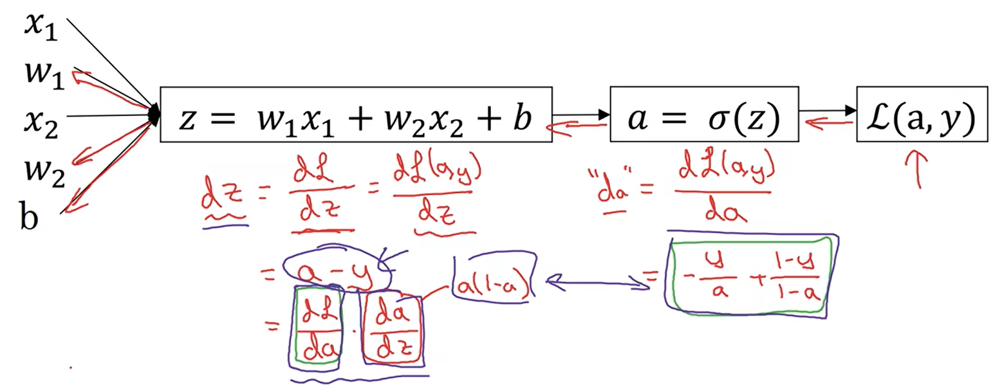

loss function: 
$$
\mathscr{l}(a,\ y) = -(y\log a + (1 - y)\log(1 - a)) \\
\frac{\partial \mathscr{l}(a,\ y)}{\partial a} = -\frac{y}{a} + \frac{1 - y}{1 - a}
$$

$$
\begin{aligned}
\frac{\partial \mathscr{l}(a,\ y)}{\partial z} &= \frac{\partial \mathscr{l}(a,\ y)}{\partial a} \frac{da}{dz} \\
&= (-\frac{y}{a} + \frac{1 - y}{1 - a}) \cdot a(1 - a) \\
&= a - y
\end{aligned}
$$

$$
z = w^Tx + b \\
\frac{\partial z(w,\ b)}{\partial w_{n_x \times 1}} = 
\begin{bmatrix}
\frac{\partial z}{\partial w_1} \\
\frac{\partial z}{\partial w_2} \\
\vdots \\
\frac{\partial z}{\partial w_{n_x}} \\
\end{bmatrix} = 
\begin{bmatrix}
x_1 \\
x_2 \\
\vdots \\
x_{n_x} \\
\end{bmatrix}
= x_{n_x \times 1} (矩阵求导) \\
\quad \frac{\partial z(w,\ b)}{\partial b} = 1
$$

最终求导结果：
$$
\begin{aligned}
\frac{\partial J}{\partial w}|_{n_x \times 1} &= \frac{1}{m}\sum_{i=1}^m [\frac{\partial \mathscr{l}^{(i)}}{\partial z^{(i)}} \frac{\partial z^{(i)}}{\partial w}] \\
&= \frac{1}{m}\sum_{i=1}^m[(a^{(i)} - y^{(i)})_{1 \times 1} \cdot x^{(i)}_{n_x \times 1}] \\
& = \frac{1}{m}X(A - Y)^T_{n_x \times 1} \\

\frac{\partial J}{\partial b} &= \frac{1}{m}\sum_{i=1}^m \frac{\partial \mathscr{l}^{(i)}}{\partial z^{(i)}}\frac{\partial z^{(i)}}{\partial b} \\
&= \frac{1}{m}\sum_{i=1}^m(a^{(i)} - y^{(i)}) \ (标量)
\end{aligned}
$$

#### 注意

- 在代码中使用for循环会显著降低运行速度，应当使用向量化和python广播形式

### 神经网络

#### activation function

- sigmoid（可用于二元分类）: 

$$
\sigma(z) = \frac{1}{1 + e^{-z}} \\
\sigma'(z) = \sigma(z)(1 - \sigma(z))
$$

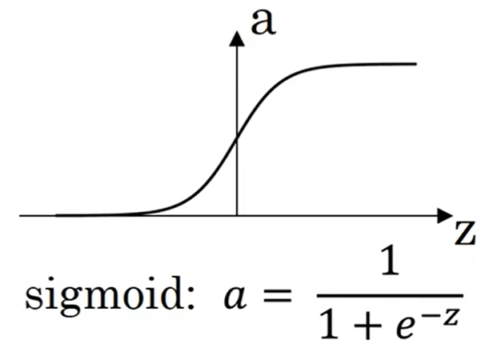

- tanh: 

$$
tanh(z) = \frac{e^{z} - e^{-z}}{e^{z} + e^{-z}} \\
tanh'(z) = 1 - tanh^2(z)
$$

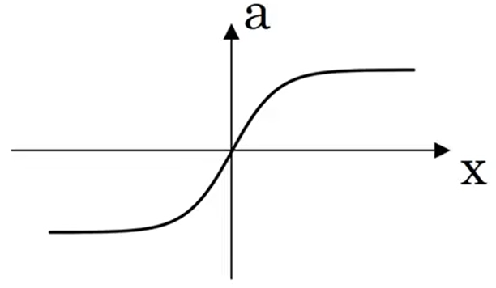

- ReLU（Rectified Liner Unit，学习速度更快）: 

$$
ReLU(z) = \max(0,\ z) \\
ReLU'(z) = 
\begin{cases}
0,\ z < 0 \\
1,\ z \ge 0
\end{cases}
$$

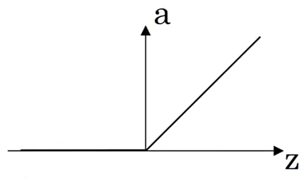

==注== 编程实现时令$z=0$处的导数为1

- leaky ReLU: 

$$
g(z) = \max(0.01z,\ z) \\
g'(z) = 
\begin{cases}
0.01,\ z < 0 \\
1,\ z \ge 0
\end{cases}
$$

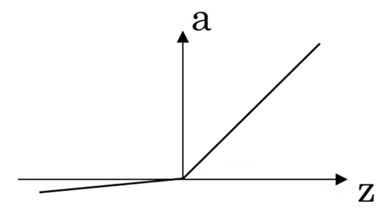

#### forward propogation

以两层网络为例：

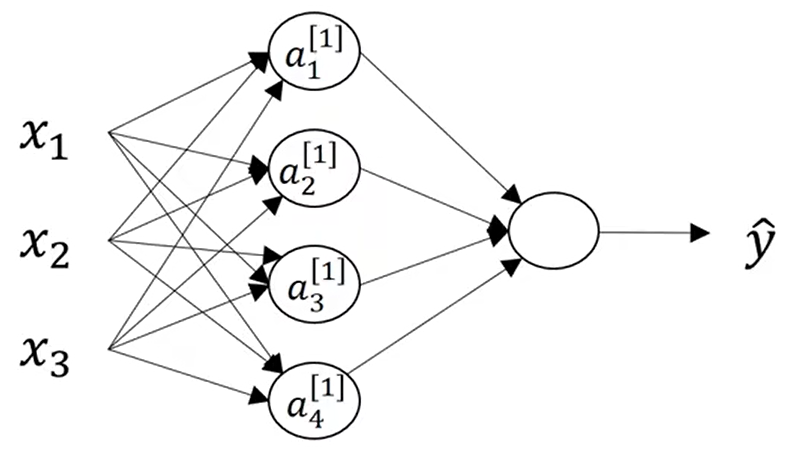

- $a^{[l]}_{i}$：activation，表示网络中第$l$层第$i$个神经元的值，且$a^{[0]} = X$

- $a^{[l](i)}$：第$i$个训练样本下第$l$层的值

- $n^{[l]}$：第$l$层的节点数，$n^{[0]} = n_x,\ n^{[1]} = 4,\ n^{[2]} = 1$

- 变量的shape: 

$$
\begin{aligned}
W^{[l]} &:\ (n^{[l]},\ n^{[n-1]}) \\
b^{[l]} &:\ (n^{[l]},\ 1) \\
dW^{[l]} &:\ (n^{[l]},\ n^{[n-1]}) \\
db^{[l]} &:\ (n^{[l]},\ 1) \\
Z^{[l]} &:\ (n^{[l]},\ m) \\
A^{[l]} &:\ (n^{[l]},\ m)
\end{aligned}
$$

针对第$i$个样本的前向传播过程：
$$
\begin{aligned}
z^{[1](i)} &= W^{[1]}x^{(i)} + b^{[1]} \\
a^{[1](i)} &= \sigma(z^{[1](i)}) \\
z^{[2](i)} &= W^{[2]}a^{[1](i)} + b^{[2]} \\
a^{[2](i)} &= \sigma(z^{[2](i)})
\end{aligned}
$$

- $x = [x_1,\ x_2,\ x_3]^T$

- $W^{[1]}_{4 \times 3}$：4个隐含层单元，样本含3个特征

前向传播过程-针对样本集的向量化：
$$
\begin{aligned}
Z^{[1]} &= W^{[1]}X + B^{[1]} \\
A^{[1]} &= \sigma(Z^{[1]}) \\
Z^{[2]} &= W^{[2]}A^{[1]} + B^{[2]} \\
A^{[2]} &= \sigma(Z^{[2]})
\end{aligned}
$$

- $X = [x^{(1)},\ x^{(2)},\ ...,\ x^{(m)}]_{n_x \times m} = A^{[0]}$：表示样本集
- $Z^{[1]} = [z^{[1](1)},\ z^{[1](2)},\ ...,\ z^{[1](m)}]$
- $Z^{[2]} = [z^{[2](1)},\ z^{[2](2)},\ ...,\ z^{[2](m)}]$
- $A^{[1]} = [a^{[1](1)},\ a^{[1](2)},\ ...,\ a^{[1](m)}]$
- $A^{[2]} = [a^{[2](1)},\ a^{[2](2)},\ ...,\ a^{[2](m)}]$
- $B^{[1]} = [b^{[1]},\ b^{[1]},\ ...,\ b^{[1]}]_{\_\times m}$

#### back propogation

- $dZ^{[2]} = \frac{\partial J}{\partial Z^{[2]}},\ Z^{[2]}_{1 \times m}(m个样本)$

- $$
  \begin{aligned}
  A^{[2]} &= [A^{[2](1)},\ A^{[2](2)},\ ...,\ A^{[2](m)}] \\
  &= [a^{[2](1)},\ a^{[2](2)},\ ...,\ a^{[2](m)}]_{1 \times m} \\
  \end{aligned}
  $$

$$
\begin{aligned}
dZ^{[2]} &= [dz^{[2](1)},\ dz^{[2](2)},\ ...,\ dz^{[2](m)}]
\end{aligned}
$$

- $Y = [y^{(1)},\ y^{(2)},\ ...,\ y^{(m)}]_{1 \times m}$
- 第2层输出层只有1个节点，采用sigmoid函数，参考logistic regression部分，有：

$$
\frac{\partial \mathscr{l}}{\partial z} = a - y \\
dz = \frac{\partial J}{\partial z} = \frac{1}{m}\sum_{i=1}^m\frac{\partial \mathscr{l}^{(i)}}{\partial z} = \frac{1}{m}\sum_{i=1}^m(a^{(i)} - y^{(i)})
$$

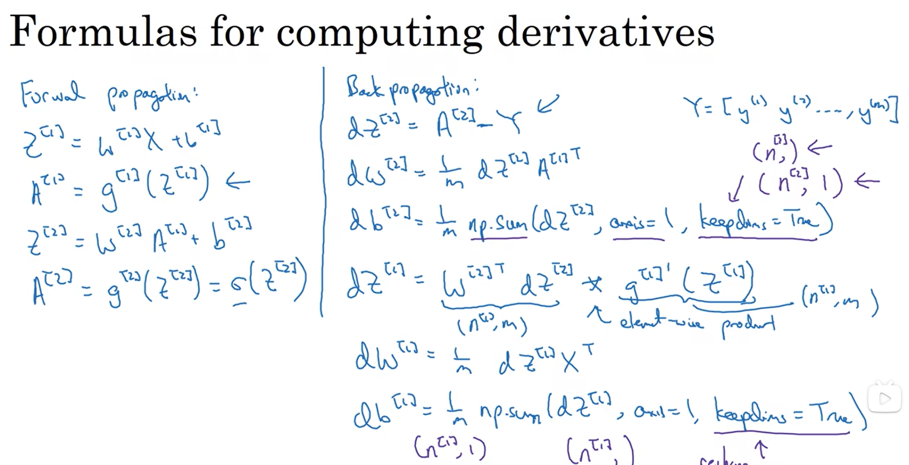

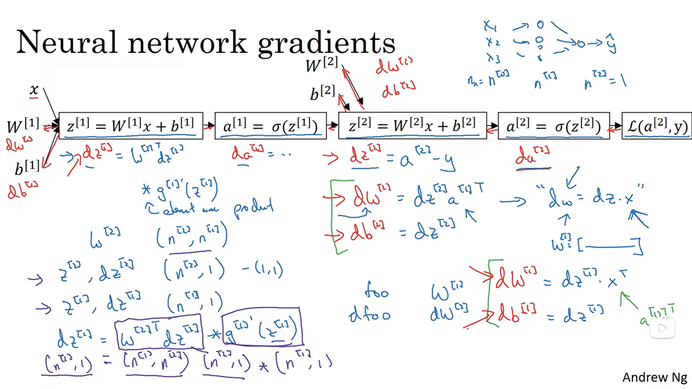

#### gradient descent

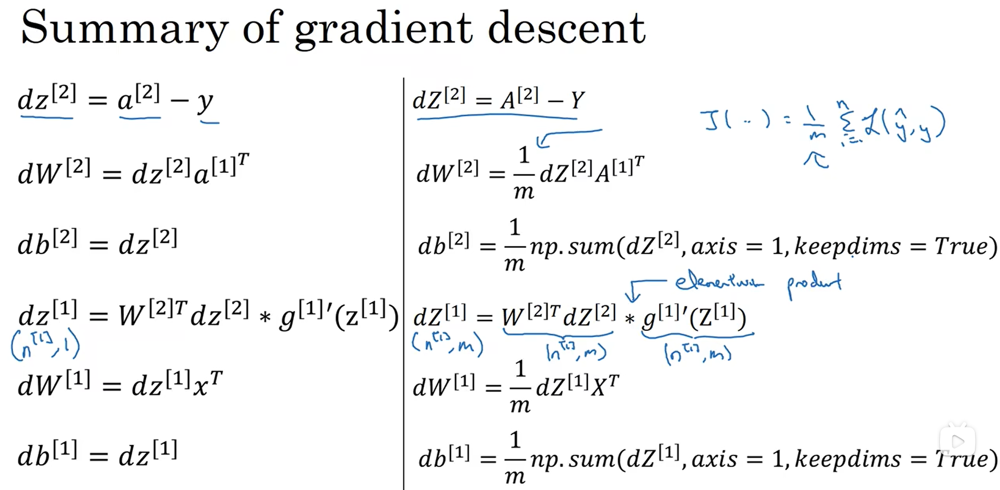

对单个样本的梯度计算：
$$
\begin{aligned}
dz^{[2]} &= a^{[2]} - y \\
dW^{[2]} &= dz^{[2]}a^{[1]T} \\
db^{[2]} &= dz^{[2]} \\
dz^{[1]} &= W^{[2]T}dz^{[2]} * g^{[1]}{'}(z^{[1]}) \\
dW^{[1]} &= dz^{[1]}x^T \\
db^{[1]} &= dz^{[1]}
\end{aligned}
$$

==注意== "$*$"表示逐元素乘积（element-wize）

==说明== 

对于第$i$个样本，有：
$$
dz^{[2](i)} = a^{[2](i)} - y^{(i)}
$$
令：
$$
\begin{aligned}
dZ^{[2]} &= [dz^{[2](1)},\ dz^{[2](2)},\ ...,\ dz^{[2](m)}] \\
A^{[2]} &= [a^{[2](1)},\ a^{[2](2)},\ ...,\ a^{[2](m)}] \\
Y &= [y^{(1)},\ y^{(2)},\ ...,\ y^{(m)}]
\end{aligned}
$$
则向量化表示可写为：
$$
dZ^{[2]} = A^{[2]} - Y
$$

----------------------------------------------------------------------------------------------------------------

由于：
$$
Z^{[2]}_{1 \times m} = W^{[2]}_{1 \times 4}A^{[1]}_{4 \times m} + b^{[2]}
$$
则有：
$$
\frac{\partial Z^{[2]}_{1 \times m}}{\partial W^{[2]}_{1 \times 4}} = A^{[1]T}_{m \times 4}
$$
存在如下对应关系：
$$
z^{[2](i)} \sim a^{[2](i)} \sim \mathscr{l}(a^{[2](i)},\ y^{(i)}) \\
J = \frac{1}{m}\sum_{i=1}^m\mathscr{l}(a^{[2](i)},\ y^{(i)})
$$
故$J$可以看做向量$Z^{[2]}_{1 \times m}$的函数，对其求偏导数有：
$$
\begin{aligned}
\frac{\partial J}{\partial Z^{[2]}}|_{1 \times m} &= [\frac{\partial J}{\partial z^{[2](1)}},\ \frac{\partial J}{\partial z^{[2](2)}},\ ...,\ \frac{\partial J}{\partial z^{[2](m)}}] \\
&= \frac{1}{m}[\frac{\partial \mathscr{l}^{(1)}}{\partial z^{[2](1)}},\ \frac{\partial \mathscr{l}^{(2)}}{\partial z^{[2](2)}},\ ...,\ \frac{\partial \mathscr{l}^{(m)}}{\partial z^{[2](m)}}] \\
&= \frac{1}{m}dZ^{[2]}
\end{aligned}
$$
进而有：
$$
dW^{[2]}_{1 \times 4} = \frac{\partial J}{\partial Z^{[2]}}\frac{\partial Z^{[2]}}{\partial W^{[2]}} = \frac{1}{m}dZ^{[2]}_{1 \times m}A^{[1]T}_{m \times 4} \quad (a)
$$
事实上，对于单个样本$(i)$有：
$$
dW^{[2]}_{1 \times 4} = dz^{[2]}_{1 \times 1}a^{[1]T}|_{1 \times 4}
$$
可以将式$(a)$改写为如下形式：
$$
\begin{aligned}
dW^{[2]}_{1 \times 4} &= dZ^{[2]}_{1 \times m} A^{[1]T}_{m \times 4} \\
&= \frac{1}{m}[dz^{[2](1)},\ dz^{[2](2)},\ ...,\ dz^{[2](m)}]
\begin{bmatrix}
a^{[1](1)T} \\
a^{[1](2)T} \\
\vdots \\
a^{[1](m)T} \\
\end{bmatrix} \\
&= \frac{1}{m}\sum_{i=1}^m dz^{[2](i)}_{1 \times 1} a^{[1](i)T}|_{1 \times 4}
\end{aligned}
$$

### 深层神经网络

#### forward propagation

$$
z^{[l]}_{n^{[l]} \times 1} = W^{[l]}_{n^{[l]} \times n^{[l-1]}}a^{[l-1]}_{n^{[l-1]} \times 1} + b^{[l]}_{n^{[l]} \times 1} \\
a^{[l]}_{n^{[l]} \times 1} = g^{[l]}(z^{[l]}_{n^{[l]} \times 1})
$$

向量化：
$$
Z^{[l]}_{n^{[l]} \times m} = W^{[l]}_{n^{[l]} \times n^{[l-1]}}A^{[l-1]}_{n^{[l-1]} \times m} + b^{[l]}_{n^{[l]} \times 1} \\
A^{[l]}_{n^{[l]} \times m} = g^{[l]}(Z^{[l]}_{n^{[l]} \times m})
$$
注：$X = A^{[0]}$

#### backward propagation

$$
dW^{[l]} = \frac{\partial J}{\partial W^{[l]}} = \frac{1}{m}dZ^{[l]}A^{[l-1]T} \\
db^{[l]} = \frac{\partial J}{\partial b^{[l]}} = \frac{1}{m}\sum_{i=1}^mdZ^{[l](i)} \\
dA^{[l-1]} = \frac{\partial J}{\partial A^{[l-1]}} = W^{[l]T}dZ^{[l]}
$$

## 序列模型

### RNN

#### notation

$x^{(i)<t>}$：第$i$个样本中第$t$个元素

$T_x^{(i)}$：第$i$个训练样本的输入序列长度

$y^{(i)<t>}$：第$i$个训练样本输出序列中第$t$个元素

$T_y^{(i)}$：第$i$个训练样本输出序列的长度

#### notes

##### one-hot representation

使用一个向量来表示一个单词，其中只有一个元素是1，其余都为0

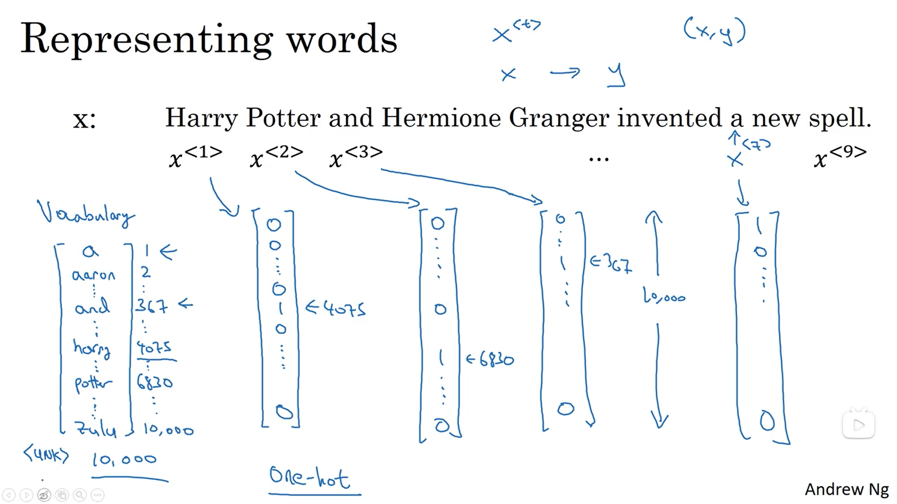

##### forward propagation

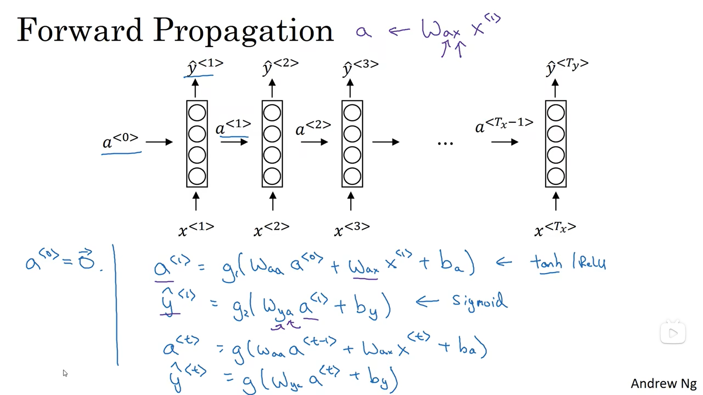
$$
a^{<t>} = g(W_{aa}a^{<t-1>} + W_{ax}x^{<t>} + b_a) \\
\hat{y}^{<t>} = g(W_{ya}a^{<t>} + b_y)
$$
simplified notation: 
$$
a^{<t>} = g(W_a[a^{<t-1>},\ x^{<t>}] + b_a) \\
\hat{y}^{<t>} = g(W_ya^{<t>} + b_y) \\
$$
其中：
$$
W_a = [W_{aa},\ W_{ax}] \\
[a^{<t-1>},\ x^{<t>}] = 
\begin{bmatrix}
a^{<t-1>} \\
x^{<t>}
\end{bmatrix} \\
W_{ya} = W_y
$$

##### summary of RNN types

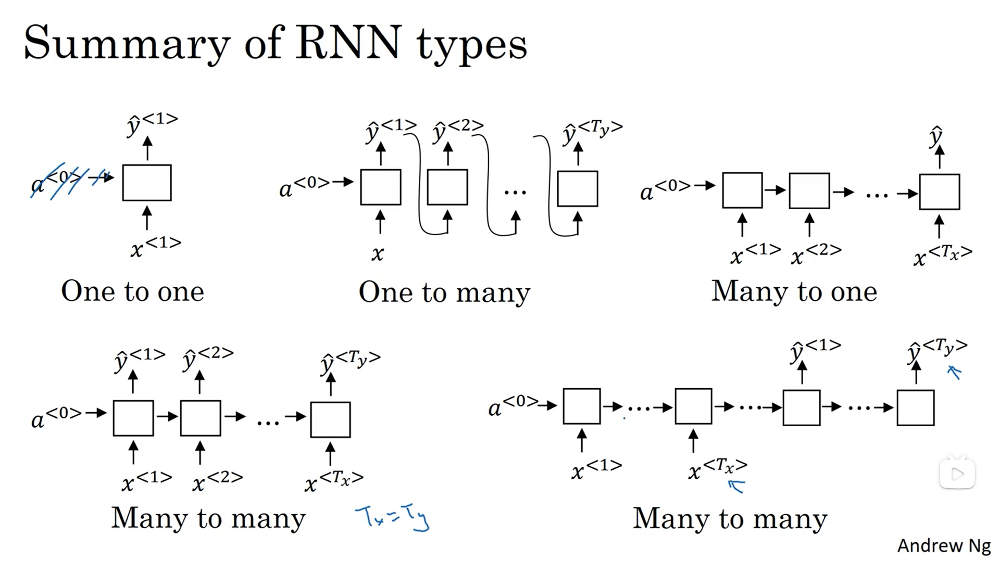

#### 说明

RNN存在的问题：

- 梯度消失
- 梯度爆炸

### GRU

memory cell: 

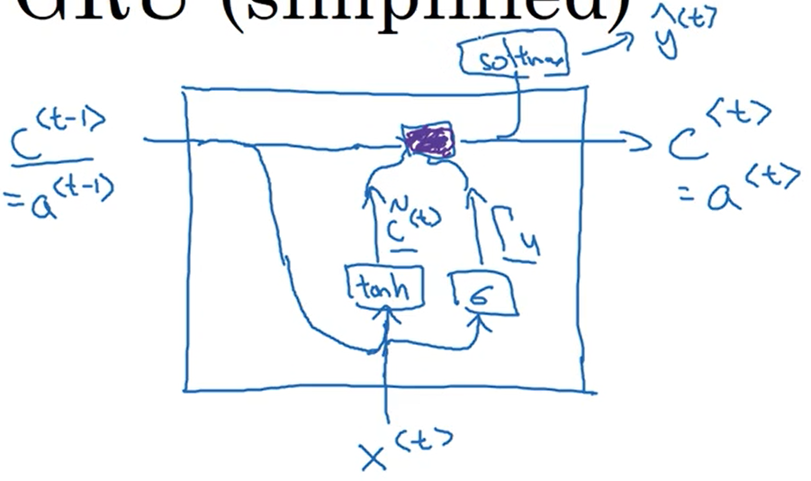
$$
\begin{aligned}
\tilde{c}^{<t>} &= \tanh(W_c[c^{<t-1>},\ x^{<t>}] + b_c) \\
\Gamma_u &= \sigma(W_u[c^{<t-1>},\ x^{<t>}] + b_u) \\
c^{<t>} &= \Gamma_u * \tilde{c}^{<t>} + (1 - \Gamma_u) * c^{<t-1>}
\end{aligned}
$$

### LSTM

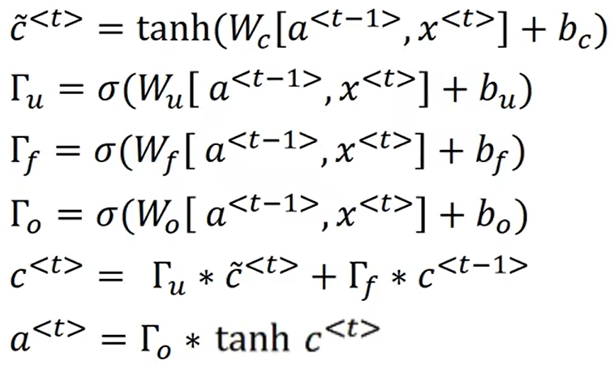

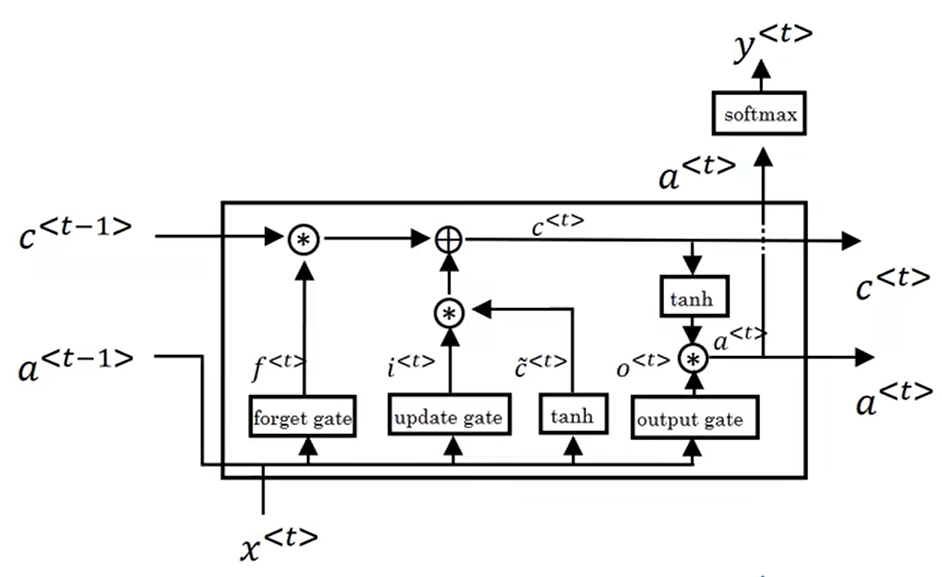

#### 参考

- [Understanding LSTM Networks](https://colah.github.io/posts/2015-08-Understanding-LSTMs/)
- [如何从RNN起步，一步一步通俗理解LSTM](https://blog.csdn.net/v_JULY_v/article/details/89894058?ops_request_misc=%257B%2522request%255Fid%2522%253A%2522171003374916800222894872%2522%252C%2522scm%2522%253A%252220140713.130102334..%2522%257D&request_id=171003374916800222894872&biz_id=0&utm_medium=distribute.pc_search_result.none-task-blog-2~all~top_positive~default-1-89894058-null-null.142^v99^pc_search_result_base7&utm_term=lstm&spm=1018.2226.3001.4187)

## 时间序列预测

- 【吴恩达团队Tensorflow2.0实践系列课程第四课】序列、时间序列和预测】 https://www.bilibili.com/video/BV1qE411u7z4/?share_source=copy_web&vd_source=c6317e87993cd23a0e65d74c89d6599d

### transformer