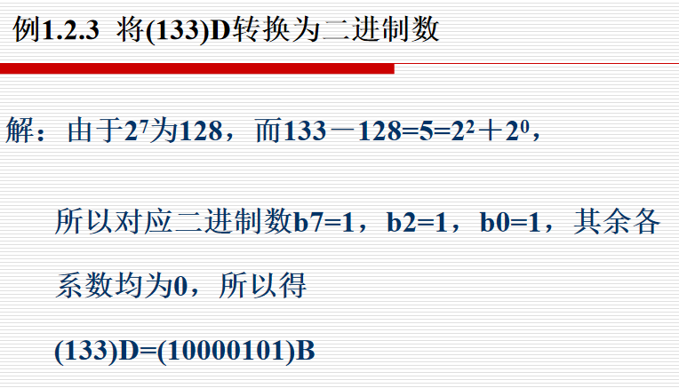
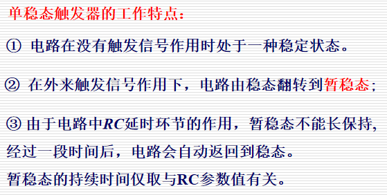
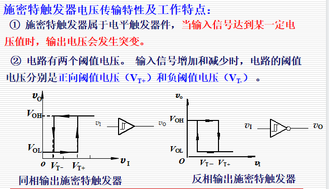

# 数字逻辑概论

## 数制

### 二-十进制的转换

#### 整数的转换

 辗转相除法：将十进制数连续不断地除以2，直至商为零，所得余数由低位到高位排列，即为所求二进制数

当十进制数较大时可采用：

#### 小数的转换

### 二-十六进制的转换

### 二-八进制的转换

## 二进制算术运算

==注== 补码运算的结果仍为补码，需根据符号位还原

## 二进制代码

### 二-十进制码（BCD码）

==注意== BCD码前后的0不可省略

### 格雷码

## 基本逻辑运算

### 与非

### 或非

### 异或

### 同或

# 逻辑代数

异或：$A \oplus B = \overline{A}B + A\overline{B}$

==注== 多个变量异或时，奇数个1结果为1，偶数个1结果为0

同或：$A \odot B = A \cdot B + \overline{A} \cdot \overline{B}$

## 基本公式与恒等式

## 逻辑代数的基本规则

### 代入规则

### 反演规则

### 对偶规则

## 逻辑函数表达式的形式

### 最小项与最小项表达式

### 最大项与最大项表达式

## 卡诺图

### 卡诺图的画法

### 卡诺图化简的步骤

==注== 卡诺图化简的结果一般为[与或式]()，若要得到[或与式]()，可以圈出0然后将结果取非

### 具有无关项的化简

# 逻辑门电路

## 逻辑门电路简介

### 开关电路

## 基本CMOS逻辑门电路

### CMOS反相器

### 其他基本CMOS逻辑门电路

#### CMOS与非门

#### CMOS或非门

### CMOS传输门

## CMOS逻辑门的不同输出结构及参数

### CMOS漏极开路和三态门电路

### CMOS逻辑门电路的重要参数

# 组合逻辑电路

## 组合逻辑电路的分析

### 组合逻辑电路的分析方法

## 组合逻辑电路的设计

### 组合逻辑电路的设计过程

## 组合逻辑电路中的竞争与冒险

### 产生原因

### 消去竞争冒险的方法

==注意== 在卡诺图中，可能会产生竞争冒险的表现是圈出的圆出现“相切”的情况，此时只需在相切的位置添加一个圈即可消除竞争冒险

#### 发现并消除互补变量

#### 增加乘积项，避免互补项增加

#### 输出端并联电容器

## 若干典型的组合逻辑电路

### ==编码器==

#### 普通编码器

#### 优先编码器

#### 典型编码器电路

##### CD4532

### ==译码器==/数据分配器

#### 3线-8线译码器74HC138

#### 用译码器实现逻辑函数

### ==数据选择器==

#### 用数据选择器实现逻辑函数

#### 8选1数据选择器74HC151

### 数值比较器

#### 集成数值比较器74HC85

### 算数运算电路

# 锁存器和触发器

- 锁存器对脉冲电平敏感
- 触发器对时钟脉冲边沿敏感

## 触发器的逻辑功能

### D触发器

### JK触发器

JK触发器：0 0 不变，1 1 翻转，0 1,、1 0同J

### T触发器

#### $T'$触发器

### D触发器功能的转换

#### D触发器构成JK触发器

#### D触发器构成T触发器

#### D触发器构成$T'$触发器

# 时序逻辑电路

## 时序逻辑电路的基本概念

### 时序逻辑电路的基本结构及分类

#### 异步时序电路与同步时序电路

- 同步时序电路：存储电路里所有触发器有一个统一的时钟源，它们的状态在同一时刻更新
- 异步时序电路：没有统一的时钟脉冲或没有时钟脉冲，电路的状态更新不是同时发生的

#### 米利型电路和穆尔型电路

### 时序逻辑电路功能的表达

## 同步时序逻辑电路的分析

- 电路状态表
- 状态图
- 工作波形图

==注意== 米利型和穆尔型输出的状态图有所不同，[米利型输出标在方向线旁，穆尔型标在圆圈状态名旁]()。

### 分析同步时序逻辑电路的一般步骤

同步时序逻辑电路的分析一般还用到[状态转换真值表]()。

## 同步时序逻辑电路的设计

### 设计同步时序逻辑电路的一般步骤

### JK激励表

| $Q^n$ | $Q^{n + 1}$ | $J$  | $K$  |
| :---: | :---------: | :--: | :--: |
|   0   |      0      |  0   |  d   |
|   0   |      1      |  1   |  d   |
|   1   |      0      |  d   |  1   |
|   1   |      1      |  d   |  0   |

## 异步时序逻辑电路的分析

分析方法：

 ==注== 若D触发器有时钟脉冲的上升沿作用时，其状态变化；无时钟脉冲上升沿作用时，其状态不变，则有如下常用公式：
$$
Q^{n + 1} = D \cdot cp + Q^n \cdot \overline{cp}
$$

## 若干典型的时序逻辑电路

### 寄存器和移位寄存器

#### 寄存器

#### 移位寄存器

##### 双向移位寄存器74HC194

==注意== 

- 右移：从高位向低位
- 左移：从低位

### 计数器

#### 二进制计数器

##### 74161

==说明== 

- $\overline{CR}$的作用：[异步]()清零（强制清零，与$CP$无关，低电平有效）
- $\overline{PE}$的作用：[同步]()置数（与$CP$有关，低电平有效）
- 进位信号TC只有在$Q_3Q_2Q_1Q_0 = 1111$且$CET = 1$时输出为1，其余时间均为0，可简单记为：

$$
TC = CET \cdot Q_3Q_2Q_1Q_0
$$

##### ==（考点）利用74161实现任意进制计数器==

实现方法（注意异步清零、同步置数）：

- 反馈清零
- 反馈置数
- 整体反馈法（多片连接）
- 级联法（+ 置数）（多片连接，当进制数可以拆成两个数的乘积时使用）

#### 环形计数器

- 若一个计数器可被分为两个独立的子计数器（$m, n$进制），则该计数器的进制为$m \times n$

# 半导体存储器

# 脉冲波形的变换与产生

## 单稳态触发器

## 施密特触发器

# 模数与数模转换器

## D/A转换器

## A/D转换器

