## 重要考点

- 感应电压的列写（注意互感电压的参考方向）

## 需记忆的重要知识点

- T型去耦等效电路
- 谐振电路的品质因数$\frac{1}{R}\sqrt{\frac{L}{C}}$
- [拉普拉斯变换的常用实例]()
- 四种类型的二端口方程形式

## 典型例题

### 正弦稳态电路分析

- 9-21
- 9-22
- 9-23
- 9-24（戴维宁等效的特殊观察技巧）

# 电阻电路的等效变换

## Y型&$\Delta$型电阻电路

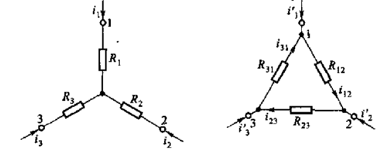

对于上图所示的两类电阻电路，有如下等效转换关系：
$$
Y型 \rightarrow \Delta 型：
\begin{cases}
R_1 = \frac{R_{12}R_{31}}{R_{12} + R_{23} + R_{31}}\\
R_2 = \frac{R_{12}R_{23}}{R_{12} + R_{23} + R_{31}}\\
R_3 = \frac{R_{31}R_{23}}{R_{12} + R_{23} + R_{31}}\\
\end{cases}\\
\Delta型 \rightarrow Y型：
\begin{cases}
R_{12} = \frac{R_1R_2 + R_2R_3 + R_3R_1}{R_3}\\
R_{23} = \frac{R_1R_2 + R_2R_3 + R_3R_1}{R_1}\\
R_{31} = \frac{R_1R_2 + R_2R_3 + R_3R_1}{R_2}\\
\end{cases}
$$
可以简单记忆为：
$$
Y型电阻 = \frac{\Delta型相邻电阻乘积}{\Delta型电阻之和}\\
\Delta型电阻= \frac{Y型电阻两两乘积之和}{相对的Y型电阻}
$$

==重点== 当Y型（或$\Delta$型）电阻电路中所有电阻相同时，即：
$$
R_1 = R_2 = R_3\\
R_{12} = R_{23} = R_{31}
$$
两类电阻电路有如下变换关系：
$$
R_{12} = 3R_1\\
\Delta型电阻 = 3 \times Y型电阻
$$

## 电压源、电流源的串联与并联

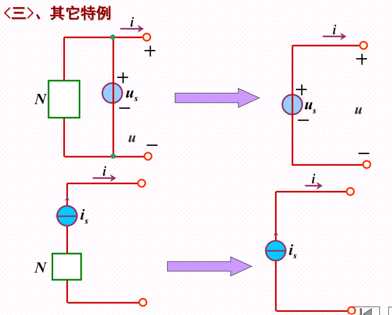

# 电阻电路的一般分析

## 回路电流法

==注意== 回路电流方程右边表示所有电压源的代数和。其中，与回路电流方向一致的电压源前应取“-”号，否则应取“+”号。

### 回路电流法的特殊情况

#### 具有受控源的情况

处理方法：将受控源当做独立电源处理列出方程，最后把控制量用回路电流表示增补方程，再对电路进行求解。

#### 具有电流源与电阻并联的情况

处理方法：利用两类实际电源模型的等效变换。

#### 具有无伴电流源的情况

==推荐== 处理方法1：选择电流源使其只包含在一个回路中。

处理方法2：假设电流源两端电压，并按常规方法列回路电流方程。

# 相量

## 相量表示形式和运算

以电压（有效值为U）电流（有效值为I）和阻抗Z为例：
$$
\dot{U} = Ue^{j\varphi_u} = U\measuredangle{\varphi_u} = U\cos\varphi_u + U\sin\varphi_u\\
\dot{I} = Ie^{j\varphi_i} = I\measuredangle{\varphi_i} = I\cos\varphi_i + I\sin\varphi_i\\
相量商：Z = \frac{\dot{U}}{\dot{I}} = \frac{U}{I}e^{j(\varphi_u - \varphi_i)}
$$
==注意== 

- 由于相量法要求参与运算的所有相量频率相同，因此不能使用相量积（复功率除外）
- 正弦值转换为相量值之前必须确保其形式为$\cos$而不是$\sin$，形式保持一致便于计算

## 元件VCR的相量形式

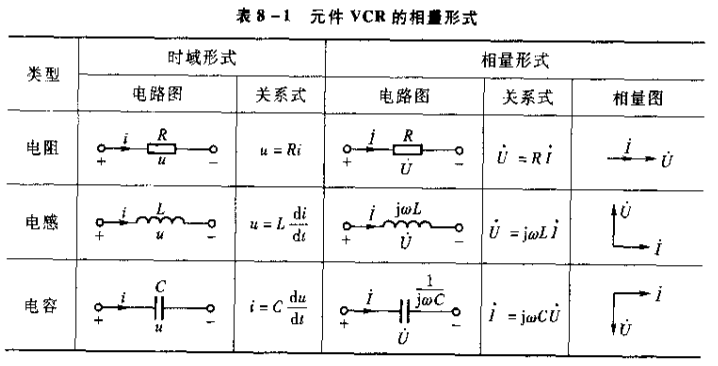

由上图可知：

- 电感电压超前电流$90^\circ$，电容电压滞后电流$90^\circ$，简记为“感前容后”；
- 纯电感的阻抗角为$90^\circ$，纯电容的阻抗角为$-90^\circ$；
- 阻抗角大于零为感性阻抗，反之为容性阻抗。

# 正弦稳态电路分析

## 阻抗和导纳

$$
阻抗：Z = R + jX = \frac{\dot{U}}{\dot{I}}\\
其中R称为电阻，X称为电抗\\
导纳：Y = G + jB = \frac{\dot{I}}{\dot{U}}\\
其中G称为电导，B称为电纳\\
阻抗和导纳的关系：Z = \frac{1}{Y}
$$

### 阻抗、导纳和电压、电流相量的关系

对于阻抗有：
$$
若:\dot{U} = Ue^{j\varphi_u},\dot{I} = Ie^{j\varphi_i}\\
则有：Z = \frac{\dot{U}}{\dot{I}} = \frac{U}{I}e^{j(\varphi_u - \varphi_i)} = \frac{U}{I}e^{j\varphi}\quad(其中\varphi = \varphi_u - \varphi_i)\\
进而有：\vert Z \vert = \frac{U}{I}\\
$$
上式说明阻抗相量的模等于电压电流有效值的比值。

对于导纳，与阻抗相反，有：
$$
若:\dot{U} = Ue^{j\varphi_u},\dot{I} = Ie^{j\varphi_i}\\
则有：Y = \frac{\dot{I}}{\dot{U}} = \frac{I}{U}e^{j(\varphi_i - \varphi_u)} = \frac{I}{U}e^{-j\varphi}\quad(其中\varphi = \varphi_u - \varphi_i)\\
进而有：\vert Y \vert = \frac{I}{U}\\
$$
上式说明导纳相量的模等于电流电压有效值的比值。

### 阻抗的功率

对于阻抗来说，其电阻分量只吸收有功功率（平均功率），电抗分量只吸收无功功率。由此可以得到：
$$
对于电路中的阻抗：Z = R + jX,其电压电流有效值为U、I，则：\\
其吸收的有功功率为：P = I^2R\\
吸收的无功功率为：Q = I^2\vert X \vert
$$

## 正弦稳态电路的功率

### 瞬时功率

$$
P = UI\cos\varphi(1 - \cos2\omega t) + UI\sin\varphi\sin2\omega t\\
\varphi = \varphi_u - \varphi_i = \varphi_z(\varphi称为阻抗角)
$$

### 平均功率（有功功率）

$$
P = UI\cos\varphi\\
单位：W
$$

### 无功功率

$$
Q = UI\sin\varphi\\
单位：var
$$

### 视在功率

$$
S = UI = \sqrt{P^2 + Q^2}\\
单位：V·A
$$

### 复功率

$$
\overline{S} = \dot{U}\dot{I}^* = Se^{j\varphi} = P + jQ\\
\dot{I}^*为相量\dot{I}的共轭\\
单位：V·A
$$

阻抗和导纳的复功率可以表示为：
$$
\overline{S}_Z = Z\dot{I}\dot{I}^* = I^2(R + jX)\\
\overline{S}_Y = \dot{U}(\dot{U}Y)^* = U^2Y^* = U^2(G - Bj)
$$
==功率守恒== 对于正弦稳态电路，电路中所有支路复功率的代数和为零，所有支路有功功率（或平均功率）的代数和为零，所有支路无功功率的代数和也为零。

### 功率因数

$$
\lambda = \frac{P}{S} = \cos\varphi
$$

==注意== 功率因数[滞后表示电流滞后电压]()，超前表示电流超前电压。

### 最大功率传输问题

对于含有一个电压源$U_s$、阻抗$Z_{eq} = R_{eq} + jX_{eq}$和负载$Z = R + jX$的电路，负载获得最大**平均功率**的条件为：
$$
Z = Z_{eq}^* \quad 或 \quad Y = Y_{eq}^*\\ （共轭匹配）
$$
此时最大功率为：
$$
P_{max} = \frac{U_s^2}{4R_{eq}}
$$

## 正弦电路的谐振

### RLC串联电路的谐振（电压谐振）

条件：
$$
\omega_0 = \frac{1}{\sqrt{LC}}
$$
特征：

- 阻抗最小：

$$
Z = R +j(\omega_0 L - \frac{1}{\omega_0 C}) = R\\
(电抗部分为零)
$$

- 电感和电容两端电压之和为零，LC串联部分相当于**短路**
- 无功功率为零，即：

$$
无功功率：Q = UI\sin\varphi = 0\\
功率因数：\lambda = \cos\varphi = 1
$$

### RLC并联电路的谐振（电流谐振）

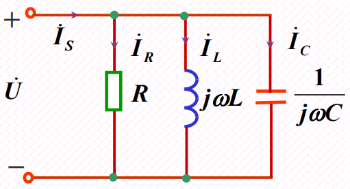

条件：
$$
\omega_0 = \frac{1}{\sqrt{LC}}
$$
特征：

- 导纳最小，阻抗最大

$$
Y = G + j(\omega_0 C - \frac{1}{\omega_0 L}) = G\\
(电纳部分为零)
$$

- 流过电感和电容的电流之和为零，LC并联部分相当于**开路**

- 无功功率为零，即
  
  $$
  Q = UI\sin\varphi = 0\\
  \lambda = \cos\varphi = 0
  $$

### ==品质因数==

设$\omega_0$为电路的谐振频率，则电路的品质因数Q定义为：
$$
Q = \frac{\omega_0L}{R} = \frac{1}{\omega_0CR} = \frac{1}{R}
\sqrt{\frac{L}{C}}
$$
电路中电容电压、电感电压、电源电压和品质因数Q的关系可表示为：
$$
U_C(j\omega_0) = U_L(j\omega_0) = QU_s(j\omega_0)\\
或：Q = \frac{U_C(j\omega_0)}{U_s(j\omega_0)} = \frac{U_L(j\omega_0)}{U_s(j\omega_0)}
$$

# 含有耦合电感的电路

## 耦合因数

$$
k = \frac{M}{\sqrt{L_1L_2}}
$$

耦合系数k的大小与施感电流无关，与两个线圈的结构、相互位置及周围磁介质有关。

## 互感电压极性的判断方法

==推荐== 方法1：同向耦合，在KVL方程中[互感电压和自感电压同号]()；反向耦合，互感电压和自感电压异号。

方法2：根据互感电压与施感电流的进端是否为同名端来判断数学表达式中互感电压的极性

## ==耦合电感的T型去耦等效==

### 同名端为共端的T型去耦等效

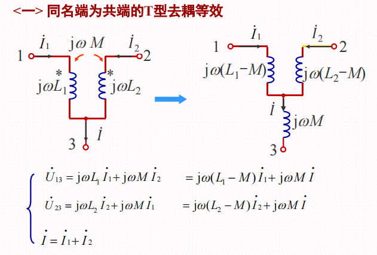

### 异名端为共端的T型去耦等效

## 理想变压器

对于理想变压器，当其变比为n时，其两端电压电流有如下关系（注意电流参考方向的选取）：
$$
\frac{u_1}{u_2} = n,\\
\frac{i_1}{i_2} = -\frac{1}{n}
$$
进一步可以得到：
$$
u_1i_1 + u_2i_2 = 0
$$
这表明理想变压器是一个不耗能不储能的非动态无损耗的磁耦合元件。

当二次侧回路所接负载为$Z_L$时，其等效至一次侧回路的引入阻抗为：
$$
Z_{eq} = n^2Z_L
$$
对于负载$Z_L$分别为$R,L,C$的情况，其等效至一次侧回路的参数分别为：
$$
n^2R,\quad n^2L,\quad \frac{C}{n^2}
$$

# 三相电路

## 三相电源的瞬时表达式及其向量

$$
\begin{cases}
u_A = \sqrt{2}U\cos(\omega t)\quad\quad\quad\quad\quad\dot{U}_A = U\measuredangle0^\circ\\
u_B = \sqrt{2}U\cos(\omega t - 120^\circ)\quad\quad\dot{U}_B = U\measuredangle-120^\circ = a^2\dot{U}_A\\
u_C = \sqrt{2}U\cos(\omega t + 120^\circ)\quad\quad\dot{U}_C = U\measuredangle120^\circ = a\dot{U}_A\\
\end{cases}\\
其中，a = 1\measuredangle120^\circ
$$

上述电源ABC的次序称为正序，电力系统常用正序。

## 线电压（电流）和相电压（电流）的关系

对于对称星形电源 ，依次设其线电压为$\dot{U}_{AB},\dot{U}_{BC},\dot{U}_{CA}$，相电压为$\dot{U}_A,\dot{U}_B,\dot{U}_C$，则有：
$$
\dot{U}_{AB} = \sqrt{3}\dot{U}_A\measuredangle30^\circ\\
\dot{U}_{BC} = \sqrt{3}\dot{U}_B\measuredangle30^\circ\\
\dot{U}_{CA} = \sqrt{3}\dot{U}_C\measuredangle30^\circ
$$
上式说明，当相电压对称时，线电压也一定依序对称，它是相电压的$\sqrt{3}$倍，且依次超前$\dot{U}_A,\dot{U}_B,\dot{U}_C$相位$30^\circ$。

对于三角形电源，其线电压和相电压相等，即：
$$
\dot{U}_{AB} = \dot{U}_A\\
\dot{U}_{BC} = \dot{U}_B\\
\dot{U}_{CA} = \dot{U}_C
$$
对于星形三相负载，线电流显然等于相电流，而对于三角形负载，则有：

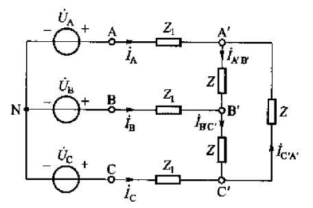

对于图中的三角形三相负载，其电流满足如下关系：
$$
\dot{I}_A = \sqrt{3}\dot{I}_{A'B'}\measuredangle-30^\circ\\
\dot{I}_B = \sqrt{3}\dot{I}_{B'C'}\measuredangle-30^\circ\\
\dot{I}_C = \sqrt{3}\dot{I}_{C'A'}\measuredangle-30^\circ\\
$$
上式说明，当三角形三相负载的相电流对称时，其线电流一定对称，它是相电流的$\sqrt{3}$倍，且依次滞后$\dot{I}_{A'B'},\dot{I}_{B'C'},\dot{I}_{C'A'}$的相位为$30^\circ$。

## 对称三相电路的功率计算

对于对称三相电路，其功率可归为一相计算：
$$
P = 3Re[\dot{U}_A·\dot{I}_A^*]
$$
当负载为星形连接时，有：
$$
\begin{aligned}
P &= 3Re[\dot{U}_A·\dot{I}_A^*]\\
&= 3U_AI_A\cos\varphi\\
&= \sqrt{3}U_{AB}I_A\cos\varphi\\
&= 3I_A^2R
\end{aligned}\\
其中，\varphi = \varphi_u - \varphi_i
$$
在如图所示对称三相电路中：

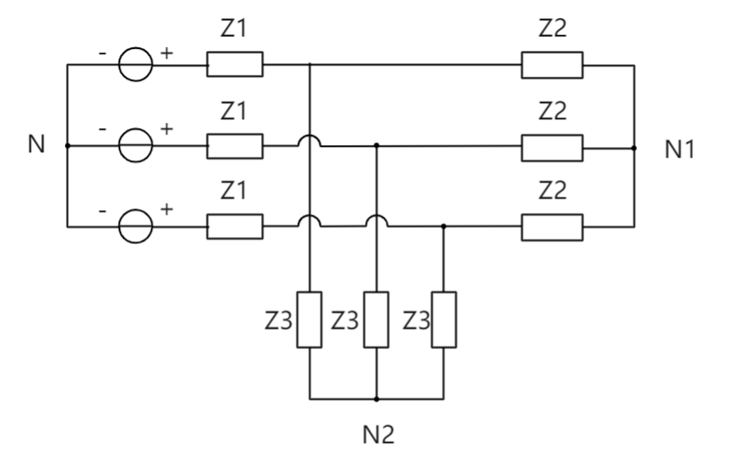

利用结点电压法可以证明：
$$
U_N = U_{N1} = U_{N2}
$$
由此该对称三相电路可归为一相计算。

## 二瓦计法测三相三线制电路功率

- 测量线路的接法

将两个功率表的电流线圈串到任意两相中，电压线圈的同名端接到其电流线圈所串的线上，电压线圈的异名端接到另一相没有串功率表的线上，共有三种接法。

在对称三相制中，令
$$
\dot{U}_A = U_A\measuredangle0^\circ\\
\dot{I}_A = I_A\measuredangle-\varphi
$$
则有：
$$
P_1 = Re[\dot{U}_{AC} \dot{I}_A^*] = U_{AC}I_A\cos(\varphi - 30^\circ)\\
P_2 = Re[\dot{U}_{BC} \dot{I}_B^*] = U_{BC}I_B\cos(\varphi + 30^\circ)\\
P = P_1 + P_2 = \sqrt{3}U_{AC}I_A\cos\varphi
$$
可以得到该电路总的复功率为：
$$
\overline{S} = U_WI_W\measuredangle(\varphi - 30) + U_WI_W\measuredangle(\varphi + 30) \\
=\sqrt{3}U_WI_W\measuredangle\varphi
$$
即有：
$$
P = \sqrt{3}U_WI_W\cos\varphi\\
Q = \sqrt{3}U_WI_W\sin\varphi
$$
式中，$U_W、I_W$分别代表线电压的有效值、线电流的有效值，$\varphi$代表阻抗角。

# 非正弦周期电流电路和信号的频谱

## 非正弦周期函数分解为傅里叶级数

$$
f(t) = \frac{A_0}{2} + \sum_{k=1}^{\infty}A_{km}\cos(k\omega_1t + \phi_k)\\
A_{km}e^{j\phi_k} = a_k - jb_k = \frac{T}{2}\int_0^Tf(t)e^{-jk\omega_1tdt}
$$

## 有效值、平均值和平均功率

### 电流的有效值

电流有效值定义为：
$$
I = \sqrt{\frac{1}{T}\int_0^T i^2dt}
$$
由此可以得到非正弦周期电流的有效值：
$$
I = \sqrt{I_0^2 + I_1^2 + I_2^2 + I_3^2 + ... } = \sqrt{I_0^2 + \sum_{k=1}^{\infty}I_k^2}
$$
即电流有效值等于恒定分量的平方与各次谐波有效值平方之和的平方根。

此结论可推广到其他非正弦周期量。

## 平均功率

平均功率定义为：
$$
P = \frac{1}{T}\int_0^Tpdt
$$
由此可以证明：
$$
P = U_0I_0 + U_1I_1\cos\varphi_1 + U_2I_2\cos\varphi_2 + U_3I_3\cos\varphi_3 + 
... + U_kI_k\cos\varphi_k + ...\\
= U_0I_0 + \sum_{k = 1}^{\infty}U_kI_k\cos\varphi_k\\
其中，U_k = \frac{U_{km}}{\sqrt{2}}，I_k = \frac{I_{km}}{\sqrt{2}}，
\varphi_k = \phi_{uk} - \phi_{ik}
$$
即平均功率等于恒定分量构成的功率和各次谐波平均功率的代数和。

# 一阶二阶电路的时域分析

## 电路的初始条件

### 独立初始条件

- 电容电压
- 电感电流

独立初始条件的确定可参考换路定则。

### 非独立初始条件的确定

#### $0_+$等效电路法

$t = 0_+$时的电容和电感分别以电压源和电流源来替代，此电压源的电压和电流源的电流分别等于电容电压和电感电流在$t = 0_+$时刻的值，对于电路中的独立电源则取$t=0_+$时刻的值。

## 换路定则

在电容电流和电感电压为有限值的条件下，换路前后瞬间[电容电压]()和[电感电流]()不发生跃变。

## 三要素法

求解[直流激励或正弦激励下]()**一阶电路**的全响应，利用**初始值、稳态特解和时间常数**三个要素：
$$
f(t) = f'(t) + [f(0_+) - f'(0_+)]e^{-\frac{t}{\tau}}\\
其中，f'(t)为稳态特解，f'(0_+)为稳态特解在t = 0_+时刻的值，\tau为时间常数
$$
对于RC和RL电路，其时间常数分别为：
$$
\tau_{RC} = RC\\
\tau_{RL} = \frac{L}{R}
$$
从不同的角度分析一阶电路的全响应，可以得到：
$$
全响应 =
\begin{cases}
零输入响应 + 零状态响应\\
强制分量 + 自由分量\\
稳态分量 + 暂态分量
\end{cases}
$$

## 一阶电路的冲激响应

### RC电路的冲激响应

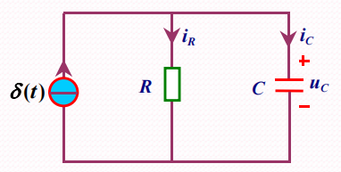

当输入信号为冲激信号$\delta(t)$时，对应的各支路响应为：
$$
u_c(t) = u_R(t) = \frac{1}{C}e^{-\frac{t}{\tau}},(\tau = RC)\\
i_c(t) = C\frac{du_c(t)}{dt} = \delta(t) - \frac{1}{RC}e^{-\frac{1}{\tau}}\\
i_R(t) = \frac{u_c(t)}{R} = \frac{1}{RC}e^{-\frac{t}{\tau}}
$$

### RL电路的冲激响应

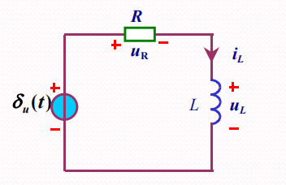

当输入信号为冲激信号$\delta_u(t)$时，对应的响应为：
$$
i_L = \frac{1}{L}e^{-\frac{t}{\tau}},(\tau = \frac{L}{R})\\
u_L = \delta_u(t) - \frac{R}{L}e^{-\frac{t}{\tau}}
$$

## 一阶电路阶跃响应和冲激响应的关系

对于一阶电路，设$s(t)$为该电路的阶跃响应，$h(t)$为该电路的冲激响应，则有：
$$
h(t) = \frac{ds(t)}{dt},\quad\quad 
s(t) = \int h(t)dt
$$

# 线性动态电路的复频域分析

==注意== 零时刻电路为零状态时，经拉普拉斯反变换后的结果需要乘以$\varepsilon(t)$

## ==常用函数的拉氏变换==

$$
\begin{align}
& \varepsilon(t) \quad\sim\sim\sim\quad \frac{1}{s}\\
& \delta(t) \quad\sim\sim\sim\quad 1\\
& e^{-at} \quad\sim\sim\sim\quad \frac{1}{s + a}\\
& e^{at} \quad\sim\sim\sim\quad \frac{1}{s - a}\\
& \sin\omega t \quad\sim\sim\sim\quad \frac{\omega}{s^2 + \omega^2}\\ 
& \cos\omega t \quad\sim\sim\sim\quad \frac{s}{s^2 + \omega^2}\\ 
& t \quad\sim\sim\sim\quad \frac{1}{s^2} \\ 
& e^{-at}\sin\omega t \quad\sim\sim\sim\quad \frac{\omega}{(s+a)^2 + \omega^2}\\
& e^{-at}\cos\omega t \quad\sim\sim\sim\quad \frac{s + a}{(s+a)^2 + \omega^2}\\
& \frac{1}{n!}t^ne^{-at} \quad\sim\sim\sim\quad \frac{1}{(s+a)^{n+1}}\\
& te^{-at} \quad\sim\sim\sim\quad \frac{1}{(s+a)^2}\\
& 1 - e^{-at} \quad\sim\sim\sim\quad \frac{a}{s(s+a)}
\end{align}
$$

## 电阻、电感、电容的运算电路

对图(a)所示电阻有：
$$
u(t) = i(t)R
$$
利用拉氏变换得到：
$$
U(s) = I(s)R\\
运算电路如图(b)
$$

对图(a)所示电感有：
$$
u(t) = L\frac{di(t)}{dt}
$$
利用拉氏变换得到：
$$
U(s) = sLI(s) - Li(0_-)\\
运算电路如图(b)
$$
或：
$$
I(s) = \frac{1}{sL}U(s) + \frac{i(0_-)}{s}\\
运算电路如图(c)
$$
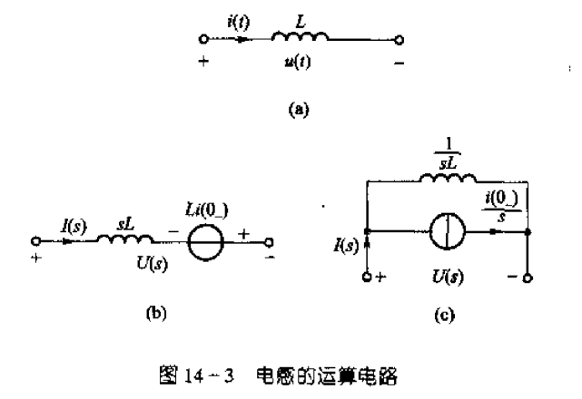

对图(a)所示电容有：
$$
u(t) = \frac{1}{C}\int_{0_-}^{t}i(\xi)d\xi + u(0_-)
$$
利用拉氏变换得到：
$$
U(s) = \frac{1}{sC}I(s) + \frac{u(0_-)}{s}\\
运算电路如图(b)
$$
或：
$$
I(s) = sCU(s) - Cu(0_-)\\
运算电路如图(c)
$$
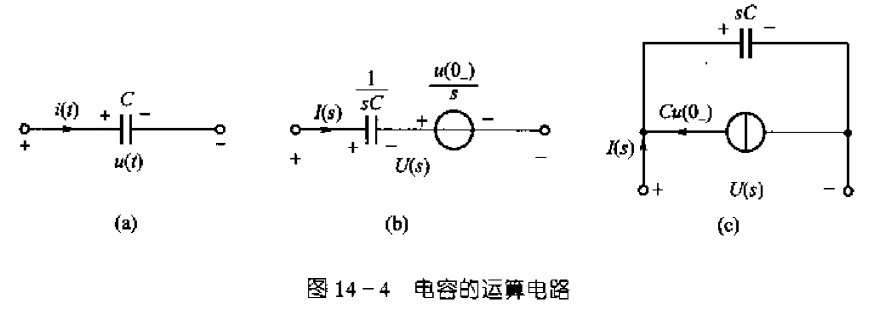

# ==二端口网络==

## Z参数方程

$$
\begin{cases}
\dot{U_1} = Z_{11}\dot{I_1} + Z_{12}\dot{I_2}\\
\\
\dot{U_2} = Z_{21}\dot{I_1} + Z_{22}\dot{I_2}
\end{cases}
$$

矩阵形式为：
$$
\begin{bmatrix}
\dot{U_1}\\
\dot{U_2}
\end{bmatrix}
=
\begin{bmatrix}
Z_{11} & Z_{12}\\
Z_{21} & Z_{22}
\end{bmatrix}
\begin{bmatrix}
\dot{I_1}\\
\dot{I_2}
\end{bmatrix}
= \mathbf{Z}
\begin{bmatrix}
\dot{I_1}\\
\dot{I_2}\\
\end{bmatrix}
$$

$$
其中，\mathbf{Z} =
\begin{bmatrix}
Z_{11} & Z_{12}\\
Z_{21} & Z_{22}
\end{bmatrix}
称为Z参数矩阵，也称开路阻抗矩阵
$$

## Y参数方程

$$
\begin{cases}
\dot{I_1} = Y_{11}\dot{U_1} + Y_{12}\dot{U_2}\\
\\
\dot{I_2} = Y_{21}\dot{U_1} + Y_{22}\dot{U_2}
\end{cases}
$$

矩阵形式为：
$$
\begin{bmatrix}
\dot{I_1}\\
\dot{I_2}
\end{bmatrix}
=
\begin{bmatrix}
Y_{11} & Y_{12}\\
Y_{21} & Y_{22}
\end{bmatrix}
\begin{bmatrix}
\dot{U_1}\\
\dot{U_2}
\end{bmatrix}
= \mathbf{Y}
\begin{bmatrix}
\dot{U_1}\\
\dot{U_2}
\end{bmatrix}
$$
$$
其中，
\mathbf{Y} 
=\begin{bmatrix}
Y_{11} & Y_{12}\\
Y_{21} & Y_{22}
\end{bmatrix}称为Y参数矩阵，也称短路导纳矩阵
$$

由互易定理可以证明，对于由线性RLC元件构成的无源二端口网络，其Z参数矩阵和Y参数矩阵有以下特征：
$$
Z_{12} = Z_{21}\\
Y_{12} = Y_{21}
$$
对于对称的二端口网络，还有以下特征：
$$
Z_{11} = Z_{22}\\
Y_{11} = Y_{22}
$$
若二端口中含有受控源，则可以证明互易定理一般不再成立，故
$$
Z_{12} \ne Z_{21}\\
Y_{12} \ne Y_{21}
$$
开路阻抗矩阵$\mathbf{Z}$和短路导纳矩阵$\mathbf{Y}$之间**互为逆阵**，由此可以得到它们之间的换算关系：
$$
\mathbf{Z} = \mathbf{Y}^{-1} \quad或\quad \mathbf{Y} = \mathbf{Z}^{-1}
$$
即：
$$
\begin{bmatrix}
Z_{11} & Z_{12}\\
Z_{21} & Z_{22}
\end{bmatrix}
=
\frac{1}{\Delta}_Y
\begin{bmatrix}
Y_{22} & -Y_{12}\\
-Y_{21} & Y_{11}
\end{bmatrix}
$$

$$
其中，\Delta_Y = 
\begin{vmatrix}
Y_{11} & Y_{12}\\
Y_{21} & Y_{22}
\end{vmatrix}
=
Y_{11}Y_{22} - Y_{12}Y_{21}
$$

## T参数方程

$$
\begin{cases}
\dot{U_1} = A\dot{U_2} - B\dot{I_2}\\
\\
\dot{I_1} = C\dot{U_2} - D\dot{I_2}
\end{cases}
$$

矩阵形式为：
$$
\begin{bmatrix}
\dot{U_1}\\
\dot{I_1}
\end{bmatrix}
=
\begin{bmatrix}
A & B\\
C & D
\end{bmatrix}
\begin{bmatrix}
\dot{U_2}\\
-\dot{I_2}
\end{bmatrix}
=
\mathbf{T}
\begin{bmatrix}
\dot{U_2}\\
-\dot{I_2}
\end{bmatrix}\\
$$

$$
其中，
\mathbf{T} = 
\begin{bmatrix}
A & B\\
C & D
\end{bmatrix}称为T参数矩阵
$$

对于无源线性二端口，有：
$$
AD - BC = 1
$$
对于对称二端口，有：
$$
A = D
$$

## H参数方程

$$
\begin{cases}
\dot{U_1} = H_{11}\dot{I_1} + H_{12}\dot{U_2}\\
\\
\dot{I_2} = H_{21}\dot{I_1} + H_{22}\dot{U_2}
\end{cases}
$$

矩阵形式为：
$$
\begin{bmatrix}
\dot{U_1}\\
\dot{I_2}
\end{bmatrix}
=
\begin{bmatrix}
H_{11} & H_{12}\\
H_{21} & H_{22}
\end{bmatrix}
\begin{bmatrix}
\dot{I_1}\\
\dot{U_2}
\end{bmatrix}
=
\mathbf{H}
\begin{bmatrix}
\dot{I_1}\\
\dot{U_2}
\end{bmatrix}
$$

$$
其中，
\mathbf{H} = 
\begin{bmatrix}
H_{11} & H_{12}\\
H_{21} & H_{22}
\end{bmatrix}称为H参数矩阵
$$

对于无源线性二端口，有
$$
H_{21} = -H_{12}
$$
对于对称二端口，有：
$$
H_{11}H_{22} - H_{12}H_{21} = 1
$$

## 二端口的连接方式

- 级联

$$
\mathbf{T} = \mathbf{T'}\mathbf{T''}
$$

- 并联

$$
\mathbf{Y} = \mathbf{Y'}\mathbf{Y''}
$$

- 串联

$$
\mathbf{Z} = \mathbf{Z'}\mathbf{Z''}
$$

大纲
